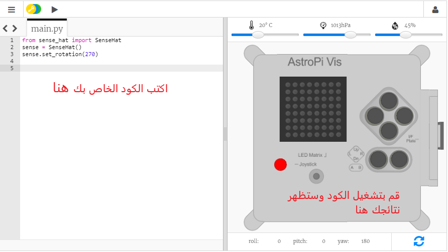

## ما هو نظام Astro Pi؟

Astro Pi هو جهاز حاسوب Raspberry Pi محاط بغلاف خارجي مصمم خصيصًا لظروف الفضاء. ويحتوي أيضًا على لوحة إضافية تُسمى Sense HAT، تمت صناعتها خصيصًا لأعمال مهمة نظام Astro Pi. وتحتوي لوحة Sense HAT على عصا تحكم وشاشة عرض LED ومستشعرات لتسجيل درجة الحرارة والرطوبة والضغط والموضع الاتجاهي.

توجد هنا وحدة حقيقية من وحدات نظام Astro Pi على متن محطة الفضاء الدولية، والتي تقوم بتشغيل بعض التعليمات البرمجية التي كتبها الطلاب. هذا هو المكان الذي سيتم فيه تشغيل التعليمات البرمجية الخاصة بك! 
<iframe width="560" height="315" src="https://www.youtube.com/embed/4ykbAJeGPMM" frameborder="0" allow="accelerometer; autoplay; encrypted-media; gyroscope; picture-in-picture" allowfullscreen mark="crwd-mark"></iframe> 

وفي هذه البعثة، ستستخدم محاكي لوحة Sense HAT. ويتمثل هذا المحاكي في برنامج من شأنه محاكاة جميع وظائف نظام Astro Pi في متصفح الويب الخاص بك.

توجد بعض الاختلافات بين لوحة Sense HAT الحقيقية ومحاكي لوحة Sense HAT:

- ففي المحاكي، يمكنك ضبط درجة الحرارة والضغط والرطوبة بنفسك باستخدام شريط تمرير الضبط، بينما تستخدم لوحة Sense HAT الحقيقية في نظام Astro Pi مستشعرات لقياس هذه المعلمات في البيئة التي توجد بها.

- يمكنك استخدام الماوس للنقر على محاكي Sense HAT وسحبها لتحريكها وتدويرها، محاكاة التغييرات في اتجاهها؛ بينما نظام Astro Pi الحقيقي (وSense HAT) يمكن ان يتحرك في العالم الحقيقي، وأجهزة استشعار التوجيه في Sense HAT، تكتشف متى وكيف تحركت.