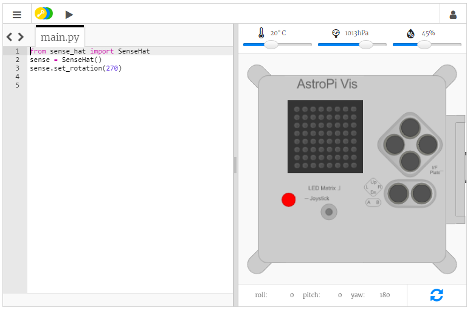

## عرض رسالة

\--- task \---

افتح [محاكي لوحة Sense HAT](https://trinket.io/mission-zero){:target="_blank"} الخاص بمشروع Mission Zero.

وسترى أنه قد تم إضافة ثلاثة أسطر من الكود لك تلقائيًا:

```python
from sense_hat import SenseHat
sense = SenseHat()
sense.set_rotation(270)
```



يتصل هذا الكود بنظام Astro Pi ويتأكد من أن العرض على شاشة عرض LED الخاصة بنظام Astro Pi يتم بشكل صحيح. اترك الكود في ذلك المكان، لأنك ستحتاجه.

\--- /task \---

\--- task \---

فقد تود ترك رسالة ترحيب لطيفة لرواد الفضاء الموجودين على متن محطة الفضاء الدولية والذين يعملون بالقرب من نظام Astro Pi؟ هيا بنا نمرر رسالة عبر شاشة العرض.

أضف هذا السطر أسفل الكود الآخر:

```python
sense.show_message("Astro Pi")
```

\--- /task \---

\--- task \---

اضغط على زر **Run** (تشغيل) وشاهد تمرير الرسالة `Astro Pi` عبر شاشة عرض LED.


\--- /task \---


لعرض رسالة مختلفة، يمكنك كتابة أي رسالة ترغبها بين علامات الاقتباس (`""`).

\--- collapse \---

* * *

## title: ما الأحرف والرموز التي يمكن استخدامها؟

يمكن للوحة Sense HAT عرض مجموعة الأحرف والرموز اللاتينية 1، مما يعني عدم توفر سوى الأحرف والرموز التالية فقط. تُعرض الأحرف والرموز الأخرى في شكل `?`.

    +-*/!"#$><0123456789.=)(
    
    ABCDEFGHIJKLMNOPQRSTUVWXYZ
    
    abcdefghijklmnopqrstuvwxyz
    
    ?,;:|@%[&_']\~
    

\--- /collapse \---

\--- task \---

يمكنك أيضًا تغيير سرعة تمرير الرسالة عبر الشاشة. أضف `scroll_speed` (سرعة_التمرير) إلى سطر الكود الذي لديك بالفعل، مثل هذا المثال:

```python
sense.show_message("Astro Pi", scroll_speed=0.05)
```

السرعة الافتراضية للرسالة هي `0.1`. يُزيد تصغير الرقم من سرعة تمرير الرسالة ويُبطئ تكبير الرقم من سرعة تمريرها.

\--- /task \---