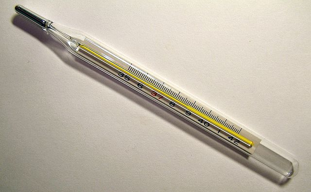

## قياس درجة الحرارة

يمكن لمستشعر درجة الحرارة في نظام Astro Pi قياس درجة حرارة الهواء في الأجواء المحيطة، وهي ميزة مفيدة من شأنها مساعدتك في جمع البيانات عن الظروف في الفضاء.


يقيس نظام Astro Pi درجة الحرارة في محطة الفضاء الدولية بالدرجة المئوية (&deg;C). ولأن درجات الحرارة في الفضاء تتباين بشكل كبير عن درجات الحرارة على سطح الأرض، يمكن لنظام Astro Pi قياس درجات الحرارة المنخفضة بداية من -40 درجة مئوية حتى +120 درجة مئوية.

ويتمثل جزء من بعثتك في دعم طاقم محطة الفضاء الدولية فيما يتعلق بأنشطة حياتهم اليومية، إذ إن قيامك بإبلاغهم بأن درجة الحرارة على متن محطة الفضاء في النطاق الطبيعي أمر من شأنه أن يبعث الطمأنينة في نفوسهم.

--- collapse ---
---
title: ما هي درجة الحرارة؟
---
درجة الحرارة هي قياس مدى سخونة أي جسم. ربما تم قياس درجة حرارة جسمك خلال إحدى زيارتك إلى الطبيب باستخدام مقياس درجة الحرارة.

 *By Menchi [CC-BY-SA-3.0](http://creativecommons.org/licenses/by-sa/3.0/){:target="_blank"} via Wikimedia Commons*

ولنكون أكثر دقة، فإن درجة الحرارة هي قياس كمية الطاقة الحرارية لأي مادة. أنت تعرف أن مكعب الثلج يكون في حالة صلبة، ولكن عندما يسخن، حيث يمتص الطاقة الحرارية من بيئته، ينصهر ويُصبح سائلًا. ينتج ذلك عن التغير الذي يحدث في حالة المادة عند امتصاصها أو فقدانها كمية كافية من الطاقة الحرارية، حيث تتحول من الحالة الصلبة إلى الحالة السائلة.

--- /collapse ---

--- task ---

أضف هذا الكود لأخذ قراءة درجة الحرارة:

```python
temp = sense.temperature
```

سيقيس هذا السطر درجة الحرارة الحالية ويُخزِّن القيمة المُقاسة في المتغير `temp` (درجة الحرارة).

--- /task ---

--- task ---

يتم تسجيل درجة الحرارة بدقة بالغة، وهو ما يعني أن القيمة المُخزَّنة ستشتمل على عدد كبير من الخانات الكسرية. يمكنك تقريب القيمة إلى أي عدد من الخانات الكسرية. في هذا المثال قمنا بالتقريب إلى خانة كسرية واحدة، ولكن للحصول على مستوى مختلف من الدقة، غيِّر العدد`1` إلى عدد الخانات الكسرية التي تريد مشاهدتها.

```python
temp = round( sense.temperature, 1 )
```

--- /task ---

--- task ---

لعرض درجة الحرارة الحالية في شكل رسالة عابرة على شاشة العرض، أضف هذا السطر من الكود:

```python
sense.show_message( str(temp) )
```

يحوِّل الجزء `str()` (سلسلة()) درجة الحرارة من عدد إلى نص بحيث يمكن لنظام Astro Pi عرضها.

--- /task ---

--- task ---

يمكنك أيضًا عرض درجة الحرارة كجزء من رسالة أخرى عن طريق ربط أجزاء الرسالة معًا باستخدام الرمز `+`.

```python
sense.show_message( "It is " + str(temp) + " degrees" )
```

--- /task ---

سيقيس نظام Astro Pi الحقيقي درجة الحرارة في الأجواء المحيطة، ومع ذلك يمكنك تحريك شريط تمرير ضبط درجة الحرارة في محاكي لوحة Sense HAT لمحاكاة تغيرات درجة الحرارة واختبار الكود الخاص بك.


**ملاحظة:** قد تتساءل لماذا يعرض شريط تمرير ضبط درجة الحرارة درجة الحرارة في شكل عدد صحيح، في حين أن القراءة التي يتم الحصول عليها تكون في عدد كسري. يتم من خلال المحاكي محاكاة حالات عدم الدقة الطفيفة للمستشعر الحقيقي، لذلك فإن قياس درجة الحرارة الذي تشاهده قد يزداد أو ينخفض بدرجة طفيفة عن القيمة التي حددتها باستخدام شريط تمرير الضبط.