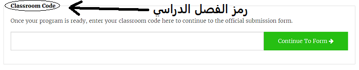

## إرسال إدخالك

توجد بعض القواعد التي يلزم اتباعها في التعليمة البرمجية الخاص بك حتى يمكنك إرساله للتشغيل في محطة الفضاء الدولية. في حال الالتزام بهذه القواعد في التعليمة البرمجية الخاص بك، فستضيء القواعد الموضحة أسفل المحاكي باللون الأخضر عند تشغيل البرنامج.

1. قم بأخذ قراءة درجة الحرارة
1. قم بشغيل شاشات LED
1. تأكد من عمل التعليمة البرمجية الخاص بك حتى النهاية دون حدوث أي أخطاء. إذا كانت لديك حلقة `while True` (في حالة الصواب) في التعليمة البرمجية الخاص بك، فستحتاج إلى الضغط على زر **إيقاف** لتجاوز هذه القاعدة.
1. Test your code with a few different humidity settings (using the slider) to make sure it will always run correctly.

وتأكد أيضًا من استيفاء المعايير التالية:

1. تأكد من أن رسالتك إلى رواد الفضاء تعمل لمدة لا تزيد عن 30 ثانية، حيث إن هذه هي مدة تشغيل التعليمة البرمجية الخاص بك في محطة الفضاء الدولية
1. تجنب استخدام أي وسائل تحتاج إلى مدخلات
1. لا تستورد إلا من وحدات `sense_hat` و `time` (الوقت)، و `random`(عشوائي)
1. تأكد من عدم تضمين أي كلمات نابية

بمجرد أن تكون جميع القواعد باللون الأخضر، فإنك تصبح حينئذ مستعدًا للإرسال.

--- task ---

أدخل رمز فصلك الدراسي في المربع الموجود بالأسفل - سيخبرك مدرسك بالرمز الخاص بك.

**يمكن العثور على الملاحظات الخاصة بالمدرسين والمعلمين** في خطوة [المقدمة](https://projects.raspberrypi.org/ar-SA/projects/astro-pi-mission-zero/1).

--- /task ---

--- task ---

سيظهر اسم مدرسك. إذا كان هذا هو الاسم الصحيح، فانقر على زر **متابعة إلى النموذج**.

--- /task ---

--- task ---

أدخل اسم فريقك وأسماء أعضاء الفريق. سيتم طباعة هذه الأسماء على الشهادة بمجرد تشغيل التعليمة البرمجية بك في الفضاء، لذلك تأكد من كتابتها بشكل صحيح!

--- /task ---

--- task ---

اضغط على زر **Submit** (إرسال) لإدخال الرمز الخاص بك. سيتلقى مدرسك أو معلمك بريدًا إلكترونيًا لتأكيد إدخالك.

--- /task ---

--- task ---

يمكنك، إذا رغبت، مشاركة رابط التعليمة البرمجية الخاص بك على وسائل التواصل الاجتماعي لإعلام الأشخاص بأن التعليمة البرمجية التي كتبتها سيتم تشغيلها في الفضاء!

--- /task ---
