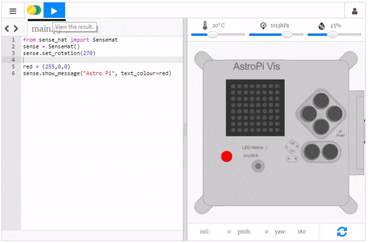

## Προσθήκη χρώματος

Τα LED του Astro Pi μπορούν επίσης να εμφανίζουν χρώματα. Μπορείς να προσδιορίσεις ένα χρώμα δημιουργώντας μια μεταβλητή στην οποία θα ορίσεις μια τιμή χρώματος RGB.

Μπορείς να μάθεις πώς να δημιουργείς όλα τα χρώματα χρησιμοποιώντας διαφορετικές αναλογίες κόκκινου, πράσινου και μπλε εδώ:

[[[generic-theory-colours]]]

\--- task \---

Επίλεξε ένα χρώμα και δές την τιμή RGB του χρώματος. Μπορείς να χρησιμοποιήσεις έναν [επιλογέα χρώματος](https://www.w3schools.com/colors/colors_rgb.asp){:target="_blank"} για να σε βοηθήσει.

\--- /task \---

\--- task \---

Δημιούργησε μια μεταβλητή για να αποθηκεύσει το επιλεγμένο χρώμα σας. Για παράδειγμα, αν επιλέξεις το κόκκινο, θα γράψεις την ακόλουθη γραμμή κώδικα:

```python
red = (255,0,0)
```

\--- /task \---

\--- task \---

Τώρα μπορείς να εμφανίσεις το κείμενό σου στο χρώμα της επιλογής σου! Για να δώσεις εντολή στο πρόγραμμα να χρησιμοποιήσει το χρώμα που δημιουργήσες, προσθέστε την παράμετρο `text_colour` στον κώδικα εμφάνισης του κειμένου σου:

```python
red = (255,0,0)
sense.show_message("Astro Pi", text_colour=red)
```

\--- /task \---



\--- task \---

Μπορείς επίσης να αλλάξεις το χρώμα φόντου της οθόνης. Επιλέξε ένα άλλο χρώμα και δημιουργήσε μια άλλη μεταβλητή για να το αποθηκεύσεις. Για να δώσεις εντολή στο πρόγραμμα να χρησιμοποιήσει το επιλεγμένο σας χρώμα φόντου, πρόσθεσε την παράμετρο `back_colour` στον κώδικά σου:

```python
red = (255,0,0)
green = (0,255,0)
sense.show_message("Astro Pi", text_colour=red, back_colour=green)
```

\--- /task \---

\--- task \---

Άλλαξε το κείμενο και το χρώμα του χαιρετισμού — τι μήνυμα θα στείλεις στους αστροναύτες που βρίσκονται στον Διεθνή Διαστημικό Σταθμό?

\--- /task \---