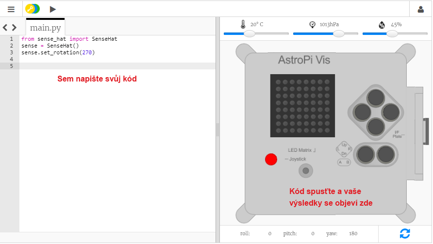

## Co je Astro Pi?

Astro Pi je počítač Raspberry Pi obalený pláštěm speciálně navrženým pro podmínky ve vesmíru. Má také přídavnou desku s názvem Sense HAT vytvořenou speciálně pro misi Astro Pi. Sense HAT má joystick, LED displej a čidla pro snímání teploty, vlhkosti, tlaku a orientace.

Tady vidíte skutečnou jednotku Astro Pi na Mezinárodní vesmírné stanici, na které běží kód napsaný studenty. Právě tady bude váš kód nakonec spuštěn! 
<iframe width="560" height="315" src="https://www.youtube.com/embed/4ykbAJeGPMM" frameborder="0" allow="accelerometer; autoplay; encrypted-media; gyroscope; picture-in-picture" allowfullscreen mark="crwd-mark"></iframe> 

Pro tuto misi budete používat emulátor desky Sense HAT. Emulátor je software, který simuluje všechny funkce Astro Pi ve vašem webovém prohlížeči.

Mezi skutečným a emulovaným Sense HAT existuje několik rozdílů:

- Na emulátoru si teplotu, tlak a vlhkost nastavujete sami pomocí posuvníků, zatímco skutečný Sense HAT v Astru Pi tyto parametry měří v prostředí okolo sebe.

- Když na emulovaný Sense HAT kliknete myší a táhnete, můžete s ním pohybovat a otáčet, a tak simulovat změnu orientace. Opravdové Astro Pi (a jeho Sense HAT) se může pohybovat v reálném světě a čidla orientace zjišťují, kdy a jak s ním bylo pohnuto.