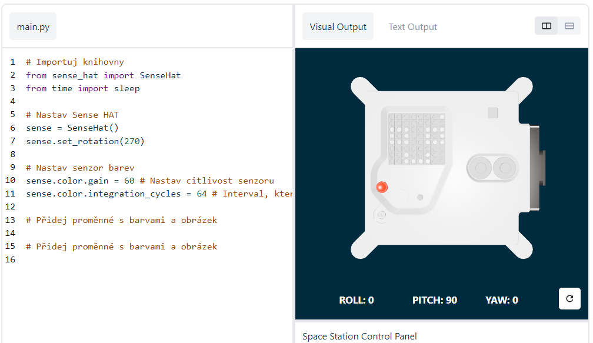
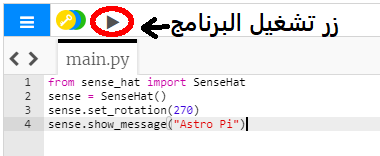

## Zobrazte zprávu

--- task ---

Otevřete [emulátor desky Sense HAT](https://trinket.io/mission-zero){:target="_blank"} pro projekt Mission Zero.

Tři řádky kódu, přidané automaticky, už tam budou:

```python
from sense_hat import SenseHat
sense = SenseHat()
sense.set_rotation(270)
```



Tento kód slouží k připojení k Astru Pi a zajistí, že jeho LED displej se zobrazuje správnou stranou nahoru. Tento kód tam nechte, protože ho budete potřebovat.

--- /task ---

--- task ---

Možná byste rádi poslali astronautům pracujícím na ISS poblíž Astra Pi nějaký pěkný vzkaz? Pojďme na displeji zobrazit běžící textový vzkaz.

Přidejte pod kód, který už tam je, tuhle řádku:

```python
sense.show_message("Astro Pi")
```

--- /task ---

--- task ---

Stiskněte tlačítko **Run** (Spustit) a sledujte, jak zpráva `Astro Pi` běží přes LED displej.



--- /task ---


Jestli chcete zobrazit nějakou jinou zprávu, napište ji mezi uvozovky (`""`).

--- collapse ---
---
title: Jaké znaky je možné použít?
---
Sense HAT umí zobrazit jen znakovou sadu Latin 1, takže k dispozici jsou jen následující znaky. Jiné znaky se zobrazí jako `?`.

    +-*/!"#$><0123456789.=)(
    
    ABCDEFGHIJKLMNOPQRSTUVWXYZ
    
    abcdefghijklmnopqrstuvwxyz
    
    ?,;:|@%[&_']~
    

--- /collapse ---

--- task ---

Můžete také změnit rychlost, jakou zpráva běží přes displej. Ke kódu, který už máte, přidejte `scroll_speed`, například takhle:

```python
sense.show_message("Astro Pi", scroll_speed=0.05)
```

Výchozí rychlost zprávy je `0,1`. (Pozor, anglicky se nepíše desetinná čárka, ale desetinná tečka!) Když číslo zmenšíte, zpráva poběží rychleji, když ho zvětšíte, poběží pomaleji.

--- /task ---