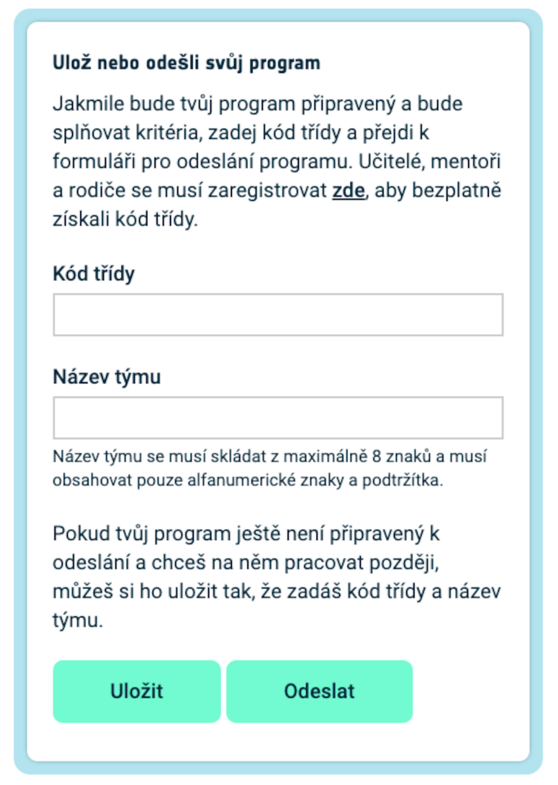

## Zobraz obrázek

LED obrazovka počítače Astro Pi umí zobrazovat barvy. V tomto kroku zobrazíš obrázky přírody na LED obrazovce počítače Astro Pi.

<p style="border-left: solid; border-width:10px; border-color: #0faeb0; background-color: aliceblue; padding: 10px;">
<span style="color: #0faeb0">**LED matice**</span> je mřížka osazená LED diodami, které můžeš ovládat jednotlivě nebo jako skupinu, a můžeš tak docílit různých světelných efektů. LED matice na desce Sense HAT má 64 LED diod v mřížce o velikosti 8 × 8. Tyto LED diody můžeš naprogramovat tak, aby vyprodukovaly širokou škálu barev.
</p>


--- task ---

Otevři [startovací projekt výzvy Mission Zero](https://missions.astro-pi.org/cs/mz/code_submissions/){:target="_blank"}.

Uvidíš pár řádků kódu, které tam už budou automaticky přichystané.

Tento kód slouží k připojení k počítači Astro Pi a zajistí, že se jeho LED displej bude zobrazovat správně, a také nastavuje senzor barev. Ten kód tam nech, protože ho budeš potřebovat.

--- code ---
---
language: python
filename: main.py
line_numbers: false
line_number_start: 1
line_highlights:
---
# Importuj knihovny
from sense_hat import SenseHat 
from time import sleep

# Nastav Sense HAT
sense = SenseHat() 
sense.set_rotation(270)

# Nastav senzor barev
sense.color.gain = 60 # Nastav citlivost senzoru
sense.color.integration_cycles = 64 # Interval, který udává frekvenci měření ze senzoru

--- /code ---


--- /task ---

### Barvy RGB

Barvy se dají vytvořit pomocí různých poměrů červené, zelené a modré. O barvách RGB se můžeš dozvědět zde:

[[[generic-theory-simple-colours]]]

LED matice je mřížka o velikosti 8 × 8. Každou LED diodu na mřížce lze nastavit na jinou barvu. Tady je seznam proměnných pro 24 různých barev. Každá barva obsahuje hodnotu pro červenou, zelenou a modrou:

[[[ambient-colours]]]

### Vyber obrázek

--- task ---

**Vyber:** Zvol si obrázek, který chceš zobrazit, z příkladů uvedených níže. Python ukládá informaci o obrázku do seznamu. Kód každého obrázku obsahuje proměnné použitých barev a samotný seznam.

Budeš muset **zkopírovat** celý kód tebou zvoleného obrázku a **vložit** ho do svého projektu pod řádek, na kterém je napsáno `# Přidej proměnné s barvami a obrázek`.

--- collapse ---

---
title: Ryba
---


Vytvořil tým chalka z Polska

```python
z = (153, 50, 204) # Tmavá orchidej
q = (255, 255, 0) # Žlutá
d = (51, 153, 255) # Modrá
c = (0, 0, 0) # Černá

obrazek = [
d, d, z, d, d, d, d, d,
d, d, d, z, z, d, d, d,
z, d, q, q, q, q, d, d,
z, z, q, q, q, c, q, d,
z, z, z, q, q, q, q, d,
z, z, q, q, q, q, q, d,
z, d, q, z, z, q, d, d,
d, d, d, z, d, d, d, d]

```

--- /collapse ---


--- collapse ---

---
title: Mrož
---


Vytvořil tým Walrus z Finska

```python
h = (0, 255, 255) # Modrozelená
c = (0, 0, 0) # Černá
s = (139, 69, 19) # Sedlově hnědá
a = (255, 255, 255) # Bílá
r = (184, 134, 11) # Tmavý zlatobýl

obrazek = [
h, h, h, h, h, h, h, h,
h, h, s, s, s, h, h, h,
h, s, s, s, s, s, h, h,
h, s, c, s, c, s, s, s,
h, r, r, r, r, r, s, s,
h, h, a, s, a, s, s, s,
h, h, a, s, a, s, s, s,
r, r, s, s, s, s, s, s]

```

--- /collapse ---

--- collapse ---
---
title: Paxi
---


Vytvořil tým tony_pi z Itálie

```python
v = (255, 0, 0) # Červená
m = (34, 139, 34) # Lesní zelená
c = (0, 0, 0) # Černá 
e = (100, 149, 237) # Chrpově modrá
l = (0, 255, 0) # Zelená

obrazek = [
    c, v, m, c, c, m, v, c,
    c, c, v, v, v, v, c, c,
    c, v, c, e, l, e, v, c,
    c, v, c, l, l, l, v, c,
    c, v, c, l, c, l, v, c,
    c, c, v, v, v, v, c, c,
    c, c, l, c, c, l, c, c,
    c, m, m, c, c, m, m, c]

```

--- /collapse ---


--- collapse ---
---
title: Pes
---


Vytvořil tým ptpr_07 ze Španělska

```python

c = (0, 0, 0) # Černá
r = (184, 134, 11) # Tmavý zlatobýl
s = (139, 69, 19) # Sedlově hnědá
y = (255, 20, 147) # Sytě růžová

obrazek = [
    c, r, r, c, c, r, r, c,
    c, r, s, s, s, s, r, c,
    c, r, c, s, s, c, r, c,
    c, s, s, s, s, s, s, c,
    c, s, s, s, s, s, s, c,
    c, s, s, c, c, s, s, c,
    c, c, s, y, y, s, c, c,
    c, c, c, y, y, c, c, c]


```

--- /collapse ---

--- collapse ---
---
title: Chameleon
---


Vytvořil tým The_ETs z Velké Británie

```python

c = (0, 0, 0) # Černá
s = (139, 69, 19) # Sedlově hnědá
a = (255, 255, 255) # Bílá
v = (255, 0, 0) # Červená
t = (255, 140, 0) # Tmavě oranžová
q = (255, 255, 0) # Žlutá
m = (34, 139, 34) # Lesní zelená
h = (0, 255, 255) # Modrozelená
z = (153, 50, 204) # Tmavá orchidej
y = (255, 20, 147) # Sytě růžová

obrazek = [
    a, a, v, v, t, a, a, a,
    a, v, v, t, t, q, a, a,
    v, c, t, t, q, q, m, a,
    v, t, t, q, q, m, m, h,
    s, s, q, s, s, m, s, h,
    a, a, a, a, a, a, a, z,
    a, a, a, a, y, a, a, z,
    a, a, a, a, a, y, z, a]

```

--- /collapse ---

--- collapse ---
---
title: Drak
---


Vytvořil tým Val z Řecka

```python

c = (0, 0, 0) # Černá
m = (34, 139, 34) # Lesní zelená
v = (255, 0, 0) # Červená
q = (255, 255, 0) # Žlutá
e = (0, 0, 205) # Středně modrá
h = (0, 255, 255) # Modrozelená

obrazek = [
    h, h, h, h, h, h, h, h, 
    h, h, h, e, e, v, v, h, 
    h, h, h, e, e, v, v, h, 
    h, h, h, q, q, m, m, h, 
    h, h, h, q, q, m, m, h,
    h, h, c, h, h, h, h, h, 
    h, c, h, h, h, h, h, h, 
    c, h, h, h, h, h, h, h]

```

--- /collapse ---

--- collapse ---
---
title: Slepice
---


Vytvořil tým Slepicky z Česka

```python

v = (255, 0, 0) # Červená
c = (0, 0, 0) # Černá
b = (105, 105, 105) # Tlumeně šedá
q = (255, 255, 0) # Žlutá
r = (184, 134, 11) # Tmavý zlatobýl

obrazek =  [
    c, c, v, v, v, c, c, c,
    c, v, b, b, r, c, c, r,
    c, b, c, b, b, c, r, b,
    q, r, b, b, b, b, b, r,
    c, v, b, b, b, b, r, b,
    c, v, b, r, r, r, b, r,
    c, c, c, r, b, q, r, c,
    c, c, c, c, q, q, c, c]

```

--- /collapse ---

--- /task ---

--- task ---

**Najdi:** řádek, na kterém je napsáno `# Zobraz obrázek` a přidej řádek kódu, který zobrazí tvůj obrázek na LED matici:

--- code ---
---
language: python
filename: main.py
line_numbers: false
line_number_start: 1
line_highlights: 18, 19
---
z = (153, 50, 204) # Tmavá orchidej
q = (255, 255, 0) # Žlutá
d = (51, 153, 255) # Modrá
c = (0, 0, 0) # Černá

obrazek = [
d, d, z, d, d, d, d, d,
d, d, d, z, z, d, d, d,
z, d, q, q, q, q, d, d,
z, z, q, q, q, c, q, d,
z, z, z, q, q, q, q, d,
z, z, q, q, q, q, q, d,
z, d, q, z, z, q, d, d,
d, d, d, z, d, d, d, d]

# Zobraz obrázek
sense.set_pixels(obrazek)

--- /code ---

--- /task ---

--- task ---

Klepni na tlačítko **Spustit** v dolní části editoru a tvůj obrázek se zobrazí na LED matici.

--- /task ---

--- task ---

**Ladění**

Můj kód má chyby v syntaxi:

- Zkontroluj si, jestli tvůj kód odpovídá kódu v příkladech uvedených výše.
- Zkontroluj si, jestli je tvůj kód seznamu správně odsazený.
- Zkontroluj si, jestli je tvůj seznam ohraničený závorkami `[` a `]`.
- Zkontroluj si, jestli je každá proměnná s barvou oddělená čárkou.

Neukazuje se mi obrázek:

- Zkontroluj si, jestli řádek `sense.set_pixels(obrazek)` není odsazený.

--- /task ---


--- task ---

**Ulož si svůj postup**

Po zobrazení obrázku můžeš svůj program uložit do startovacího projektu výzvy zadáním názvu týmu, jmen členů týmu a kódu třídy, který ti byl přidělen. Program můžeš načíst na jakémkoli zařízení s připojením k internetu tak, že zadáš název týmu a kód třídy.



--- /task --- 
