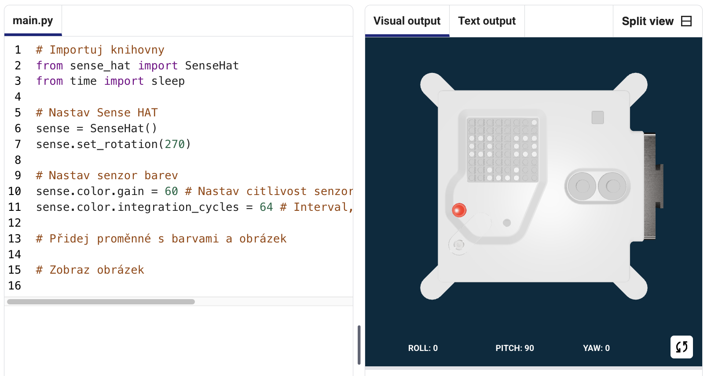
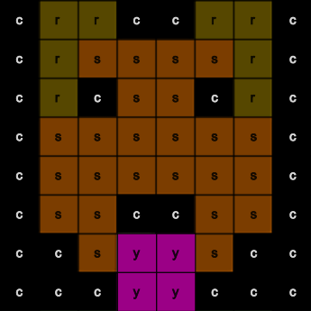
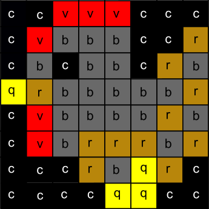

## Zobraz obrázek

LED obrazovka počítače Astro Pi umí zobrazovat barvy. V tomto kroku zobrazíš obrázky přírody na LED obrazovce počítače Astro Pi.

<p style="border-left: solid; border-width:10px; border-color: #0faeb0; background-color: aliceblue; padding: 10px;">
<span style="color: #0faeb0">**LED matice**</span> je mřížka osazená LED diodami, které můžeš ovládat jednotlivě nebo jako skupinu, a můžeš tak docílit různých světelných efektů. LED matice na desce Sense HAT má 64 LED diod v mřížce o velikosti 8 × 8. Tyto LED diody můžeš naprogramovat tak, aby vyprodukovaly širokou škálu barev.
</p>


--- task ---

Otevři [startovací projekt výzvy Mission Zero](https://missions.astro-pi.org/mz/code_submissions/){:target="_blank"}.

Uvidíš pár řádků kódu, které tam už budou automaticky přichystané.

Tento kód slouží k připojení k počítači Astro Pi a zajistí, že se jeho LED displej bude zobrazovat správně, a také nastavuje senzor barev. Ten kód tam nech, protože ho budeš potřebovat.

--- code ---
---
language: python filename: main.py line_numbers: false line_number_start: 1
line_highlights:
---
# Importuj knihovny
from sense_hat import SenseHat from time import sleep

# Nastav Sense HAT
sense = SenseHat() sense.set_rotation(270)

# Nastav senzor barev
sense.color.gain = 60 # Set the sensitivity of the sensor sense.color.integration_cycles = 64 # The interval at which the reading will be taken

--- /code ---



--- /task ---

### Barvy RGB

Barvy se dají vytvořit pomocí různých poměrů červené, zelené a modré. O barvách RGB se můžeš dozvědět zde:

[[[generic-theory-simple-colours]]]

LED matice je mřížka o velikosti 8 × 8. Každou LED diodu na mřížce lze nastavit na jinou barvu. Tady je seznam proměnných pro 24 různých barev. Každá barva obsahuje hodnotu pro červenou, zelenou a modrou:

[[[ambient-colours]]]

### Vyber obrázek

--- task ---

**Vyber:** Zvol si obrázek, který chceš zobrazit, z příkladů uvedených níže. Python ukládá informaci o obrázku do seznamu. Kód každého obrázku obsahuje proměnné použitých barev a samotný seznam.

Budeš muset **zkopírovat** celý kód tebou zvoleného obrázku a **vložit** ho do svého projektu pod řádek, na kterém je napsáno `# Přidej proměnné s barvami a obrázek`.

--- collapse ---

---
title: Liška
---


Vytvořil tým i_pupi z Itálie

```python
c = (0, 0, 0) # Černá
a = (255, 255, 255) # Bílá
t = (255, 140, 0) # Tmavě oranžová

obrazek = [
t, a, t, c, c, t, a, t,
t, a, t, c, c, t, a, t,
t, t, t, t, t, t, t, t,
t, a, c, t, t, c, a, t,
t, t, t, t, t, t, t, t,
a, a, a, c, c, a, a, a,
c, a, a, a, a, a, a, c,
c, c, a, a, a, a, c, c]

```

--- /collapse ---


--- collapse ---

---
title: Slon
---


Vytvořil tým ILiFanT z Finska

```python
c = (0, 0, 0) # Černá
b = (105, 105, 105) # Tmavě šedá
a = (255, 255, 255) # Bílá

obrazek = [
    c, c, c, c, c, c, c, c,
    c, b, b, b, c, c, c, c,
    c, b, c, b, c, c, b, b,
    c, b, c, c, c, b, b, b,
    c, b, b, c, c, b, c, b,
    c, b, b, b, b, b, b, b,
    c, c, b, b, a, b, b, b,
    c, c, c, c, a, b, b, b]

```

--- /collapse ---

--- collapse ---
---
title: Paxi
---


Vytvořil tým 6TETHASI z Nizozemska

```python
a = (255, 255, 255) # Bílá
c = (0, 0, 0) # Černá
n = (154, 205, 50) # Žlutozelená
q = (255, 255, 0) # Žlutá
t = (255, 140, 0) # Tmavě oranžová

obrazek = [   
  q, q, c, n, c, c, a, c,
  q, c, c, n, c, a, a, a,
  c, n, c, n, c, c, c, c,
  c, n, n, n, c, n, c, c,
  c, a, n, n, n, n, c, c,
  a, a, a, n, c, a, a, a,
  c, c, c, n, a, a, a, c,
  t, t, t, t, t, t, t, t]

```

--- /collapse ---


--- collapse ---
---
title: Krokodýl
---



Vytvořil tým ptpr_07 ze Španělska

```python

a = (255, 255, 255) # Bílá
c = (0, 0, 0) # Černá
f = (25, 25, 112) # Půlnoční modrá
m = (34, 139, 34) # Lesní zelená

obrazek = [
  m, m, m, m, m, c, c, c,
  m, f, m, f, m, m, m, m,
  m, m, m, m, m, m, m, m,
  m, m, c, a, c, c, c, a,
  m, m, c, c, c ,c ,c ,c,
  m, m, c, c, c, a, c, c,
  m, m, m, m, m, m, m, m,
  m, m, m, m, m, m, m, m]


```

--- /collapse ---

--- collapse ---
---
title: Duha
---


Vytvořil tým The_ETs z Velké Británie

```python

c = (100, 149, 237) # Chrpově modrá
a = (255, 255, 255) # Bílá
v = (255, 0, 0) # Červená
t = (255, 140, 0) # Tmavě oranžová
q = (255, 255, 0) # Žlutá
l = (0, 255, 127) # Jarní zelená
e = (0, 0, 205) # Středně modrá

duha = [
  c, c, c, c, c, c, c, c, 
  v, v, v, v, c, c, c, c,
  t, t, t, t, v, v, c, c,
  q, q, q, q, t, v, c, c,
  l, l, l, l, q, t, v, c,
  e, e, e, l, q, t, v, c,
  c, c, e, a, a, a, a, c,
  c, a, a, a, a, a, a, a
]

```

--- /collapse ---

--- collapse ---
---
title: Drak
---


Vytvořil tým Val z Řecka

```python

b = (105, 105, 105) # Tlumeně šedá
c = (0, 0, 0) # Černá
d = (100, 149, 237) # Chrpově modrá
v = (255, 0, 0) # Červená
z = (153, 50, 204) # Tmavá orchidej

obrazek = [
    c, c, v, c, v, c, c, c,
    c, z, z, z, z, v, c, c,
    z, b, z, b, z, c, c, c,
    z, z, z, z, z, v, c, c,
    c, c, d, d, d, c, c, z,
    c, z, d, z, z, z, z, c,
    c, c, d, d, z, c, c, c,
    c, c, z, c, z, c, c, c]

```

--- /collapse ---

--- collapse ---
---
title: Slepice
---



Vytvořil tým Slepicky z Česka

```python

a = (255, 255, 255) # Bílá
c = (0, 0, 0) # Černá
f = (25, 25, 112) # Půlnoční modrá
m = (34, 139, 34) # Lesní zelená

obrazek = [
  m, m, m, m, m, c, c, c,
  m, f, m, f, m, m, m, m,
  m, m, m, m, m, m, m, m,
  m, m, c, a, c, c, c, a,
  m, m, c, c, c ,c ,c ,c,
  m, m, c, c, c, a, c, c,
  m, m, m, m, m, m, m, m,
  m, m, m, m, m, m, m, m]

# Zobraz obrázek
sense.set_pixels(obrazek)

```

--- /collapse ---

--- /task ---

--- task ---

**Najdi:** řádek, na kterém je napsáno `# Zobraz obrázek` a přidej řádek kódu, který zobrazí tvůj obrázek na LED matici:

--- code ---
---
language: python filename: main.py line_numbers: false line_number_start: 1
line_highlights: 18, 19
---
Neukazuje se mi obrázek:

image = [ d, d, z, d, d, d, d, d, d, d, d, z, z, d, d, d, z, d, q, q, q, q, d, d, z, z, q, q, q, c, q, d, z, z, z, q, q, q, q, d, z, z, q, q, q, q, q, d, z, d, q, z, z, q, d, d, d, d, d, z, d, d, d, d]

# Zobraz obrázek
sense.set_pixels(image)

--- /code ---

--- /task ---

--- task ---

Klepni na tlačítko **Spustit** v dolní části editoru a tvůj obrázek se zobrazí na LED matici.

--- /task ---

--- task ---

**Ladění**

Můj kód má chyby v syntaxi:

- Zkontroluj si, jestli tvůj kód odpovídá kódu v příkladech uvedených výše.
- Zkontroluj si, jestli je tvůj kód seznamu správně odsazený.
- Zkontroluj si, jestli je tvůj seznam ohraničený závorkami `[` a `]`.
- Zkontroluj si, jestli je každá proměnná s barvou oddělená čárkou.

Neukazuje se mi obrázek:

- Zkontroluj si, jestli řádek `sense.set_pixels(obrazek)` není odsazený.

--- /task ---


--- task ---

**Ulož si svůj postup**

Po zobrazení obrázku můžeš svůj program uložit do startovacího projektu výzvy zadáním názvu týmu, jmen členů týmu a kódu třídy, který ti byl přidělen. Program můžeš načíst na jakémkoli zařízení s připojením k internetu tak, že zadáš název týmu a kód třídy.


--- /task --- 
