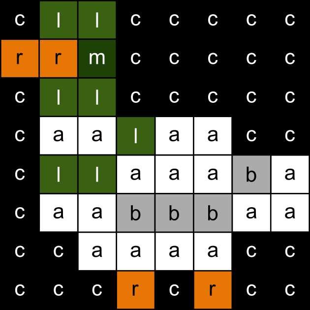
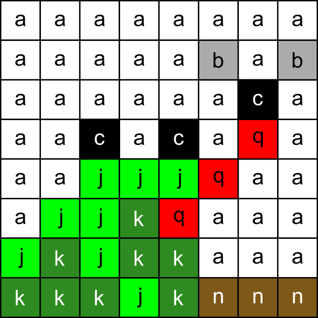

## Zobraz obrázek

Obrázek, který zobrazíš, bude tvořit 64 barevných čtverečků, kterým se říká **pixely**. Tyto pixely jsou uspořádány v mřížce o velikost 8 × 8. Každý pixel může mít jinou barvu. Pečlivým výběrem barev můžeš vytvořit obrázek. Tady je příklad velryby vytvořené za použití různých odstínů modré na černém pozadí.

<p style="border-left: solid; border-width:10px; border-color: #0faeb0; background-color: aliceblue; padding: 10px;">
<span style="color: #0faeb0">**LED matice**</span> je mřížka osazená LED diodami, které můžeš ovládat jednotlivě nebo jako skupinu, a můžeš tak docílit různých světelných efektů. LED matice na desce Sense HAT má 64 LED diod v mřížce o velikosti 8 × 8. Tyto LED diody můžeš naprogramovat tak, aby vyprodukovaly širokou škálu barev.
</p>


Všimni si, že každý čtvereček je označen kódem, který představuje určitou barvu. V tomto obrázku jsou použity 3 barvy:
+ c = černá
+ f = oceánská modř
+ g = nebesky modrá


--- task ---

Otevři [startovací projekt výzvy Mission Zero](https://missions.astro-pi.org/cs/mz/code_submissions/){:target="_blank"}.

Uvidíš pár řádků kódu, které tam už budou automaticky přichystané.

Tento kód slouží k připojení k počítači Astro Pi a zajistí, že se jeho LED displej bude zobrazovat správně, a také nastavuje senzor barev. Ten kód tam nech, protože ho budeš potřebovat.

--- code ---
---
language: python
filename: main.py
line_numbers: false
line_number_start: 1
line_highlights: 
---
# Importuj knihovny
from sense_hat import SenseHat
from time import sleep

# Nastav Sense HAT
sense = SenseHat()
sense.set_rotation(270)

# Nastav senzor barev
sense.color.gain = 60 # Nastav citlivost senzoru
sense.color.integration_cycles = 64 # Interval, který udává frekvenci měření ze senzoru

--- /code ---


--- /task ---

### Barvy RGB

Barvy se dají vytvořit pomocí různých poměrů červené, zelené a modré. O barvách RGB se můžeš dozvědět zde:


LED matice je mřížka o velikosti 8 × 8. Každou LED diodu na mřížce lze nastavit na jinou barvu. Jako názvy proměnných můžeme použít písmena od A do Z, která budou představovat 24 různých barev. Každá barva obsahuje hodnotu pro červenou, zelenou a modrou.

--- collapse ---

---
title: Seznam proměnných s barvami
---


```python
a = (255, 255, 255) # Bílá
b = (171, 171, 171) # Šedá
c = (0, 0, 0)       # Černá
d = (25, 25, 113)   # Námořnická modrá
e = (0, 0, 255)     # Čistě modrá
f = (36, 128, 200)  # Oceánská modř
g = (0, 204, 255)   # Nebesky modrá
h = (86, 255, 255)  # Elektrická modrozelená
j = (0, 255, 0)     # Čistě zelená
k = (46, 139, 33)   # Listově zelená
l = (57, 97, 17)    # Olivově zelená
m = (30, 65, 6)     # Lesní zelená
n = (126, 88, 25)   # Hnědá hlína
o = (179, 96, 65)   # Hnědá terakota
p = (180, 34, 34)   # Cihlově červená
q = (255, 0, 0)     # Čisté červená
r = (232, 118, 5)   # Oranžová
s = (241, 231, 100) # Bledě žlutá
t = (255, 255, 0)   # Čistě žlutá
u = (255, 209, 209) # Bledě růžová
v = (255, 177, 177) # Růžová tvářenka
w = (249, 169, 255) # Světle růžová
y = (248, 97, 255)  # Purpurová
z = (220, 53, 232)  # Fialová

```

--- /collapse ---

### Vyber obrázek

--- task ---

**Vyber:** Zvol si obrázek, který chceš zobrazit, z příkladů uvedených níže. Python ukládá informaci o obrázku do seznamu. Kód každého obrázku obsahuje proměnné použitých barev a samotný seznam.

Budeš muset **zkopírovat** celý kód tebou zvoleného obrázku a **vložit** ho do svého projektu pod řádek, na kterém je napsáno `# Přidej proměnné s barvami a obrázek`.

--- collapse ---

---
title: Velryba
---


Vytvořil tým Naicom z Itálie

```python
c = (0, 0, 0)       # Černá
f = (36, 128, 200)  # Oceánská modř
g = (0, 204, 255)   # Nebesky modrá

obrazek = [
c, g, c, g, c, c, c, c,
c, c, g, c, c, f, f, f,
c, f, f, f, c, c, f, a,
f, f, c, f, f, c, f, c,
f, f, f, f, f, c, f, c,
g, f, f, f, f, f, f, c,
g, g, g, g, g, g, c, c,
c, g, g, g, g, c, c, c]

```

--- /collapse ---


--- collapse ---

---
title: Citrón
---


Vytvořil tým g4lemoni z Řecka

```python
c = (0, 0, 0)       # Černá
k = (46, 139, 33)   # Listově zelená
t = (255, 255, 0)   # Čistě žlutá

obrazek = [
c, c, c, k, k, c, c, c,
c, c, k, c, k, c, c, c,
c, k, c, t, t, c, c, c,
c, c, t, t, t, t, c, c,
c, c, t, t, t, t, c, c,
c, c, t, t, t, t, c, c,
c, c, t, t, t, t, c, c,
c, c, c, t, t, c, c, c]

```

--- /collapse ---

--- collapse ---
---
title: Prasátko
---


Vytvořil Gary z Velké Británie

```python
a = (255, 255, 255) # Bílá
v = (255, 177, 177) # Růžová tvářenka
y = (248, 97, 255)  # Purpurová
o = (179, 96, 65)   # Hnědá terakota
c = (0, 0, 0)       # Černá

obrazek = [
a, a, y, a, a, y, a, a,
a, y, y, y, y, y, y, a,
a, y, c, y, c, y, y, y,
v, v, v, v, v, y, y, y,
v, o, v, o, v, y, y, y,
v, v, v, v, v, y, y, y,
a, y, y, y, y, y, y, y,
a, a, y, a, a, a, y, a]

```

--- /collapse ---


--- collapse ---
---
title: Bouřka
---


Vytvořil tým hop2p023 ze Španělska

```python

c = (0, 0, 0)       # Černá
f = (36, 128, 200)  # Oceánská modř
g = (0, 204, 255)   # Nebesky modrá
t = (255, 255, 0)   # Čistě žlutá

obrazek = [
c, c, c, c, c, c, c, c,
c, c, f, f, f, f, c, c,
c, f, f, f, f, f, f, c,
c, g, c, g, t, g, c, c,
c, c, c, t, t, c, c, c,
c, c, t, t, c, c, c, c,
c, c, g, c, c, c, c, g,
c, g, c, c, c, c, c, c]


```

--- /collapse ---

--- collapse ---
---
title: Kachna
---



Vytvořil Peter z Irska

```python

c = (0, 0, 0) # Černá
l = (57, 97, 17)    # Olivově zelená
m = (30, 65, 6)     # Lesní zelená
r = (232, 118, 5)   # Oranžová
a = (255, 255, 255) # Bílá
b = (171, 171, 171) # Šedá

obrazek = [
c, l, l, c, c, c, c, c,
r, r, m, c, c, c, c, c,
c, l, l, c, c, c, c, c,
c, a, a, l, a, a, c, c,
c, l, l, a, a, a, b, a,
c, a, a, b, b, b, a, a,
c, c, a, a, a, a, c, c,
c, c, c, r, c, r, c, c]

```

--- /collapse ---

--- collapse ---
---
title: Žába
---



Vytvořil tým Jmeno z České republiky

```python

a = (255, 255, 255) # Bílá
b = (171, 171, 171) # Šedá
c = (0, 0, 0)       # Černá
q = (255, 0, 0)     # Čistě červená
j = (0, 255, 0)     # Čistě zelená
k = (46, 139, 33)   # Listově zelená
n = (126, 88, 25)   # Hnědá hlína

obrazek = [
a, a, a, a, a, a, a, a,
a, a, a, a, a, b, a, b,
a, a, a, a, a, a, c, a,
a, a, c, a, c, a, q, a,
a, a, j, j, j, q, a, a,
a, j, j, k, q, a, a, a,
j, k, j, k, k, a, a, a,
k, k, k, j, k, n, n, n]

```

--- /collapse ---

--- collapse ---
---
title: Kvetoucí strom
---


Vytvořil tým Zssh14 ze Slovenska

```python

t = (255, 255, 0)   # Čistě žlutá
g = (0, 204, 255)   # Nebesky modrá
w = (249, 169, 255) # Světle růžová
y = (248, 97, 255)  # Purpurová
z = (220, 53, 232)  # Fialová
n = (126, 88, 25)   # Hnědá hlína
o = (179, 96, 65)   # Hnědá terakota
k = (46, 139, 33)   # Listově zelená

obrazek =  [
t, g, g, w, w, y, g, g,
g, g, w, w, y, y, z, g,
g, w, y, z, y, z, z, z,
w, y, z, z, g, n, w, g,
g, g, o, o, n, w, y, z,
g, g, g, g, n, g, g, g,
g, g, g, o, n, n, g, g,
k, k, o, n, n, n, k, k]

```

--- /collapse ---

--- /task ---

--- task ---

**Najdi:** řádek, na kterém je napsáno `# Zobraz obrázek` a přidej řádek kódu, který zobrazí tvůj obrázek na LED matici:

--- code ---
---
language: python
filename: main.py
line_numbers: false
line_number_start: 1
line_highlights: 17, 18
---
c = (0, 0, 0)       # Černá
f = (36, 128, 200)  # Oceánská modř
g = (0, 204, 255)   # Nebesky modrá

obrazek = [
c, g, c, g, c, c, c, c,
c, c, g, c, c, f, f, f,
c, f, f, f, c, c, f, a,
f, f, c, f, f, c, f, c,
f, f, f, f, f, c, f, c,
g, f, f, f, f, f, f, c,
g, g, g, g, g, g, c, c,
c, g, g, g, g, c, c, c]

# Zobraz obrázek
sense.set_pixels(obrazek)

--- /code ---

--- /task ---

--- task ---

Klepni na tlačítko **Spustit** v dolní části editoru a tvůj obrázek se zobrazí na LED matici.

--- /task ---

--- task ---

**Ladění**

Můj kód má chyby v syntaxi:

- Zkontroluj si, jestli tvůj kód odpovídá kódu v příkladech uvedených výše.
- Zkontroluj si, jestli je tvůj kód seznamu správně odsazený.
- Zkontroluj si, jestli je tvůj seznam ohraničený závorkami `[` a `]`.
- Zkontroluj si, jestli je každá proměnná s barvou oddělená čárkou.

Neukazuje se mi obrázek:

- Zkontroluj si, jestli řádek `sense.set_pixels(obrazek)` není odsazený.

--- /task ---


--- task --- 

**Ulož si svůj postup**

Po zobrazení obrázku můžeš svůj program uložit do startovacího projektu výzvy zadáním názvu týmu, jmen členů týmu a kódu třídy, který ti byl přidělen. Program můžeš načíst na jakémkoli zařízení s připojením k internetu tak, že zadáš název týmu a kód třídy.


--- /task --- 

