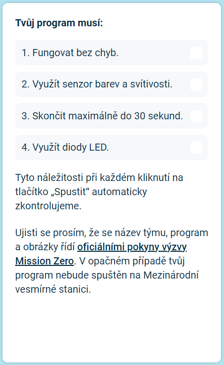
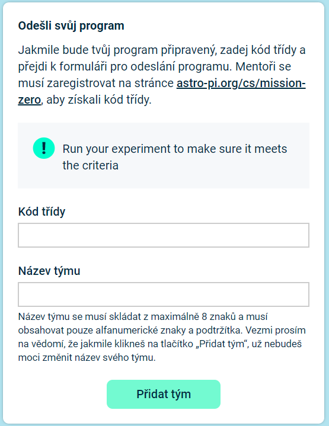

## Odešli svůj příspěvek

Pokud chceš svůj kód odeslat ke spuštění na Mezinárodní vesmírné stanici, musí se řídit několika pravidly. Pokud se jimi řídí, tak se pravidla v dolní části **emulátoru Sense HAT** při spuštění programu rozsvítí zeleně.

**Tip:** Otestuj svůj kód s různými hodnotami barev (pomocí kapátka) a ujisti se, že vždy funguje.

Ujisti se prosím, že se tvůj příspěvek řídí [oficiálními pokyny](https://astro-pi.org/mission-zero/guidelines){:target="_blank"} výzvy Mission Zero. Pokud se jimi neřídí, tvůj program nebude spuštěn na Mezinárodní vesmírné stanici.

Neuváděj prosím do názvu týmu ani kódu:

+ cokoli, co by mohlo být interpretováno jako nelegální, politické, nebo popudlivé,
+ vlajky, které mohou být považovány za politicky popudlivé,
+ cokoli, co odkazuje na nepříjemnost nebo újmu způsobenou jiné osobě,
+ osobní údaje, jako jsou telefonní čísla, odkazy na sociální média nebo e-mailové adresy,
+ neslušné obrázky,
+ speciální znaky nebo emotikony,
+ vulgární výrazy nebo nadávky.

--- task ---

Do rámečku dole zadej název týmu a kód třídy, který ti sdělí tvůj mentor.

**Poznámky pro mentory** jsou v [úvodním](https://projects.raspberrypi.org/en/projects/astro-pi-mission-zero/0) kroku.

--- /task ---

--- task ---

Stiskni tlačítko **Přidat tým** a zadej kód. Vezmi prosím na vědomí, že po odeslání nelze program upravit.

Tvůj mentor obdrží e-mail s potvrzením, že byl tvůj příspěvek odeslán.

--- /task ---

--- task ---

Jestli chceš, můžeš odkaz na svůj kód sdílet na sociálních sítích a pochlubit se tak, že tvůj kód poběží ve vesmíru!

--- /task ---
