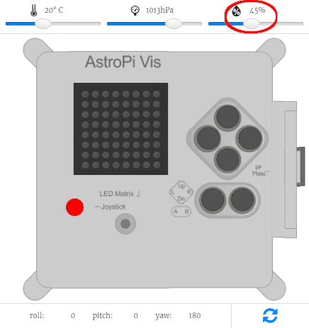

## Změř vlhkost

Senzor vlhkosti v Astro Pi dokáže měřit vlhkost okolního vzduchu. To je užitečná funkce, která ti pomůže shromažďovat údaje o podmínkách ve vesmíru.


Astro Pi měří vlhkost na ISS v procentech koncentrace vody ve vzduchu.

Součástí tvé mise je podílet se na každodenním životě posádky na palubě ISS, takže je uklidní, když jim sdělíš, že vlhkost na palubě vesmírné stanice je v normě.

[[[generic-theory-what-is-humidity]]]

--- task ---

Přidej tenhle kód pro změření vlhkosti:

```python
vlhkost = sense.get_humidity()
```

Tenhle řádek kódu změří aktuální vlhkost a uloží naměřenou hodnotu do proměnné `vlhkost`.

--- /task ---

--- task ---

Vlhkost se zaznamenává velmi přesně, proto bude mít uložená hodnota velký počet desetinných míst. Hodnotu můžeš zaokrouhlit na libovolný počet desetinných míst. V příkladu zaokrouhlujeme na jedno desetinné místo, ale když číslo `1` změníš na jiné číslo, dostaneš jiný počet desetinných míst.

```python
vlhkost = round(sense.get_humidity(), 1)
```

--- /task ---

--- task ---

Pokud chceš, aby aktuální vlhkost po displeji běžela, přidej tenhle řádek kódu:

```python
sense.show_message(str(vlhkost))
```

Část `str()` převádí vlhkost z čísla na text tak, aby ji Astro Pi mohlo zobrazit.

--- /task ---

--- task ---

Vlhkost můžeš také zobrazit jako součást jiné zprávy, jestliže spojíš částí zprávy pomocí znaménka `+`.

```python
sense.show_message( "Je " + str(vlhkost) + " %" )
```

--- /task ---

Skutečné Astro Pi bude měřit vlhkost kolem sebe, ale ty můžeš pomocí posuvníku na emulátoru Sense HAT simulovat změnu vlhkosti a vyzkoušet si tak svůj kód.



**Poznámka:** Možná tě zajímá, proč posuvník vlhkosti zobrazuje vlhkost jako celé číslo, zatímco zobrazená hodnota je desetinné číslo. Emulátor simuluje maličkou míru nepřesnosti skutečného senzoru, takže získaná hodnota z měření vlhkosti může být nepatrně větší nebo menší než hodnota, kterou nastavuješ pomocí posuvníku.
