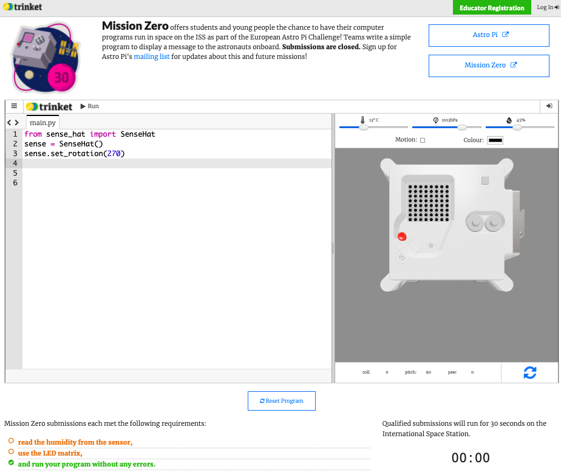

## Odešli svůj příspěvek

Pokud chceš svůj kód odeslat ke spuštění na Mezinárodní vesmírné stanici, musí se řídit několika pravidly. Pokud se jim řídí, tak se pravidla v dolní části [emulátoru Sense HAT](https://trinket.io/mission-zero) při spuštění programu rozsvítí zeleně.

1. Proveďte měření vlhkosti.
1. Rozsviťte LED diody.
1. Ensure your code runs all the way to the end without any errors occurring. You should not include any `while True` loops in your code as this will keep you code running and prevent it from finishing.
1. Test your code with a few different humidity settings (using the slider) to make sure it will always run correctly.

Také se ujistěte, že jste splnili následující kritéria:

1. Ujistěte se, že vaše zpráva pro astronauty není delší než 30 sekund, protože váš kód poběží na ISS právě 30 sekund
1. Nepoužívejte žádné metody vyžadující vstup
1. Importujte jen z modulů `sense_hat`, `time`, a `random`
1. V kódu nesmějí být žádné vulgární výrazy

Když jsou všechna pravidla zelená, všechno je připravené a kód můžete odeslat.

--- task ---

Do rámečku dole zadejte svůj kód třídy – řekne vám ho učitel.

**Poznámky pro učitele nebo mentory** najdete v kroku [Úvod](https://projects.raspberrypi.org/cs-CZ/projects/astro-pi-mission-zero/1).

--- /task ---

--- task ---

Your teacher's name will appear. If it is the right name, click on the green **Continue to form** button.

--- /task ---

--- task ---

Enter your team name and the names of the team members. These will be printed on the certificate once your code is run in space, so make sure you spell them correctly!

--- /task ---

--- task ---

Press the **Submit** button to enter your code. Your teacher or mentor will get an email to confirm your entry.

--- /task ---

--- task ---

Jestli chcete, můžete odkaz na svůj kód sdílet na sociálních sítích, abyste se pochlubili, že kód, který jste napsali, poběží ve vesmíru!

--- /task ---
