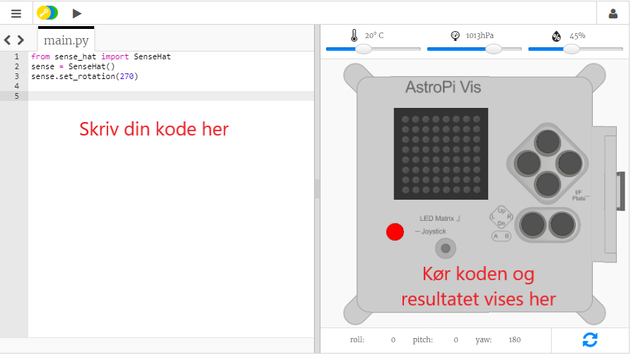

## Hvad er en Astro Pi?

En Astro Pi er en Raspberry Pi-computer indkapslet i et kabinet, der er specialdesignet til forhold i rummet. Den har også et add-on board, der kaldes Sense HAT og er specialfremstillet til Astro Pi-missionen. Sense HAT har et joystick, et LED-display og sensorer til optagelse af temperatur, fugtighed, tryk og retning.

Her er en rigtig Astro Pi-enhed på den internationale rumstation, der kører noget kode skrevet af eleverne. Det er her, din kode bliver kørt til sidst! <iframe width="560" height="315" src="https://www.youtube.com/embed/4ykbAJeGPMM" frameborder="0" allow="accelerometer; autoplay; encrypted-media; gyroscope; picture-in-picture" allowfullscreen mark="crwd-mark"></iframe> 

>

Til denne mission kommer du til at anvende Sense HAT-emulatoren. The emulator is a piece of software which simulates all of the functions of the Astro Pi in your web browser.

There are a few differences between the real and the emulated Sense HAT:

- På emulatoren kan du selv indstille temperatur, tryk og fugtighed ved hjælp af skydere, hvorimod den rigtige Sense HAT i Astro Pi anvender sensorer til at måle disse parametre i dens omgivelser.

- Du kan anvende musen til at klikke på og trække i emuleringen af Sense HAT for at flytte og dreje den, så der simuleres ændringer af dens retning; den rigtige Astro Pi (og dens Sense HAT) kan bevæge sig i den virkelige verden, og retningssensorerne på Sense HAT registrerer, hvornår og hvordan den har bevæget sig.