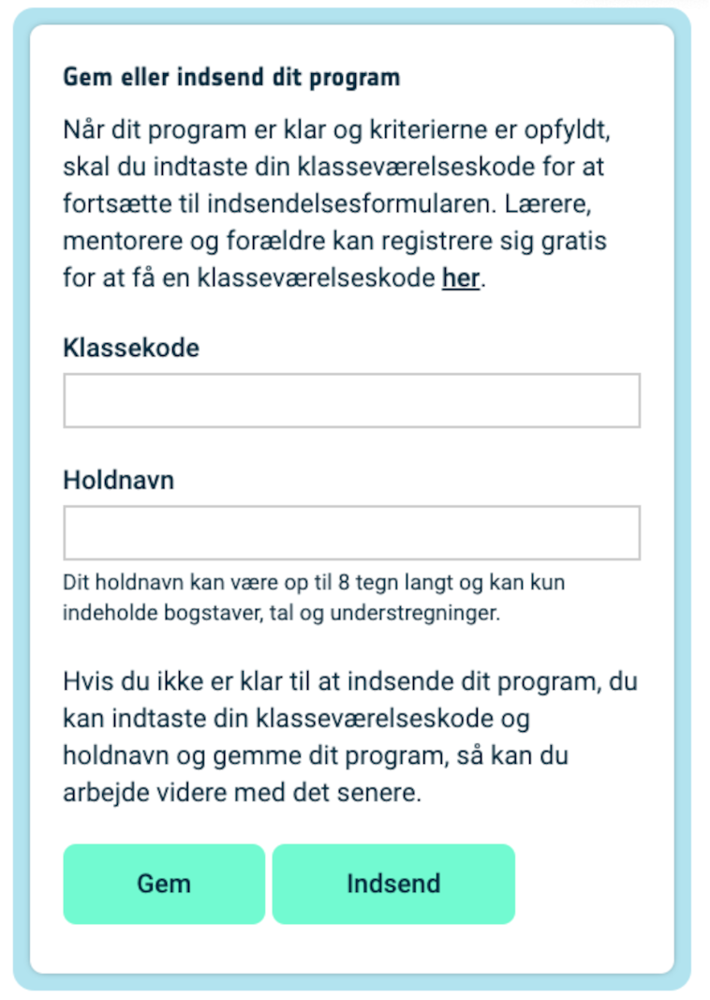

## Vis et billede

Astro Pi'ens LED-matrix kan vise farver. I dette trin skal du vise billeder fra naturen på Astro Pi'ens LED-matrix.

<p style="border-left: solid; border-width:10px; border-color: #0faeb0; background-color: aliceblue; padding: 10px;">
En <span style="color: #0faeb0">**LED-matrix**</span> er et gitter af lysdioder, der kan styres individuelt eller som en gruppe til at skabe forskellige lyseffekter. LED-matrixen på Sense HAT har 64 lysdioder viset i et 8 x 8 gitter. Lysdioderne kan programmeres til at vise et stort udvalg af farver.
</p>


--- task ---

Åbn [Mission Zero startprojektet](https://missions.astro-pi.org/da/mz/code_submissions/new){:target="_blank"}.

Her kan du se, at der automatisk er blevet tilføjet tre linjer kode for dig.

Denne kode opretter forbindelse til Astro Pi'en og sørger for, at LED-displayet vises korrekt og indstiller farvesensoren. Lad koden stå, for du får brug for den.

--- code ---
---
language: python
filename: main.py
line_numbers: false
line_number_start: 1
line_highlights: 
---
# Importér bibliotekerne
from sense_hat import SenseHat
from time import sleep

# Konfigurer Sense HAT
sense = SenseHat()
sense.set_rotation(270)

# Konfigurer farvesensoren
sense.color.gain = 60 # Indstil sensorens følsomhed
sense.color.integration_cycles = 64 # Intervallet, som aflæsningen vil blive taget med


--- /code ---


--- /task ---

### RGB farver

Farver kan laves ved hjælp af forskellige blandinger af rød, grøn og blå. Du kan lære om RGB farver her:

[[[generic-theory-simple-colours]]]

LED-matrixen er et 8 x 8 gitter. Hvert LED på gitteret kan indstilles til en anden farve. Her er en liste over variabler for 24 forskellige farver. Hver farve har en værdi for rød, grøn og blå:

[[[ambient-colours]]]

### Vælg et billede

--- task ---

**Vælg:** Vælg et billede, der skal vises, blandt mulighederne nedenfor. Python gemmer informationen om et billede i en liste. Koden for hvert billede inkluderer de anvendte farvevariabler og listen.

Du skal **kopiere** hele koden for dit valgte billede og derefter **indsætte** den i dit projekt under den linje, der siger `# Tilføj farvevariabler og billede`.

--- collapse ---

---
title: Ræv
---


Lavet af team i_pupi, Italien

```python
c = (0, 0, 0) # Sort
a = (255, 255, 255) # Hvid
t = (255, 140, 0) # Mørk orange

billede = [
t, a, t, c, c, t, a, t,
t, a, t, c, c, t, a, t,
t, t, t, t, t, t, t, t,
t, a, c, t, t, c, a, t,
t, t, t, t, t, t, t, t,
a, a, a, c, c, a, a, a,
c, a, a, a, a, a, a, c,
c, c, a, a, a, a, c, c]
```

--- /collapse ---

--- collapse ---

---
title: Elefant
---


Lavet af team ILiFanT, Finland

```python
c = (0, 0, 0) # Sort
b = (105, 105, 105) # Mørkegrå
a = (255, 255, 255) # Hvid

billede = [
    c, c, c, c, c, c, c, c,
    c, b, b, b, c, c, c, c,
    c, b, c, b, c, c, b, b,
    c, b, c, c, c, b, b, b,
    c, b, b, c, c, b, c, b,
    c, b, b, b, b, b, b, b,
    c, c, b, b, a, b, b, b,
    c, c, c, c, a, b, b, b]
```

--- /collapse ---

--- collapse ---
---
title: Kaktus
---


Lavet af team 6TETHASI, Holland

```python
a = (255, 255, 255) # Hvid
c = (0, 0, 0) # Sort
n = (154, 205, 50) # GulGrøn
q = (255, 255, 0) # Gul
t = (255, 140, 0) # Mørk orange

billede = [   
  q, q, c, n, c, c, a, c,
  q, c, c, n, c, a, a, a,
  c, n, c, n, c, c, c, c,
  c, n, n, n, c, n, c, c,
  c, a, n, n, n, n, c, c,
  a, a, a, n, c, a, a, a,
  c, c, c, n, a, a, a, c,
  t, t, t, t, t, t, t, t]

```

--- /collapse ---


--- collapse ---
---
title: Krokodille
---


```python

a = (255, 255, 255) # Hvid
c = (0, 0, 0) # Sort
f = (25, 25, 112) # Midnatsblå
m = (34, 139, 34) # Skovgrøn

billede = [
  m, m, m, m, m, c, c, c,
  m, f, m, f, m, m, m, m,
  m, m, m, m, m, m, m, m,
  m, m, c, a, c, c, c, a,
  m, m, c, c, c ,c ,c ,c,
  m, m, c, c, c, a, c, c,
  m, m, m, m, m, m, m, m,
  m, m, m, m, m, m, m, m]

```

--- /collapse ---

--- collapse ---
---
title: Regnbue
---


Lavet af team camrus_6, Storbritannien

```python

c = (100, 149, 237) # KornblomstBlå
a = (255, 255, 255) # Hvid
v = (255, 0, 0) # Rød
t = (255, 140, 0) # Mørk orange
q = (255, 255, 0) # Gul
l = (0, 255, 127) # ForårsGrøn
e = (0, 0, 205) # Mellemblå

regnbue = [
  c, c, c, c, c, c, c, c, 
  v, v, v, v, c, c, c, c,
  t, t, t, t, v, v, c, c,
  q, q, q, q, t, v, c, c,
  l, l, l, l, q, t, v, c,
  e, e, e, l, q, t, v, c,
  c, c, e, a, a, a, a, c,
  c, a, a, a, a, a, a, a
]

```

--- /collapse ---

--- collapse ---
---
title: Drage
---


Lavet af team hwplucyr, Storbritannien

```python

b = (105, 105, 105) # MørkeGrå
c = (0, 0, 0) # Sort
d = (100, 149, 237) # KornblomstBlå
v = (255, 0, 0) # Rød
z = (153, 50, 204) # MørkOrkidé

billede = [
    c, c, v, c, v, c, c, c,
    c, z, z, z, z, v, c, c,
    z, b, z, b, z, c, c, c,
    z, z, z, z, z, v, c, c,
    c, c, d, d, d, c, c, z,
    c, z, d, z, z, z, z, c,
    c, c, d, d, z, c, c, c,
    c, c, z, c, z, c, c, c]

```

--- /collapse ---

--- /task ---

--- task ---

**Find:** den linje, der siger `# Vis billedet` og tilføj en linje kode for at vise dit billede på LED-matrixen:

```python
a = (255, 255, 255) # Hvid
c = (0, 0, 0) # Sort
f = (25, 25, 112) # Midnatsblå
m = (34, 139, 34) # Skovgrøn

billede = [
  m, m, m, m, m, c, c, c,
  m, f, m, f, m, m, m, m,
  m, m, m, m, m, m, m, m,
  m, m, c, a, c, c, c, a,
  m, m, c, c, c ,c ,c ,c,
  m, m, c, c, c, a, c, c,
  m, m, m, m, m, m, m, m,
  m, m, m, m, m, m, m, m]

# Vis billedet
sense.set_pixels(billede)

```

--- /task ---

--- task ---

Tryk på **Kør** i bunden af editoren for at se dit billede vist på LED-matrixen.

--- /task ---

--- task ---

**Fejlsøgning**

Min kode har en syntaksfejl:

- Tjek at din kode matcher koden i eksemplerne ovenfor
- Tjek at du har indrykket koden i din liste
- Tjek at din liste er omgivet af `[` og `]`
- Tjek at hver farvevariabel i listen er adskilt af et komma

Mit billede vises ikke:

- Tjek at din `sense.set_pixels(billede)` ikke er indrykket

--- /task ---


--- task ---

**Gem dine fremskridt**

Nu hvor du har vist et billede, kan du gemme dit program på Mission Starter-projektet ved at indtaste dit holdnavn, holdmedlemmers navne og den klasseværelseskode, som du har fået. Du kan genindlæse dit program på enhver enhed med internetforbindelse ved at indtaste dit teamnavn og klasseværelseskode.



--- /task --- 
