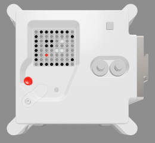
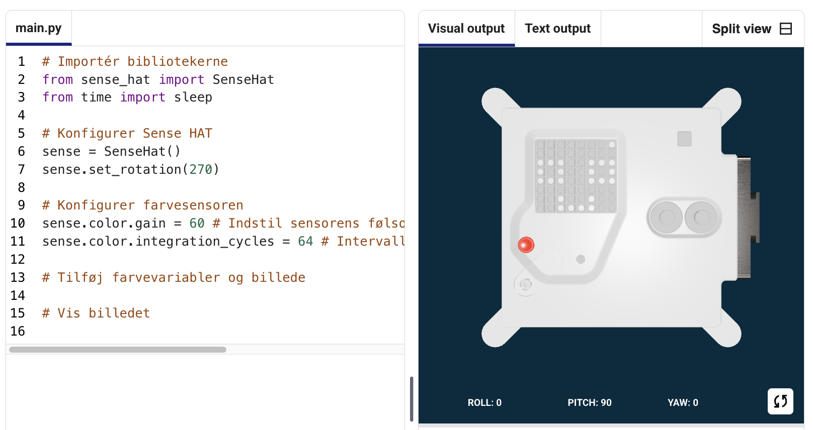

## Vis et billede

Astro Pi'ens LED-matrix kan vise farver. I dette trin skal du vise billeder fra naturen på Astro Pi'ens LED-matrix.

<p style="border-left: solid; border-width:10px; border-color: #0faeb0; background-color: aliceblue; padding: 10px;">
En <span style="color: #0faeb0">**LED-matrix**</span> er et gitter af lysdioder, der kan styres individuelt eller som en gruppe til at skabe forskellige lyseffekter. LED-matrixen på Sense HAT har 64 lysdioder viset i et 8 x 8 gitter. Lysdioderne kan programmeres til at vise et stort udvalg af farver.
</p>



--- task ---

Åbn [Mission Zero startprojektet](https://missions.astro-pi.org/da/mz/code_submissions/){:target="_blank"}.

Her kan du se, at der automatisk er blevet tilføjet tre linjer kode for dig.

Denne kode opretter forbindelse til Astro Pi'en og sørger for, at LED-displayet vises korrekt og indstiller farvesensoren. Lad koden stå, for du får brug for den.

--- code ---
---
language: python filename: main.py line_numbers: false line_number_start: 1
line_highlights:
---
# Importér bibliotekerne
from sense_hat import SenseHat from time import sleep

# Konfigurer Sense HAT
sense = SenseHat() sense.set_rotation(270)

# Konfigurer farvesensoren
sense.color.gain = 60 # Set the sensitivity of the sensor sense.color.integration_cycles = 64 # The interval at which the reading will be taken

--- /code ---



--- /task ---

### RGB farver

Farver kan laves ved hjælp af forskellige blandinger af rød, grøn og blå. Du kan lære om RGB farver her:

[[[generic-theory-simple-colours]]]

LED-matricen er et 8 x 8 gitter. Hvert LED på gitteret kan indstilles til en anden farve. Her er en liste over variabler for 24 forskellige farver. Hver farve har en værdi for rød, grøn og blå:

[[[ambient-colours]]]

### Vælg et billede

--- task ---

**Vælg:** Vælg et billede, der skal vises, blandt mulighederne nedenfor. Python gemmer informationen om et billede i en liste. Koden for hvert billede inkluderer de anvendte farvevariabler og listen.

Du skal **kopiere** hele koden for dit valgte billede og derefter **indsætte** den i dit projekt under den linje, der siger `# Tilføj farvevariabler og billede`.

--- collapse ---

---
title: Fisk
---


Lavet af holdet chalka, Polen

```python
z = (153, 50, 204) # MørkOrkidé
q = (255, 255, 0) # Gul
d = (51, 153, 255) # blå
c = (0, 0, 0) # Sort

billede = [
d, d, z, d, d, d, d,
d, d, d, z, z, d, d,
z, d, q, q, q, q, d, d,
z, z, q, q, q, c, q, d,
z, z, z, q, q, q, q, d,
z, z, q, q, q, q, q, d,
z, d, q, z, z, q, d, d,
d, d, d, z, d, d, d, d]

```

--- /collapse ---


--- collapse ---

---
titel: Hvalros
---


Lavet af holdet Walrus, Finland

```python
h = (0, 255, 255) # Cyan
c = (0, 0, 0) # Sort
s = (139, 69, 19) # Sadelbrun
a = (255, 255, 255) # Hvid
r = (184, 134, 11) # MørkGyldenris

billede = [
h, h, h, h, h, h, h, h,
h, h, s, s, s, h, h, h,
h, s, s, s, s, s, h, h,
h, s, c, s, c, s, s, s,
h, r, r, r, r, r, s, s,
h, h, a, s, a, s, s, s,
h, h, a, s, a, s, s, s,
r, r, s, s, s, s, s, s]

```

--- /collapse ---

--- collapse ---
---
title: Paxi
---


Lavet af holdet tony_pi, Italien

```python
v = (255, 0, 0) # Rød
m = (34, 139, 34) # Skovgrøn
c = (0, 0, 0) # Sort 
e = (100, 149, 237) # KornblomstBlå
l = (0, 255, 0) # Grøn

billede = [
    c, v, m, c, c, m, v, c,
    c, c, v, v, v, v, c, c,
    c, v, c, e, l, e, v, c,
    c, v, c, l, l, l, v, c,
    c, v, c, l, c, l, v, c,
    c, c, v, v, v, v, c, c,
    c, c, l, c, c, l, c, c,
    c, m, m, c, c, m, m, c]

```

--- /collapse ---


--- collapse ---
---
titel: Hund
---


Lavet af holdet ptpr_07, Spanien

```python

c = (0, 0, 0) # Sort
r = (184, 134, 11) # MørkGyldenris
s = (139, 69, 19) # Sadelbrun
y = (255, 20, 147) # DybPink

billede = [
    c, r, r, c, c, r, r, c,
    c, r, s, s, s, s, r, c,
    c, r, c, s, s, c, r, c,
    c, s, s, s, s, s, s, c,
    c, s, s, s, s, s, s, c,
    c, s, s, c, c, s, s, c,
    c, c, s, y, y, s, c, c,
    c, c, c, y, y, c, c, c]


```

--- /collapse ---

--- collapse ---
---
titel: Kamæleon
---


Lavet af holdet The_ETs, Storbritannien

```python

c = (0, 0, 0) # Sort
s = (139, 69, 19) # Sadelbrun
a = (255, 255, 255) # Hvid
v = (255, 0, 0) # Rød
t = (255, 140, 0) # MørkOrange
q = (255, 255, 0) # Gul
m = (34, 139, 34) # Skovgrøn
h = (0, 255, 255) # Cyan
z = (153, 50, 204) # MørkOrkidé
y = (255, 20, 147) # DybPink

billede = [
    a, a, v, v, t, a, a, a,
    a, v, v, t, t, q, a, a,
    v, c, t, t, q, q, m, a,
    v, t, t, q, q, m, m, h,
    s, s, q, s, s, m, s, h,
    a, a, a, a, a, a, a, z,
    a, a, a, a, y, a, a, z,
    a, a, a, a, a, y, z, a]

```

--- /collapse ---

--- collapse ---
---
titel: Drage
---


Lavet af holdet Val, Grækenland

```python

c = (0, 0, 0) # Sort
m = (34, 139, 34) # Skovgrøn
v = (255, 0, 0) # Rød
q = (255, 255, 0) # Gul
e = (0, 0, 205) # Mellemblå
h = (0, 255, 255) # Cyan

billede = [
    h, h, h, h, h, h, h, h, 
    h, h, h, e, e, v, v, h, 
    h, h, h, e, e, v, v, h, 
    h, h, h, q, q, m, m, h, 
    h, h, h, q, q, m, m, h,
    h, h, c, h, h, h, h, h, 
    h, c, h, h, h, h, h, h, 
    c, h, h, h, h, h, h, h]

```

--- /collapse ---

--- collapse ---
---
title: Kylling
---


Lavet af holdet Slepicky, Tjekkiet

```python

v = (255, 0, 0) # Rød
c = (0, 0, 0) # Sort
b = (105, 105, 105) # MørkeGrå
q = (255, 255, 0) # Gul
r = (184, 134, 11) # MørkGyldenris

billede =  [
    c, c, v, v, v, c, c, c,
    c, v, b, b, r, c, c, r,
    c, b, c, b, b, c, r, b,
    q, r, b, b, b, b, b, r,
    c, v, b, b, b, b, r, b,
    c, v, b, r, r, r, b, r,
    c, c, c, r, b, q, r, c,
    c, c, c, c, q, q, c, c]

```

--- /collapse ---

--- /task ---

--- task ---

**Find:** linjen, der siger `# Vis billedet”`, og tilføj en linje kode for at vise dit billede på LED-matricen:

--- code ---
---
language: python filename: main.py line_numbers: false line_number_start: 1
line_highlights: 18, 19
---
z = (153, 50, 204) # MørkOrkidé q = (255, 255, 0) # Gul d = (51, 153, 255) # blå c = (0, 0, 0) # Sort

image = [ d, d, z, d, d, d, d, d, d, d, d, z, z, d, d, d, z, d, q, q, q, q, d, d, z, z, q, q, q, c, q, d, z, z, z, q, q, q, q, d, z, z, q, q, q, q, q, d, z, d, q, z, z, q, d, d, d, d, d, z, d, d, d, d]

# Vis billedet
sense.set_pixels(image)

--- /code ---

--- /task ---

--- task ---

Tryk på **Kør** i bunden af editoren for at se dit billede vist på LED-matrixen.

--- /task ---

--- task ---

**Fejlsøgning**

Min kode har en syntaksfejl:

- Tjek at din kode matcher koden i eksemplerne ovenfor
- Tjek at du har indrykket koden i din liste
- Tjek at din liste er omgivet af `[` og `]`
- Tjek at hver farvevariabel i listen er adskilt af et komma

Mit billede vises ikke:

- Tjek at din `sense.set_pixels(billede)` ikke er indrykket

--- /task ---


--- task ---

**Gem dine fremskridt**

Nu hvor du har vist et billede, kan du gemme dit program på Mission Starter-projektet ved at indtaste dit holdnavn, holdmedlemmers navne og den klasseværelseskode, som du har fået. Du kan genindlæse dit program på enhver enhed med internetforbindelse ved at indtaste dit teamnavn og klasseværelseskode.


--- /task --- 
