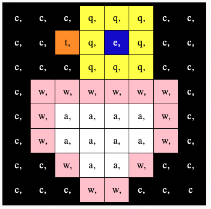

## Vis et billede

Astro Pi'ens LED-matrix kan vise farver. I dette trin skal du vise billeder fra naturen på Astro Pi'ens LED-matrix.

En **LED-matrix** er et gitter af lysdioder, der kan styres individuelt eller som en gruppe til at skabe forskellige lyseffekter. LED-matrixen på Sense HAT har 64 lysdioder viset i et 8 x 8 gitter. Lysdioderne kan programmeres til at vise et stort udvalg af farver.

--- task ---

Åbn [Mission Zero startprojektet](https://missions.astro-pi.org/da/mz/code_submissions/new){:target="_blank"}.

Her kan du se, at der automatisk er blevet tilføjet tre linjer kode for dig.

Denne kode opretter forbindelse til Astro Pi'en og sørger for, at LED-displayet vises korrekt og indstiller farvesensoren. Lad koden stå, for du får brug for den.

--- code ---
---
Tilføj denne linje under den anden kode:
title: Hvilke tegn kan bruges?
---
# Importér bibliotekerne
from sense_hat import SenseHat from time import sleep

# Konfigurer Sense HAT
sense = SenseHat() sense.set_rotation(270)

# Konfigurer farvesensoren
Tryk på knappen **Run** (Kør) og kig på, mens beskeden `Astro Pi` ruller hen over LED-displayet.

--- /code ---

--- /task ---

### Vælg et navn til de nye Astro Pi -computere

Farver kan laves ved hjælp af forskellige blandinger af rød, grøn og blå. Du kan lære om RGB farver her:

[[[generic-theory-simple-colours]]]

LED-matrixen er et 8 x 8 gitter. Hvert LED på gitteret kan indstilles til en anden farve. Her er en liste over variabler for 24 forskellige farver. Hver farve har en værdi for rød, grøn og blå:

[[[ambient-colours]]]

### Vælg et billede

--- task ---

**Vælg:** Vælg et billede, der skal vises, blandt mulighederne nedenfor. Python gemmer informationen om et billede i en liste. Koden for hvert billede inkluderer de anvendte farvevariabler og listen.

Du skal **kopiere** hele koden for dit valgte billede og derefter **indsætte** den i dit projekt under den linje, der siger `# Tilføj farvevariabler og billede`.

--- collapse ---

---
title: Kylling
---

--- code ---
---
Hvis du ønsker at stemme, *skal* din besked starte med disse ord, ellers vil vi ikke automatisk kunne tælle den med.
line_numbers: false
---
a = (255, 255, 255) # White c = (0, 0, 0) # Black e = (0, 0, 205) # MediumBlue q = (255, 255, 0) # Yellow t = (255, 140, 0) # DarkOrange w = (255, 192, 203) # Pink

image = [ c, c, c, q, q, q, c, c, c, c, t, q, e, q, c, c, c, c, c, q, q, q, c, c, c, w, w, w, w, w, w, c, c, w, a, a, a, a, w, c, c, w, a, a, a, a, w, c, c, c, w, a, a, w, c, c, c, c, c, w, w, c, c, c]

--- /code ---

--- /collapse ---

--- collapse ---

---
title: Blomst
---

--- code ---
---
language: python filename: main.py
line_numbers: false
---
c = (0, 0, 0) # Black m = (34, 139, 34) # ForestGreen q = (255, 255, 0) # Yellow t = (255, 140, 0) # DarkOrange y = (255, 20, 147) # DeepPink

image = [ c, c, y, y, y, y, c, c, c, y, y, t, t, y, y, c, y, y, t, q, q, t, y, y, c, y, y, t, t, y, y, c, c, c, y, y, y, y, c, c, m, c, c, m, m, c, c, m, c, m, m, m, m, m, m, c, c, c, c, m, m, c, c, c]

--- /code ---

--- /collapse ---

--- collapse ---
---
title: Krabbe
---

--- code ---
---
language: python filename: main.py
line_numbers: false
---
a = (255, 255, 255) # White c = (0, 0, 0) # Black v = (255, 0, 0) # Red

image = [ c, a, a, c, a, a, c, c, c, a, c, c, a, c, c, c, c, v, c, c, v, c, c, c, c, v, c, c, v, c, c, c, v, v, v, v, v, c, v, v, v, v, c, c, v, v, v, c, v, v, v, v, v, c, v, v, v, c, v, c, v, c, c, c]

--- /code ---

--- /collapse ---

--- collapse ---
---
title: Krokodille
---

--- code ---
---
language: python filename: main.py
line_numbers: false
---
a = (255, 255, 255) # White c = (0, 0, 0) # Black f = (25, 25, 112) # MidnightBlue m = (34, 139, 34) # ForestGreen

image = [ m, m, m, m, m, c, c, c, m, f, m, f, m, m, m, m, m, m, m, m, m, m, m, m, m, m, c, a, c, c, c, a, m, m, c, c, c ,c ,c ,c, m, m, c, c, c, a, c, c, m, m, m, m, m, m, m, m, m, m, m, m, m, m, m, m]

--- /code ---

--- /collapse ---

--- collapse ---
---
title: Slange
---

--- code ---
---
language: python filename: main.py
line_numbers: false
---
  c = (0, 0, 0) # Sort m = (34, 139, 34) # Skovgrøn q = (255, 255, 0) # Gul v = (255, 0, 0) # Rød

  billede = [ c, c, c, c, c, c, c, m, c, m, m, m, m, m, m, m, c, m, c, c, c, c, c, c, c, m, m, m, m, m, c, c, c, c, c, c, c, m, c, c, q, m, q, m, m, m, c, c, m, m, m, c, c, c, c, c, v, c, c, c, c, c, c, c]

--- /code ---

--- /collapse ---

--- collapse ---
---
title: Frø
---

--- code ---
---
language: python filename: main.py line_numbers: false line_number_start:
line_highlights:
---
c = (0, 0, 0) # Black m = (34, 139, 34) # ForestGreen q = (255, 255, 0) # Yellow v = (255, 0, 0) # Red

image = [ c, m, m, m, c, m, m, m, c, m, q, m, c, m, q, m, m, m, m, m, m, m, m, m, m, v, v, v, v, v, v, v, m, m, m, m, m, m, m, m, m, m, m, m, m, m, m, m, m, m, m, m, m, m, m, m, m, m, c, m, m, m, c, m]

--- /code ---

--- /collapse ---

--- /task ---

--- task ---

**Find:** den linje, der siger `# Vis billedet` og tilføj en linje kode for at vise dit billede på LED-matrixen:

--- code ---
---
language: python filename: main.py line_numbers: false line_number_start: 1
line_highlights: 12
---
image = [ c, c, c, q, q, q, c, c, c, c, t, q, e, q, c, c, c, c, c, q, q, q, c, c, c, w, w, w, w, w, w, c, c, w, a, a, a, a, w, c, c, w, a, a, a, a, w, c, c, c, w, a, a, w, c, c, c, c, c, w, w, c, c, c]

# Vis billedet
sense.set_pixels(image)

--- /code ---

--- /task ---

--- task ---

Tryk på **Kør** i bunden af editoren for at se dit billede vist på LED-matrixen.

--- /task ---

--- task ---

**Fejlsøgning**

Min kode har en syntaksfejl:

- Tjek at din kode matcher koden i eksemplerne ovenfor
- Tjek at du har indrykket koden i din liste
- Tjek at din liste er omgivet af `[` og `]`
- Tjek at hver farvevariabel i listen er adskilt af et komma

Mit billede vises ikke:

- Tjek at din `sense.set_pixels(billede)` ikke er indrykket

--- /task ---

