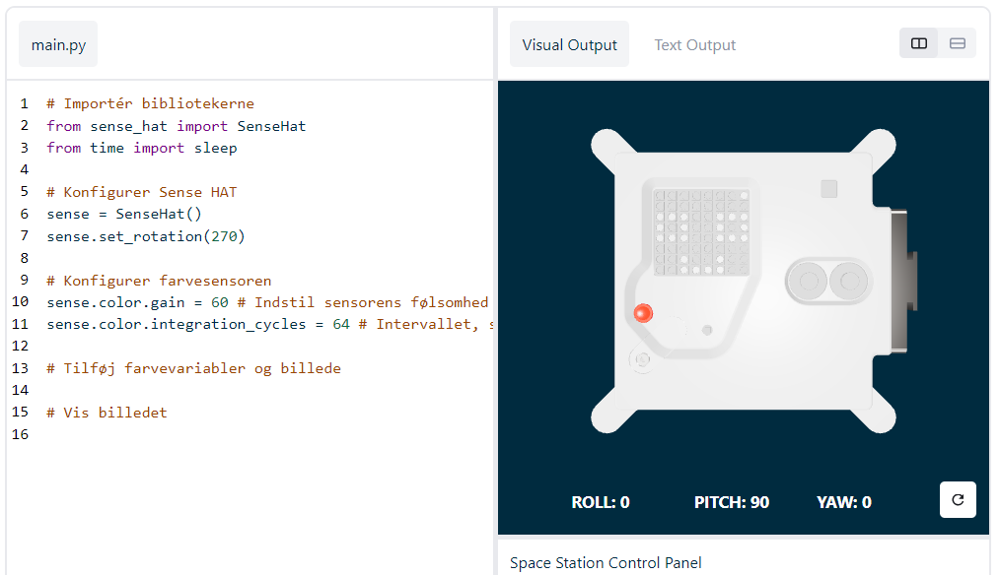

## Vis en besked

\--- task \---

Åbn [Sense HAT-emulatoren](https://trinket.io/mission-zero){:target="_blank"} til Mission Zero-projektet.

Her kan du se, at der automatisk er blevet tilføjet tre linjer kode for dig:

```python
from sense_hat import SenseHat
sense = SenseHat()
sense.set_rotation(270)
```



Denne kode opretter forbindelse til Astro Pi og sørger for, at LED-displayet på Astro Pi vises på korrekt vis. Lad koden stå, for du får brug for den.

\--- /task \---

\--- task \---

Måske kunne du efterlade en hyggelig hilsen til de astronauter på ISS, der arbejder i nærheden af Astro Pi? Lad os rulle (scrolle) en besked hen over displayet.

Tilføj denne linje under den anden kode:

```python
sense.show_message("Astro Pi")
```

\--- /task \---

\--- task \---

Tryk på knappen **Run** (Kør) og kig på, mens beskeden `Astro Pi` ruller hen over LED-displayet.


\--- /task \---


For at få vist en anden besked kan du skrive præcist, hvad du ønsker mellem anførselstegnene (`""`).

\--- collapse \---

* * *

## title: Hvilke tegn kan bruges?

Sense HAT kan kun vise tegnsættet Latin 1, hvilket betyder, at kun følgende tegn er tilgængelige. Øvrige tegn vises som `?`.

    +-*/!"#$><0123456789.=)(
    
    ABCDEFGHIJKLMNOPQRSTUVWXYZ
    
    abcdefghijklmnopqrstuvwxyz
    
    ?,;:|@%[&_']\~
    

\--- /collapse \---

\--- task \---

Du kan også ændre den hastighed, som beskeden ruller med hen over displayet med. Tilføj en `scroll_speed` (Rullehastighed) til den kodelinje, du allerede har, som følger:

```python
sense.show_message("Astro Pi", scroll_speed=0.05)
```

Beskedens standardhastighed er `0.1` (0,1). Hvis du gør talværdien mindre, ruller beskeden hurtigere, og hvis du gør talværdien større, ruller beskeden langsommere.

\--- /task \---