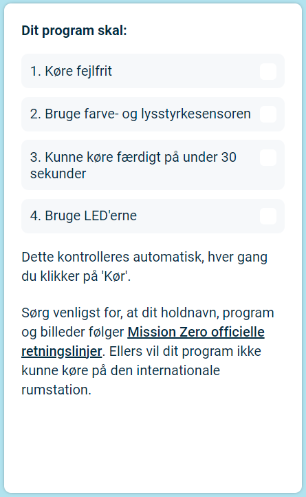

## Indsend dit bidrag

Du kan nu deltage i [Astro Pi Mission Zero](https://astro-pi.org/da/mission-zero){:target="_blank"}-udfordringen ved at bruge den kode, du har skrevet.

Der er nogle få regler, som din kode skal følge, før du kan indsende den og få den kørt på den internationale rumstation. Hvis din kode følger dem, så vil reglerne i bunden af **Sense HAT-emulatoren** lyse grønt, når du kører programmet.

**Tip:** Test din kode med et par forskellige farveindstillinger (ved hjælp af farvevælgeren) for at sikre, at den altid kører korrekt.

Sørg for, at dit bidrag følger de [officielle retningslinjer](https://astro-pi.org/da/mission-zero/guidelines){:target="_blank"} for Mission Zero. Hvis det ikke følger retningslinjerne, vil dit program ikke være i stand til at blive kørt på den internationale rumstation.

Vær venlig ikke at inkludere noget af følgende i dit holdnavn eller kode:

+ Alt hvad der kan fortolkes som værende ulovligt, politisk eller af følsom karakter
+ Flag, da de kan betragtes som værende politisk følsomme
+ Alt hvad der refererer til ubehageligheder eller skade mod en anden person
+ Personlige oplysninger såsom telefonnumre, kaldenavne på sociale medier og e-mailadresser
+ Sjofle billeder
+ Specialtegn eller emojis
+ Dårligt sprog eller bandeord

--- task ---

Indtast din klasseværelseskode og holdnavn i boksen nederst — din mentor vil fortælle dig, hvad din kode er.

**Bemærkninger til mentorer** kan findes i trinntet [Introduktion](https://projects.raspberrypi.org/da-DK/projects/astro-pi-mission-zero/0).

--- /task ---

--- task ---

Tryk på knappen **Tilføj dit hold** for at indtaste din kode. Bemærk venligst, at et program ikke kan ændres, når det først er indsendt.

Din mentor vil modtage en e-mail for at bekræfte din tilmelding.

--- /task ---

--- task ---

Hvis du vil, kan du dele linket til din kode på de sociale medier for at fortælle folk, at den kode, du har skrevet, bliver kørt i rummet!

--- /task ---
