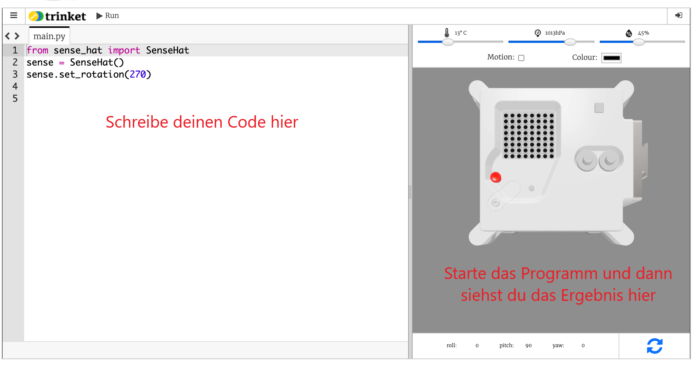

## Was ist ein Astro Pi?

Ein Astro Pi ist ein Raspberry Pi Computer, der von einem Gehäuse umgeben ist, das speziell für Weltraumbedingungen entwickelt wurde. Er hat auch eine Aufsteckplatine namens Sense HAT, der speziell für die Mission Astro Pi gemacht wurde. Der Sense HAT verfügt über einen Joystick, eine LED-Anzeige und Sensoren zur Aufzeichnung von Temperatur, Feuchtigkeit, Druck und Ausrichtung.

Hier ist ein echtes Astro Pi Gerät auf der Internationalen Raumstation, auf dem ein von Schülern geschriebener Code läuft. Hier wird dein Code später laufen! <iframe src="https://player.vimeo.com/video/172737314" width="640" height="360" frameborder="0" webkitallowfullscreen mozallowfullscreen allowfullscreen mark="crwd-mark"></iframe> 

Für diese Mission wirst du den Sense HAT Emulator verwenden. Der Emulator ist eine Software, die alle Funktionen des Astro Pi in deinem Webbrowser simuliert.

Es gibt einige wenige Unterschiede zwischen dem echten und dem emulierten Sense HAT:

- Auf dem Emulator kannst du die Temperatur, den Druck und die Luftfeuchtigkeit mit Hilfe von Schiebereglern selbst einstellen, während der echte Sense HAT im Astro Pi Sensoren verwendet, um diese Parameter in seiner Umgebung zu messen.

- Du kannst die Maus verwenden, um den emulierten Sense HAT durch klicken und ziehen zu verschieben und zu drehen, so dass Änderungen in seiner Ausrichtung simuliert werden. Der echte Astro Pi (und sein Sense HAT) kann sich in der realen Welt bewegen, und die Orientierungssensoren des Sense HAT erkennen, wann und wie er sich bewegt hat.