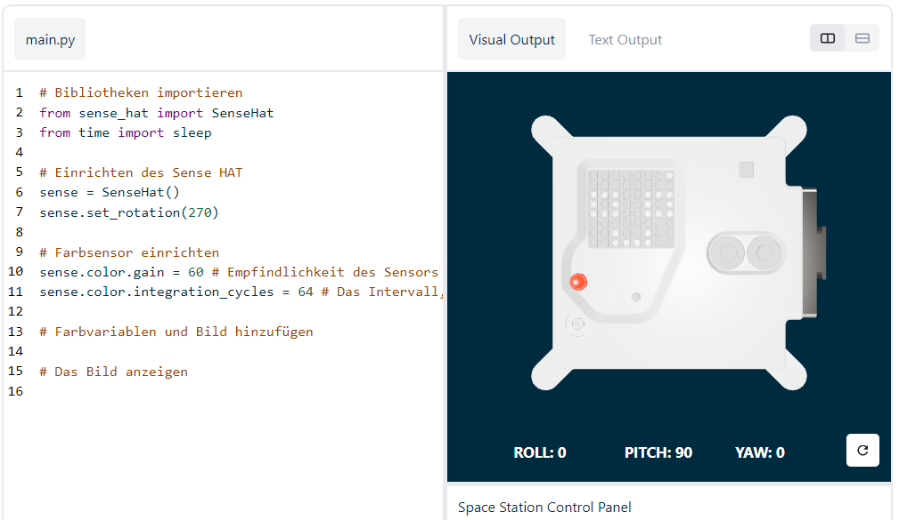

## Zeige eine Nachricht und wähle einen Namen für die neuen Astro Pi Computer

--- task ---

Öffne den [Sense HAT Emulator](https://trinket.io/mission-zero){:target="_blank"} für das Mission Zero Projekt.

Du wirst sehen, dass drei Zeilen Code bereits automatisch erscheinen:

```python
from sense_hat import SenseHat
sense = SenseHat()
sense.set_rotation(270)
```



Dieser Code verbindet sich mit dem Astro Pi und sorgt dafür, dass die LED-Anzeige des Astro Pi korrekt angezeigt wird. Lass den Code so dort stehen, weil du ihn noch brauchen wirst.

--- /task ---

--- task ---

Vielleicht könntest du einen schönen Gruß für die Astronauten hinterlassen, die auf der ISS in der Nähe des Astro Pi arbeiten? Wir lassen nun eine Nachricht über den Bildschirm laufen.

Füge diese Zeile unter dem anderen Code hinzu:

```python
sense.show_message("Astro Pi")
```

--- /task ---

--- task ---

Klicke auf **Run** (Ausführen) und schau wie die Nachricht `Astro Pi` über den LED-Bildschirm läuft.


--- /task ---


Um eine andere Nachricht anzuzeigen, kannst du etwas Beliebiges zwischen die Anführungszeichen schreiben (`""`).

--- collapse ---

---
title: Welche Zeichen können verwendet werden?
---

Der Sense HAT kann nur den Zeichensatz Latin 1 anzeigen, sodass nur die folgenden Zeichen verfügbar sind. Andere Zeichen werden als `?` angezeigt.

```
+-*/!"#$><0123456789.=)(

ABCDEFGHIJKLMNOPQRSTUVWXYZ

abcdefghijklmnopqrstuvwxyz

?,;:|@%[&_']\~
```

--- /collapse ---

--- task ---

Du kannst auch die Geschwindigkeit der Nachricht ändern, mit der sie über den Bildschirm läuft. Füge `scroll_speed` (Laufgeschwindigkeit) zu der Codezeile, die du schon hast, folgendermaßen hinzu:

```python
sense.show_message("Astro Pi", scroll_speed=0.05)
```

Die Standardgeschwindigkeit der Nachricht ist `0.1`. Wenn du die Zahl verkleinerst, läuft die Nachricht schneller ab, und wenn du sie vergrößerst, läuft die Nachricht langsamer ab.

--- /task ---

### Wähle einen Namen für die neuen Astro Pi-Computer

--- task --- Wir werden die Astro Pi-Computer nach zwei inspirierenden europäischen Wissenschaftlern benennen. Es gibt Hunderte von Männern und Frauen, die zu Wissenschaft und Technologie beigetragen haben; Teilnehmer können ihre eigenen Namen vorschlagen oder aus unserer Liste an Vorschlägen wählen:


[Ada Lovelace](https://en.wikipedia.org/wiki/Ada_Lovelace){:target="_blank"} 
[Alan Turing](https://en.wikipedia.org/wiki/Alan_Turing){:target="_blank"} 
[Caroline Herschel](https://en.wikipedia.org/wiki/Caroline_Herschel){:target="_blank"} 
[Edsgar Dijkstra](https://en.wikipedia.org/wiki/Edsger_W._Dijkstra){:target="_blank"} 
[Hedy Lamarr](https://en.wikipedia.org/wiki/Hedy_Lamarr){:target="_blank"} 
[Hypatia](https://en.wikipedia.org/wiki/Hypatia){:target="_blank"} 
[John Edmonstone](https://en.wikipedia.org/wiki/John_Edmonstone){:target="_blank"} 
[Marie Curie](https://en.wikipedia.org/wiki/Marie_Curie){:target="_blank"} 
[Nikola Tesla](https://en.wikipedia.org/wiki/Nikola_Tesla){:target="_blank"} 
[Tycho Brahe](https://en.wikipedia.org/wiki/Tycho_Brahe){:target="_blank"}

Um abzustimmen, beginne Deine Nachricht mit den Worten "Mein Name sollte sein". Wenn Du beispielsweise für Ada Lovelace stimmen möchtest, würde Dein Code so aussehen:

```python
sense.show_message("Mein Name sollte sein Ada Lovelace")
```

Wenn du mitwählen willst, muss deine Nachricht mit diesen Worten beginnen, da wir deine Wahl sonst nicht zählen können.

--- /task ---


