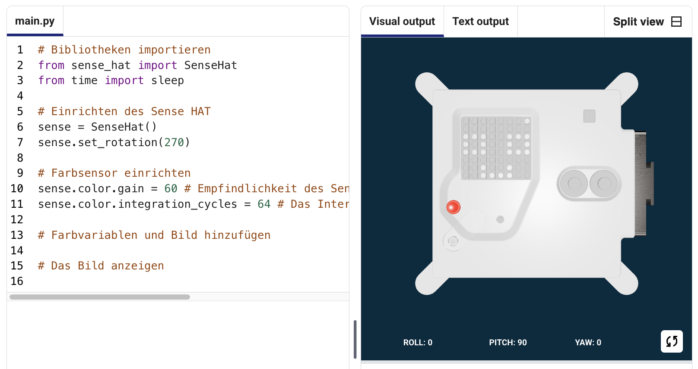
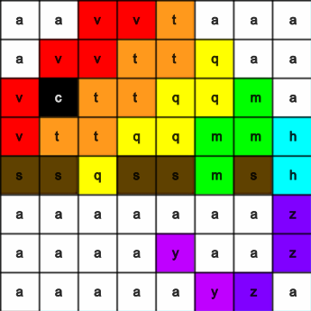
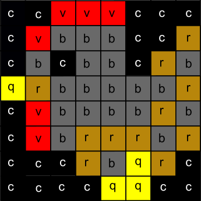
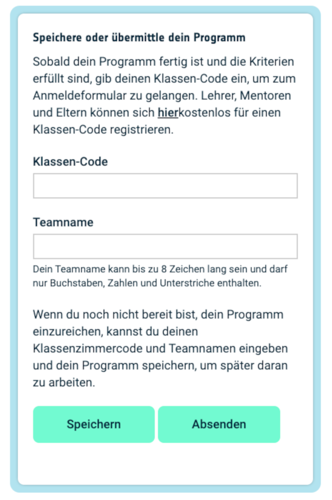

## Anzeigen eines Bildes

Die LED-Matrix des Astro Pi kann Farben darstellen. In diesem Schritt zeigst du Bilder aus der Natur auf der LED-Matrix des Astro Pi an.

<p style="border-left: solid; border-width:10px; border-color: #0faeb0; background-color: aliceblue; padding: 10px;">
Eine <span style="color: #0faeb0">**LED-Matrix**</span> ist ein Raster von LEDs, die einzeln oder als Gruppe gesteuert werden können, um verschiedene Lichteffekte zu erzeugen. Die LED-Matrix des Sense HAT verfügt über 64 LEDs, die in einem 8 x 8-Raster angeordnet sind. Die LEDs können so programmiert werden, dass sie eine breite Palette von Farben erzeugen.
</p>


--- task ---

Öffne das [Mission Zero-Starterprojekt](https://missions.astro-pi.org/mz/code_submissions/){:target="_blank"}.

Du wirst sehen, dass einige Zeilen Code bereits automatisch erscheinen.

Dieser Code verbindet sich mit dem Astro Pi, stellt sicher, dass die LED-Anzeige des Astro Pi richtig herum angezeigt wird und richtet den Farbsensor ein. Lass den Code so dort stehen, weil du ihn noch brauchen wirst.

--- code ---
---
language: python 
filename: main.py 
line_numbers: false 
line_number_start: 1
line_highlights:
---
# Bibliotheken importieren
from sense_hat import SenseHat 
from time import sleep

# Einrichten des Sense HAT
sense = SenseHat() 
sense.set_rotation(270)

# Farbsensor einrichten
sense.color.gain = 60 # Stelle die Empfindlichkeit des Sensors ein 
sense.color.integration_cycles = 64 # Das Intervall in dem gemessen wird

--- /code ---



--- /task ---

### RGB-Farben

Alle Farben können mit unterschiedlichen Anteilen von rot, grün und blau erzeugt werden. Informationen zu RGB-Farben findest du hier:

[[[generic-theory-simple-colours]]]

Die LED-Matrix ist ein 8 x 8 Raster. Jede LED am Raster kann auf eine andere Farbe eingestellt werden. Hier ist eine Liste von Variablen für 24 verschiedene Farben. Jede Farbe hat einen Wert für Rot, Grün und Blau:

[[[ambient-colours]]]

### Wähle ein Bild

--- task ---

**Auswählen:** Wähle ein Bild aus den folgenden Optionen, um es anzuzeigen. Python speichert die Informationen für ein Bild in einer Liste. Der Code für jedes Bild enthält die verwendeten Farbvariablen und die Liste.

Du musst den gesamten Code für dein ausgewähltes Bild **kopieren** und ihn dann in dein Projekt **einfügen**, unterhalb der Zeile mit der Aufschrift `# Farbvariablen und Bild hinzufügen`.

--- collapse ---

---
title: Fisch
---


Erstellt vom Team Chalka, Polen

```python
z = (153, 50, 204) # DunkelOrchidee
q = (255, 255, 0) # Gelb
d = (51, 153, 255) # Blau
c = (0, 0, 0) # Schwarz

bild = [
d, d, z, d, d, d, d, d,
d, d, d, z, z, d, d, d,
z, d, q, q, q, q, d, d,
z, z, q, q, q, c, q, d,
z, z, z, q, q, q, q, d,
z, z, q, q, q, q, q, d,
z, d, q, z, z, q, d, d,
d, d, d, z, d, d, d, d]

```

--- /collapse ---


--- collapse ---

---
title: Walross
---


Erstellt vom Team Walrus, Finnland

```python
h = (0, 255, 255) # Zyan
c = (0, 0, 0) # Schwarz
s = (139, 69, 19) # Sattelbraun
a = (255, 255, 255) # Weiß
r = (184, 134, 11) # DunkleGoldrute

bild = [
h, h, h, h, h, h, h, h,
h, h, s, s, s, h, h, h,
h, s, s, s, s, s, h, h,
h, s, c, s, c, s, s, s,
h, r, r, r, r, r, s, s,
h, h, a, s, a, s, s, s,
h, h, a, s, a, s, s, s,
r, r, s, s, s, s, s, s]

```

--- /collapse ---

--- collapse ---
---
title: Paxi
---


Erstellt vom Team tony_pi, Italien

```python
v = (255, 0, 0) # Rot
m = (34, 139, 34) # Waldgrün
c = (0, 0, 0) # Schwarz 
e = (100, 149, 237) # Kornblumenblau
l = (0, 255, 0) # Grün

bild = [
    c, v, m, c, c, m, v, c,
    c, c, v, v, v, v, c, c,
    c, v, c, e, l, e, v, c,
    c, v, c, l, l, l, v, c,
    c, v, c, l, c, l, v, c,
    c, c, v, v, v, v, c, c,
    c, c, l, c, c, l, c, c,
    c, m, m, c, c, m, m, c]

```

--- /collapse ---


--- collapse ---
---
title: Hund
---


Erstellt vom Team ptpr_07, Spanien

```python

c = (0, 0, 0) # Black
r = (184, 134, 11) # DunkleGoldrute
s = (139, 69, 19) # Sattelbraun
y = (255, 20, 147) # TiefesPink

bild = [
    c, r, r, c, c, r, r, c,
    c, r, s, s, s, s, r, c,
    c, r, c, s, s, c, r, c,
    c, s, s, s, s, s, s, c,
    c, s, s, s, s, s, s, c,
    c, s, s, c, c, s, s, c,
    c, c, s, y, y, s, c, c,
    c, c, c, y, y, c, c, c]


```

--- /collapse ---

--- collapse ---
---
title: Chamäleon
---



Erstellt vom Team The_ETs, Vereinigtes Königreich

```python

c = (0, 0, 0) # Schwarz
s = (139, 69, 19) # Sattelbraun
a = (255, 255, 255) # Weiß
v = (255, 0, 0) # Rot
t = (255, 140, 0) # DunkelOrange
q = (255, 255, 0) # Gelb
m = (34, 139, 34) # Waldgrün
h = (0, 255, 255) # Zyan
z = (153, 50, 204) # DunkleOrchidee
y = (255, 20, 147) # TiefesPink

bild = [
    a, a, v, v, t, a, a, a,
    a, v, v, t, t, q, a, a,
    v, c, t, t, q, q, m, a,
    v, t, t, q, q, m, m, h,
    s, s, q, s, s, m, s, h,
    a, a, a, a, a, a, a, z,
    a, a, a, a, y, a, a, z,
    a, a, a, a, a, y, z, a]

```

--- /collapse ---

--- collapse ---
---
title: Drache
---


Erstellt vom Team Val, Griechenland

```python

c = (0, 0, 0) # Schwarz
m = (34, 139, 34) # Waldgrün
v = (255, 0, 0) # Rot
q = (255, 255, 0) # Gelb
e = (0, 0, 205) # MittelBlau
h = (0, 255, 255) # Zyan

bild = [
    h, h, h, h, h, h, h, h, 
    h, h, h, e, e, v, v, h, 
    h, h, h, e, e, v, v, h, 
    h, h, h, q, q, m, m, h, 
    h, h, h, q, q, m, m, h,
    h, h, c, h, h, h, h, h, 
    h, c, h, h, h, h, h, h, 
    c, h, h, h, h, h, h, h]

```

--- /collapse ---

--- collapse ---
---
title: Huhn
---



Erstellt vom Team Slepicky, Tschechien

```python

v = (255, 0, 0) # Rot
c = (0, 0, 0) # Schwarz
b = (105, 105, 105) # DunklesGrau
q = (255, 255, 0) # Gelb
r = (184, 134, 11) # DunkleGoldrute

bild =  [
    c, c, v, v, v, c, c, c,
    c, v, b, b, r, c, c, r,
    c, b, c, b, b, c, r, b,
    q, r, b, b, b, b, b, r,
    c, v, b, b, b, b, r, b,
    c, v, b, r, r, r, b, r,
    c, c, c, r, b, q, r, c,
    c, c, c, c, q, q, c, c]

```

--- /collapse ---

--- /task ---

--- task ---

**Suche:** die Zeile `# das Bild anzeigen` und füge eine Zeile Code hinzu, um dein Bild auf der LED-Matrix anzuzeigen:

--- code ---
---
language: python
filename: main.py
line_numbers: false
line_number_start: 1
line_highlights: 18, 19
---
z = (153, 50, 204) # Dunkle Orchidee
q = (255, 255, 0) # Gelb
d = (51, 153, 255) # Blau
c = (0, 0, 0) # Schwarz

bild = [
d, d, z, d, d, d, d, d,
d, d, d, z, z, d, d, d,
z, d, q, q, q, q, d, d,
z, z, q, q, q, c, q, d,
z, z, z, q, q, q, q, d,
z, z, q, q, q, q, q, d,
z, d, q, z, z, q, d, d,
d, d, d, z, d, d, d, d]

# Das Bild anzeigen
sense.set_pixels(bild)

--- /code ---

--- /task ---

--- task ---

Drücke **Ausführen** am unteren Rand des Editors, um dein Bild auf der LED-Matrix anzuzeigen.

--- /task ---

--- task ---

**Fehlersuche**

Mein Code hat einen Syntaxfehler:

- Überprüfe, ob dein Code mit dem Code in den obigen Beispielen übereinstimmt
- Überprüfe, ob du den Code richtig eingerückt hast
- Überprüfe, ob deine Liste von `[` und `]`umgeben ist
- Überprüfe, ob die Farbvariablen in der Liste durch ein Kommas getrennt sind

Mein Bild wird nicht angezeigt:

- Überzeuge dich, dass dein `sense.set_pixels(bild)` nicht eingerückt ist

--- /task ---


--- task ---

**Speichere deinen Fortschritt**

Nachdem du nun ein Bild angezeigt hast, kannst du dein Programm im Mission Starter-Projekt speichern, indem du deinen Teamnamen, die Namen der Teammitglieder und den dir zugewiesenen Klassen-Code eingibst. Du kannst dein Programm auf jedem Gerät mit Internetverbindung neu laden, indem du deinen Teamnamen und deinen Klassen-Code eingibst.



--- /task --- 
