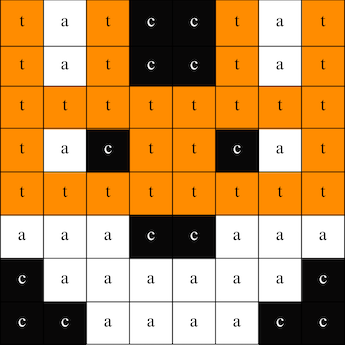

## Anzeigen eines Bildes

Die LED-Matrix des Astro Pi kann Farben darstellen. In diesem Schritt zeigst du Bilder aus der Natur auf der LED-Matrix des Astro Pi an.

<p style="border-left: solid; border-width:10px; border-color: #0faeb0; background-color: aliceblue; padding: 10px;">
Eine <span style="color: #0faeb0">**LED-Matrix**</span> ist ein Raster von LEDs, die einzeln oder als Gruppe gesteuert werden können, um verschiedene Lichteffekte zu erzeugen. Die LED-Matrix des Sense HAT verfügt über 64 LEDs, die in einem 8 x 8-Raster angeordnet sind. Die LEDs können so programmiert werden, dass sie eine breite Palette von Farben erzeugen.
</p>


--- task ---

Öffne das [Mission Zero-Starterprojekt](http://rpf.io/mzcode){:target="_blank"}.

Du wirst sehen, dass einige Zeilen Code bereits automatisch erscheinen.

Dieser Code verbindet sich mit dem Astro Pi, stellt sicher, dass die LED-Anzeige des Astro Pi richtig herum angezeigt wird und richtet den Farbsensor ein. Lass den Code so dort stehen, weil du ihn noch brauchen wirst.

--- code ---
---
language: python filename: main.py line_numbers: false line_number_start: 1
line_highlights:
---
# Bibliotheken importieren
from sense_hat import SenseHat from time import sleep

# Einrichten des Sense HAT
sense = SenseHat() sense.set_rotation(270)

# Farbsensor einrichten
sense.color.gain = 60 # Set the sensitivity of the sensor sense.color.integration_cycles = 64 # The interval at which the reading will be taken

--- /code ---


--- /task ---

### RGB-Farben

Alle Farben können mit unterschiedlichen Anteilen von rot, grün und blau erzeugt werden. Informationen zu RGB-Farben findest du hier:

[[[generic-theory-simple-colours]]]

Die LED-Matrix ist ein 8 x 8 Raster. Jede LED am Raster kann auf eine andere Farbe eingestellt werden. Hier ist eine Liste von Variablen für 24 verschiedene Farben. Jede Farbe hat einen Wert für Rot, Grün und Blau:

[[[ambient-colours]]]

### Wähle ein Bild

--- task ---

**Auswählen:** Wähle ein Bild aus den folgenden Optionen, um es anzuzeigen. Python speichert die Informationen für ein Bild in einer Liste. Der Code für jedes Bild enthält die verwendeten Farbvariablen und die Liste.

Du musst den gesamten Code für dein ausgewähltes Bild **kopieren** und ihn dann in dein Projekt **einfügen**, unterhalb der Zeile mit der Aufschrift `# Farbvariablen und Bild hinzufügen`.

--- collapse ---

---
title: Fox
---



Created by team i_pupi, Italy

```python
c = (0, 0, 0) # Black
a = (255, 255, 255) # white
t = (255, 140, 0) # dark orange

image = [
t, a, t, c, c, t, a, t,
t, a, t, c, c, t, a, t,
t, t, t, t, t, t, t, t,
t, a, c, t, t, c, a, t,
t, t, t, t, t, t, t, t,
a, a, a, c, c, a, a, a,
c, a, a, a, a, a, a, c,
c, c, a, a, a, a, c, c]
```

--- /collapse ---


--- collapse ---

---
title: Elephant
---


Created by team ILiFanT, Finland

```python
c = (0, 0, 0) # Black
b = (105, 105, 105) # dark grey
a = (255, 255, 255) # white

image = [
    c, c, c, c, c, c, c, c,
    c, b, b, b, c, c, c, c,
    c, b, c, b, c, c, b, b,
    c, b, c, c, c, b, b, b,
    c, b, b, c, c, b, c, b,
    c, b, b, b, b, b, b, b,
    c, c, b, b, a, b, b, b,
    c, c, c, c, a, b, b, b]
```

--- /collapse ---

--- collapse ---
---
title: Cactus
---


Created by team 6TETHASI, The Netherlands

```python
a = (255, 255, 255) # White
c = (0, 0, 0) # Black
n = (154, 205, 50) # YellowGreen
q = (255, 255, 0) # Yellow
t = (255, 140, 0) # DarkOrange

image = [   
  q, q, c, n, c, c, a, c,
  q, c, c, n, c, a, a, a,
  c, n, c, n, c, c, c, c,
  c, n, n, n, c, n, c, c,
  c, a, n, n, n, n, c, c,
  a, a, a, n, c, a, a, a,
  c, c, c, n, a, a, a, c,
  t, t, t, t, t, t, t, t]

```

--- /collapse ---


--- collapse ---
---
title: Krokodil
---


```python

a = (255, 255, 255) # White
c = (0, 0, 0) # Black
f = (25, 25, 112) # MidnightBlue
m = (34, 139, 34) # ForestGreen

image = [
  m, m, m, m, m, c, c, c,
  m, f, m, f, m, m, m, m,
  m, m, m, m, m, m, m, m,
  m, m, c, a, c, c, c, a,
  m, m, c, c, c ,c ,c ,c,
  m, m, c, c, c, a, c, c,
  m, m, m, m, m, m, m, m,
  m, m, m, m, m, m, m, m]

```

--- /collapse ---

--- collapse ---
---
title: Rainbow
---


Created by team camrus_6, United Kingdom

```python

c = (100, 149, 237) # CornflowerBlue
a = (255, 255, 255) # White
v = (255, 0, 0) # Red
t = (255, 140, 0) # DarkOrange
q = (255, 255, 0) # Yellow
l = (0, 255, 127) # SpringGreen
e = (0, 0, 205) # MediumBlue

rainbow = [
  c, c, c, c, c, c, c, c, 
  v, v, v, v, c, c, c, c,
  t, t, t, t, v, v, c, c,
  q, q, q, q, t, v, c, c,
  l, l, l, l, q, t, v, c,
  e, e, e, l, q, t, v, c,
  c, c, e, a, a, a, a, c,
  c, a, a, a, a, a, a, a
]

```

--- /collapse ---

--- collapse ---
---
title: Dragon
---


Created by team hwplucyr, United Kingdom

```python

b = (105, 105, 105) # DimGray
c = (0, 0, 0) # Black
d = (100, 149, 237) # CornflowerBlue
v = (255, 0, 0) # Red
z = (153, 50, 204) # DarkOrchid

image = [
    c, c, v, c, v, c, c, c,
    c, z, z, z, z, v, c, c,
    z, b, z, b, z, c, c, c,
    z, z, z, z, z, v, c, c,
    c, c, d, d, d, c, c, z,
    c, z, d, z, z, z, z, c,
    c, c, d, d, z, c, c, c,
    c, c, z, c, z, c, c, c]

```

--- /collapse ---

--- /task ---

--- task ---

**Suche:** die Zeile `# das Bild anzeigen` und füge eine Zeile Code hinzu, um dein Bild auf der LED-Matrix anzuzeigen:

```python
a = (255, 255, 255) # White
c = (0, 0, 0) # Black
f = (25, 25, 112) # MidnightBlue
m = (34, 139, 34) # ForestGreen

image = [
  m, m, m, m, m, c, c, c,
  m, f, m, f, m, m, m, m,
  m, m, m, m, m, m, m, m,
  m, m, c, a, c, c, c, a,
  m, m, c, c, c ,c ,c ,c,
  m, m, c, c, c, a, c, c,
  m, m, m, m, m, m, m, m,
  m, m, m, m, m, m, m, m]

# Display the image 
sense.set_pixels(image)

```

--- /task ---

--- task ---

Drücke **Ausführen** am unteren Rand des Editors, um dein Bild auf der LED-Matrix anzuzeigen.

--- /task ---

--- task ---

**Fehlersuche**

Mein Code hat einen Syntaxfehler:

- Überprüfe, ob dein Code mit dem Code in den obigen Beispielen übereinstimmt
- Überprüfe, ob du den Code richtig eingerückt hast
- Überprüfe, ob deine Liste von `[` und `]`umgeben ist
- Überprüfe, ob die Farbvariablen in der Liste durch ein Kommas getrennt sind

Mein Bild wird nicht angezeigt:

- Überzeuge dich, dass dein `sense.set_pixels(image)` nicht eingerückt ist

--- /task ---


--- task ---

**Save your progress**

Now that you have displayed an image, you can save your program on the Mission Starter project by entering your team name, team members' names, and the classroom code given to you. You can reload your program on any device with an internet connection by entering your team name and classroom code.


--- /task --- 
