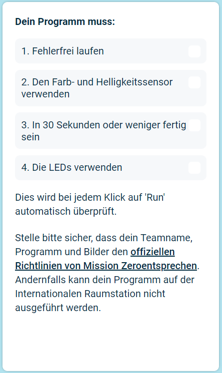

## Deinen Beitrag einsenden

Du kannst nun die [Astro Pi Mission Zero](https://astro-pi.org/mission-zero){:target="_blank"} Herausforderung betreten, indem du den Code verwendest, den du geschrieben hast.

Dein Code muss einige Regeln einhalten, damit du ihn einreichen kannst um auf der Internationalen Raumstation ausgeführt zu werden. Wenn du sie richtig befolgst, werden die Regeln unten im **Sense HAT emulator** nach dem Ausführen des Programms grün angezeigt.

**Tipp:** Teste deinen Code mit ein paar anderen Farbeinstellungen (mit dem Picker) um sicherzustellen, dass er immer korrekt läuft.

Bitte stelle sicher, dass dein Beitrag den [offiziellen Richtlinien](https://astro-pi.org/mission-zero/guidelines){:target="_blank"} für Mission Zero entspricht. Wenn es den Richtlinien nicht entspricht, kann dein Programm nicht auf der Internationalen Raumstation ausgeführt werden.

Bitte fügen Sie Folgendes nicht in Ihren Teamnamen oder Code ein:

+ Alles, was als illegal, politisch oder heikel interpretiert werden könnte
+ Flaggen, da sie als politisch sensibel angesehen werden können
+ Alles, was auf Unannehmlichkeiten oder Schaden für eine andere Person hinweist
+ Personenbezogene Daten wie Telefonnummern, Social-Media-Adressen und E-Mail-Adressen
+ Obszöne Bilder
+ Sonderzeichen oder Emojis
+ Schimpfwörter oder Fluchen

--- task ---

Gib deinen Klassenraumcode und Teamnamen in das Feld unten ein – dein Mentor wird dir deinen Code mitteilen.

**Hinweise für Mentoren** sind im Schritt [Einleitung](https://projects.raspberrypi.org/de-DE/projects/astro-pi-mission-zero/0) zu finden.

--- /task ---

--- task ---

Drücke die Schaltfläche **Füge dein Team hinzu**, um deinen Code einzureichen. Bitte beachte, dass ein Programm nach dem Absenden nicht geändert werden kann.

Dein Mentor wird eine E-Mail erhalten, um deine Einsendung zu bestätigen.

--- /task ---

--- task ---

Wenn du möchtest, kannst du den Link zu deinem Code auf sozialen Netzwerken teilen, um allen zu berichten, dass der Code, den du geschrieben hast, im Weltraum ausgeführt wird!

--- /task ---
