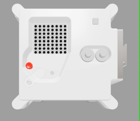

## Εισαγωγή

Προσφέρετε μια ευχάριστη νότα στην καθημερινή ρουτίνα των αστροναυτών στον Διεθνή Διαστημικό Σταθμό, δείχνοντάς τους ένα μήνυμα και την υγρασία περιβάλλοντος μέσα στον σταθμό, χρησιμοποιώντας το Sense ΗΑΤ του υπολογιστή Astro Pi.

The Mark II Astro Pi hardware is so new that the computers don’t even have names yet. We will name the Astro Pi computers after two inspirational European scientists. You can help choose what they’ll be called by voting for your favourite name as part of your Mission Zero program.

You will use the online Sense HAT emulator to create your program, so no extra hardware is needed — everything is done in a web browser. *If it meets the eligibility criteria* your completed program will be run in space on the International Space Station (ISS)! You will also receive a special certificate that shows exactly where the ISS was when your program ran.

We will announce the chosen names for the new Astro Pi computers in spring 2022.

### Τι θα φτιάξετε

Here is an example of the kind of program you could make. Click **Run** to see it in action.

 <iframe src="https://trinket.io/embed/python/b92d76c0f3?outputOnly=true&runOption=run&start=result" width="100%" height="600" frameborder="0" marginwidth="0" marginheight="0" allowfullscreen mark="crwd-mark"></iframe>

--- collapse ---

---
title: Τι θα μάθετε
---

You will learn about the Astro Pi unit and how to control an it, including how to:
+ Εμφάνιση μηνυμάτων και χρωμάτων
+ Δημιουργία εικόνων
+ Μέτρηση υγρασίας με τη χρήση ενός Sense HAT

This project covers elements from the following strands of the [Raspberry Pi Digital Making Curriculum](http://rpf.io/curriculum){:target="_blank"}:

+ [Χρησιμοποίησε βασικές δομές προγραμματισμού για να δημιουργήσεις απλά προγράμματα](https://curriculum.raspberrypi.org/programming/creator/){:target="_blank"}

--- /collapse ---

--- collapse ---

---
title: Τι θα χρειαστείτε
---

### Υλικό (Hardware)

+ Οποιοσδήποτε υπολογιστής με σύνδεση στο Διαδίκτυο

### Λογισμικό

+ Ένα πρόγραμμα περιήγησης Ιστού (π.χ. Google Chrome) για να ανοίξετε το [https://trinket.io/mission-zero](https://trinket.io/mission-zero){:target="_blank"}

--- /collapse ---

--- collapse ---
---
title: Σημειώσεις για εκπαιδευτικούς και συμβούλους (μέντορες)
---

This activity can be completed in an afternoon. Organise your students into teams of two to four, and let us guide them through writing a short Python program to show a personal message and the relative humidity on the Astro Pi.

\* Παρακαλώ, προσέξτε ότι αυτή η φόρμα εγγραφής είναι διαθέσιμη μόνο στα Αγγλικά.

Τα πεδία της φόρμας περιλαμβάνουν:   
Όνομα δασκάλου/μέντορα   
Όνομα ομάδας   
Αριθμός μελών ομάδας   
Ονόματα και ηλικίες μελών ομάδας   
Σε ποια γλώσσα είχατε πρόσβαση στις οδηγίες του Mission Zero;

+ Μεταβείτε στη [σελίδα Mission Zero του εξομοιωτή Trinket](https://trinket.io/mission-zero){:target="_blank"}.

+ Συμπληρώστε τη φόρμα και κάντε κλικ στο «**Submit**»\*.

\* Please note that this registration form is available in English only.

The fields on the form include:  
Teacher/mentor name   
Team name  
Number of team members  
Names and ages of team members  
In which language did you access the Mission Zero guidelines?

+ A Trinket account will be created for you (if you don't already have one, or you're not logged in). You can create one account per email address. Each account has its own **classroom code**, and you will need to tell your team(s) what yours is when they are ready to submit their programs.

+ Προβάλλετε σε κάποιο εμφανές σημείο τον κωδικό τάξης σας, για παράδειγμα σε έναν πίνακα ή χρησιμοποιώντας μια συσκευή προβολής και ξεκινήστε τη δραστηριότητα.

 Δημιουργήσαμε [ένα εκτυπώσιμο φυλλάδιο δύο σελίδων](https://astro-pi.org/astro_pi_mission_zero_project_print_out_v10_print/){:target="_blank"} που καλύπτει τα βασικά σημεία του Mission Zero και το οποίο οι μαθητές και οι νέοι μπορούν να χρησιμοποιήσουν μαζί με αυτό το online έργο.

--- /collapse ---

