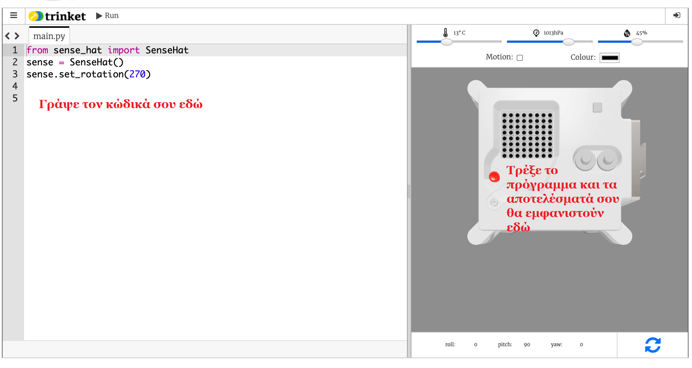

## Τι είναι το Astro Pi;

Το Astro Pi είναι ένας υπολογιστής Raspberry Pi μέσα σε ένα περίβλημα που είναι ειδικά σχεδιασμένο για τις συνθήκες που υπάρχουν στο διάστημα. Διαθέτει επίσης μια επιπρόσθετη πλακέτα που ονομάζεται Sense HAT και είναι ειδικά κατασκευασμένη για την αποστολή Astro Pi. Το Sense HAT διαθέτει ένα χειριστήριο, μια οθόνη LED καθώς και αισθητήρες για καταγραφή της θερμοκρασίας, της υγρασίας, της πίεσης και του προσανατολισμού.

Παρακάτω φαίνεται μια πραγματική μονάδα Mark I Astro Pi στον Διεθνή Διαστημικό Σταθμό, στην οποία εκτελείται κάποιος κώδικας που έχει γραφτεί από μαθητές. Ο κώδικάς σου θα εκτελεστεί τελικά σε μια νέα έκδοση υπολογιστών Astro Pi!

<iframe width="560" height="315" src="https://www.youtube.com/embed/4ykbAJeGPMM" frameborder="0" allow="accelerometer; autoplay; encrypted-media; gyroscope; picture-in-picture" allowfullscreen mark="crwd-mark"></iframe>>

Γι΄ αυτή την αποστολή, θα χρησιμοποιήσεις τον εξομοιωτή Sense HAT. Ο εξομοιωτής είναι ένα λογισμικό που προσομοιώνει όλες τις λειτουργίες του Astro Pi στο πρόγραμμα περιήγησης του φυλλομετρητή σου.

Υπάρχουν μερικές διαφορές μεταξύ του πραγματικού και του εξομοιωμένου Sense HAT:

- Στον εξομοιωτή, μπορείς να ρυθμίσεις τη θερμοκρασία, την πίεση και την υγρασία μόνος σου χρησιμοποιώντας μπάρες ρύθμισης, ενώ το πραγματικό Sense HAT στο Astro Pi χρησιμοποιεί αισθητήρες που μετρούν αυτές τις παραμέτρους στο πραγματικό περιβάλλον.

- Μπορείς να χρησιμοποιήσεις το ποντίκι για να κάνεις κλικ και να σύρεις το προσομοιωμένο Sense HAT για να το μετακινήσεις και να το περιστρέψεις, προσομοιώνοντας αλλαγές στον προσανατολισμό του΄ το πραγματικό Astro Pi (καθώς και το Sense HAT του) μπορεί να κινηθεί στον πραγματικό κόσμο και οι αισθητήρες προσανατολισμού του Sense HAT εντοπίζουν πότε και πώς έχει μετακινηθεί.
