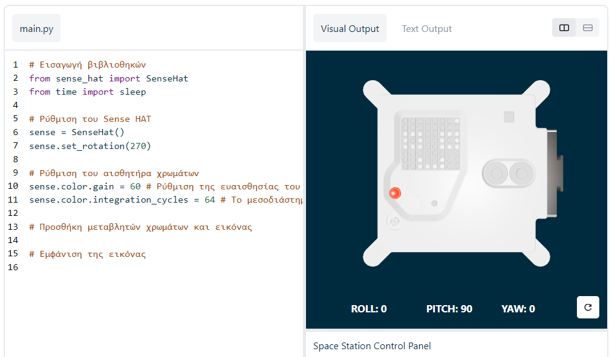

## Εμφάνιση μηνύματος

\--- task \---

Ανοίξτε τον [εξομοιωτή Sense HAT](https://trinket.io/mission-zero){:target="_blank"} για την εργασία Mission Zero.

Θα δείτε τρεις γραμμές κώδικα που έχουν προστεθεί αυτόματα για εσάς:

```python
from sense_hat import SenseHat
sense = SenseHat()
sense.set_rotation(270)
```



Ο κώδικας αυτός συνδέεται στο Astro Pi και εξασφαλίζει ότι η οθόνη LED του Astro Pi εμφανίζεται στη σωστή κατεύθυνση. Αφήστε αυτόν τον κώδικα εκεί, γιατί θα τον χρειαστείτε.

\--- /task \---

\--- task \---

Μήπως να στέλνατε έναν χαιρετισμό στους αστροναύτες στον ΔΔΣ που εργάζονται κοντά στο Astro Pi; Ας πραγματοποιήσουμε κύλιση ενός μηνύματος στην οθόνη.

Προσθέστε αυτή τη γραμμή κάτω από τον υπόλοιπο κώδικα:

```python
sense.show_message("Astro Pi")
```

\--- /task \---

\--- task \---

Πατήστε το κουμπί «**Run**» και παρακολουθήστε το κυλιόμενο μήνυμα «`Astro Pi`» στην οθόνη LED.


\--- /task \---


Για να εμφανίσετε ένα διαφορετικό μήνυμα, μπορείτε να γράψετε ό,τι άλλο θέλετε μεταξύ των εισαγωγικών (`""`).

\--- collapse \---

* * *

## title: Τι χαρακτήρες μπορούν να χρησιμοποιηθούν;

Το Sense HAT μπορεί να εμφανίσει μόνο το σύνολο χαρακτήρων Latin 1, που σημαίνει ότι διατίθενται μόνο οι ακόλουθοι χαρακτήρες. Οποιοσδήποτε άλλος χαρακτήρας θα εμφανίζεται ως `?`.

    +-*/!"#$><0123456789.=)(
    
    ABCDEFGHIJKLMNOPQRSTUVWXYZ
    
    abcdefghijklmnopqrstuvwxyz
    
    ?,;:|@%[&_']\~
    

\--- /collapse \---

\--- task \---

Μπορείτε επίσης να αλλάξετε την ταχύτητα κύλισης του μηνύματος στην οθόνη. Προσθέστε την παράμετρο `scroll_speed` στη γραμμή κώδικα που έχετε ήδη, ως εξής:

```python
sense.show_message("Astro Pi", scroll_speed=0.05)
```

Η προεπιλεγμένη ταχύτητα του μηνύματος είναι `0.1`. Αν μειώσετε τον αριθμό, το μήνυμα θα κυλάει πιο γρήγορα. Αν τον αυξήσετε, το μήνυμα θα κυλάει πιο αργά.

\--- /task \---