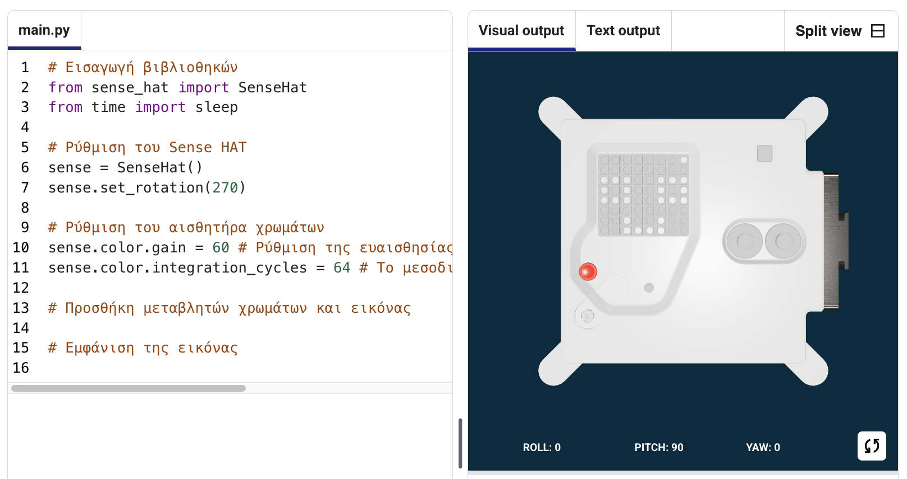

## Εμφάνιση εικόνας

Ο πίνακας LED του Astro Pi μπορεί να εμφανίζει χρώματα. Σε αυτό το βήμα, θα εμφανίσεις εικόνες από τη φύση στη οθόνη LED του Astro Pi.

<p style="border-left: solid; border-width:10px; border-color: #0faeb0; background-color: aliceblue; padding: 10px;">
Ένα <span style="color: #0faeb0">**LED matrix**</span> είναι ένα πλέγμα από LED που μπορούν να ελεγχθούν μεμονωμένα ή ως ομάδα για να δημιουργήσουν διαφορετικά εφέ φωτισμού. Ο πίνακας LED matrix στο Sense HAT έχει 64 LED που εμφανίζονται σε ένα πλέγμα 8 x 8. Τα LED μπορούν να προγραμματιστούν ώστε να παράγουν μεγάλη γκάμα χρωμάτων.
</p>


--- task ---

Άνοιξε το [αρχικό έργο Mission Zero](https://missions.astro-pi.org/mz/code_submissions/){:target="_blank"}.

Θα δεις ότι μερικές γραμμές κώδικα έχουν ήδη προστεθεί αυτόματα για σένα.

Αυτός ο κώδικας συνδέεται με το Astro Pi, εξασφαλίζει ότι η οθόνη LED του Astro Pi εμφανίζεται με τον σωστό τρόπο και ρυθμίζει τον αισθητήρα χρώματος. Άφησε αυτόν τον κώδικα εκεί, γιατί θα τον χρειαστείς.

--- code ---
---
language: python filename: main.py line_numbers: false line_number_start: 1
line_highlights:
---
# Εισαγωγή βιβλιοθηκών
from sense_hat import SenseHat from time import sleep

# Ρύθμιση του Sense HAT
sense = SenseHat() sense.set_rotation(270)

# Ρύθμιση του αισθητήρα χρωμάτων
sense.color.gain = 60 # Set the sensitivity of the sensor sense.color.integration_cycles = 64 # The interval at which the reading will be taken

--- /code ---



--- /task ---

### Χρώματα RGB

Τα χρώματα μπορούν να δημιουργηθούν χρησιμοποιώντας διαφορετικές αναλογίες κόκκινου, πράσινου και μπλε. Μπορείς να μάθεις για τα χρώματα RGB εδώ:

[[[generic-theory-simple-colours]]]

The LED matrix is an 8 x 8 grid. Κάθε LED στο πλέγμα μπορεί να ρυθμιστεί σε διαφορετικό χρώμα. Εδώ είναι μια λίστα μεταβλητών για 24 διαφορετικά χρώματα. Κάθε χρώμα έχει μια τιμή για το κόκκινο, το πράσινο και το μπλε:

[[[ambient-colours]]]

### Επίλεξε μια εικόνα

--- task ---

**Επίλεξε:** Από τις παρακάτω επιλογές διάλεξε μια εικόνα για να την εμφανίσεις. Η Python αποθηκεύει τις πληροφορίες για μια εικόνα σε μια λίστα. Ο κώδικας για κάθε εικόνα περιλαμβάνει τις μεταβλητές για τα χρώματα που χρησιμοποιούνται και τη λίστα.

Θα χρειαστεί να **αντιγράψεις** όλο τον κώδικα για την εικόνα που επέλεξες και στη συνέχεια να τον **επικολλήσεις** στο έργο σου κάτω από τη γραμμή που λέει `# Προσθήκη μεταβλητών χρώματος και εικόνας`.

--- collapse ---

---
title: Fish
---


Created by team chalka, Poland

```python
z = (153, 50, 204) # DarkOrchid
q = (255, 255, 0) # Yellow
d = (51, 153, 255) # blue
c = (0, 0, 0) # Black

image = [
d, d, z, d, d, d, d, d,
d, d, d, z, z, d, d, d,
z, d, q, q, q, q, d, d,
z, z, q, q, q, c, q, d,
z, z, z, q, q, q, q, d,
z, z, q, q, q, q, q, d,
z, d, q, z, z, q, d, d,
d, d, d, z, d, d, d, d]

```

--- /collapse ---


--- collapse ---

---
title: Walrus
---


Created by team Walrus, Finland

```python
h = (0, 255, 255) # Cyan
c = (0, 0, 0) # Black
s = (139, 69, 19) # SaddleBrown
a = (255, 255, 255) # White
r = (184, 134, 11) # DarkGoldenrod

image = [
h, h, h, h, h, h, h, h,
h, h, s, s, s, h, h, h,
h, s, s, s, s, s, h, h,
h, s, c, s, c, s, s, s,
h, r, r, r, r, r, s, s,
h, h, a, s, a, s, s, s,
h, h, a, s, a, s, s, s,
r, r, s, s, s, s, s, s]

```

--- /collapse ---

--- collapse ---
---
title: Paxi
---


Created by team tony_pi, Italy

```python
v = (255, 0, 0) # Red
m = (34, 139, 34) # ForestGreen
c = (0, 0, 0) # Black 
e = (100, 149, 237) # CornflowerBlue
l = (0, 255, 0) # Green

image = [
    c, v, m, c, c, m, v, c,
    c, c, v, v, v, v, c, c,
    c, v, c, e, l, e, v, c,
    c, v, c, l, l, l, v, c,
    c, v, c, l, c, l, v, c,
    c, c, v, v, v, v, c, c,
    c, c, l, c, c, l, c, c,
    c, m, m, c, c, m, m, c]

```

--- /collapse ---


--- collapse ---
---
title: Dog
---


Created by team ptpr_07, Spain

```python

c = (0, 0, 0) # Black
r = (184, 134, 11) # DarkGoldenrod
s = (139, 69, 19) # SaddleBrown
y = (255, 20, 147) # DeepPink

image = [
    c, r, r, c, c, r, r, c,
    c, r, s, s, s, s, r, c,
    c, r, c, s, s, c, r, c,
    c, s, s, s, s, s, s, c,
    c, s, s, s, s, s, s, c,
    c, s, s, c, c, s, s, c,
    c, c, s, y, y, s, c, c,
    c, c, c, y, y, c, c, c]


```

--- /collapse ---

--- collapse ---
---
title: Chameleon
---


Created by team The_ETs, United Kingdom

```python

c = (0, 0, 0) # Black
s = (139, 69, 19) # SaddleBrown
a = (255, 255, 255) # White
v = (255, 0, 0) # Red
t = (255, 140, 0) # DarkOrange
q = (255, 255, 0) # Yellow
m = (34, 139, 34) # ForestGreen
h = (0, 255, 255) # Cyan
z = (153, 50, 204) # DarkOrchid
y = (255, 20, 147) # DeepPink

image = [
    a, a, v, v, t, a, a, a,
    a, v, v, t, t, q, a, a,
    v, c, t, t, q, q, m, a,
    v, t, t, q, q, m, m, h,
    s, s, q, s, s, m, s, h,
    a, a, a, a, a, a, a, z,
    a, a, a, a, y, a, a, z,
    a, a, a, a, a, y, z, a]

```

--- /collapse ---

--- collapse ---
---
title: Kite
---


Created by team Val, Greece

```python

c = (0, 0, 0) # Black
m = (34, 139, 34) # ForestGreen
v = (255, 0, 0) # Red
q = (255, 255, 0) # Yellow
e = (0, 0, 205) # MediumBlue
h = (0, 255, 255) # Cyan

image = [
    h, h, h, h, h, h, h, h, 
    h, h, h, e, e, v, v, h, 
    h, h, h, e, e, v, v, h, 
    h, h, h, q, q, m, m, h, 
    h, h, h, q, q, m, m, h,
    h, h, c, h, h, h, h, h, 
    h, c, h, h, h, h, h, h, 
    c, h, h, h, h, h, h, h]

```

--- /collapse ---

--- collapse ---
---
title: Chicken
---


Created by team Slepicky, Czechia

```python

v = (255, 0, 0) # Red
c = (0, 0, 0) # Black
b = (105, 105, 105) # DimGray
q = (255, 255, 0) # Yellow
r = (184, 134, 11) # DarkGoldenrod

image =  [
    c, c, v, v, v, c, c, c,
    c, v, b, b, r, c, c, r,
    c, b, c, b, b, c, r, b,
    q, r, b, b, b, b, b, r,
    c, v, b, b, b, b, r, b,
    c, v, b, r, r, r, b, r,
    c, c, c, r, b, q, r, c,
    c, c, c, c, q, q, c, c]

```

--- /collapse ---

--- /task ---

--- task ---

**Find:** the line that says `# Display the image` and add a line of code to display your image on the LED matrix:

--- code ---
---
language: python filename: main.py line_numbers: false line_number_start: 1
line_highlights: 18, 19
---
z = (153, 50, 204) # DarkOrchid q = (255, 255, 0) # Yellow d = (51, 153, 255) # blue c = (0, 0, 0) # Black

image = [ d, d, z, d, d, d, d, d, d, d, d, z, z, d, d, d, z, d, q, q, q, q, d, d, z, z, q, q, q, c, q, d, z, z, z, q, q, q, q, d, z, z, q, q, q, q, q, d, z, d, q, z, z, q, d, d, d, d, d, z, d, d, d, d]

# Display the image
sense.set_pixels(image)

--- /code ---

--- /task ---

--- task ---

Πάτα **Run (Εκτέλεση)** στο κάτω μέρος του προγράμματος επεξεργασίας επεξεργαστή, για να δεις την εικόνα σου να εμφανίζεται στην οθόνη LED.

--- /task ---

--- task ---

**Εντοπισμός σφαλμάτων**

Ο κώδικάς μου έχει ένα συντακτικό σφάλμα:

- Έλεγξε ότι ο κώδικάς σου ταιριάζει με τον κώδικα στα παραπάνω παραδείγματα
- Έλεγξε ότι έχεις βάλει εσοχές στον κώδικα στη λίστα σου
- Έλεγξε ότι η λίστα σου περιβάλλεται από `[` και `]`
- Έλεγξε ότι κάθε μεταβλητή για τα χρώματα στη λίστα διαχωρίζεται με κόμμα

Η εικόνα μου δεν εμφανίζεται:

- Έλεγξε μήπως το `sense.set_pixels(image)` δεν είναι σε εσοχή

--- /task ---


--- task ---

**Αποθήκευσε την πρόοδό σου**

Τώρα που εμφάνισες μια εικόνα, μπορείς να αποθηκεύσεις το πρόγραμμά σου στο έργο Mission Starter εισάγοντας το όνομα της ομάδας σου, τα ονόματα των μελών της ομάδας και τον κωδικό της τάξης που σου έχει δοθεί. Μπορείς να φορτώσεις ξανά το πρόγραμμά σου σε οποιαδήποτε συσκευή με σύνδεση στο Διαδίκτυο εισάγοντας το όνομα της ομάδας και τον κωδικό της τάξης σου.


--- /task --- 
