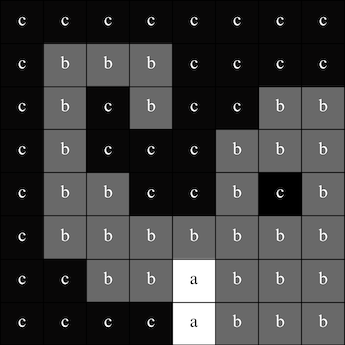

## Εμφάνιση εικόνας

Ο πίνακας LED του Astro Pi μπορεί να εμφανίζει χρώματα. Σε αυτό το βήμα, θα εμφανίσεις εικόνες από τη φύση στη οθόνη LED του Astro Pi.

<p style="border-left: solid; border-width:10px; border-color: #0faeb0; background-color: aliceblue; padding: 10px;">
Ένα <span style="color: #0faeb0">**LED matrix**</span> είναι ένα πλέγμα από LED που μπορούν να ελεγχθούν μεμονωμένα ή ως ομάδα για να δημιουργήσουν διαφορετικά εφέ φωτισμού. Ο πίνακας LED matrix στο Sense HAT έχει 64 LED που εμφανίζονται σε ένα πλέγμα 8 x 8. Τα LED μπορούν να προγραμματιστούν ώστε να παραγάγουν μεγάλη γκάμα χρωμάτων.
</p>


--- task ---

Άνοιξε το [αρχικό έργο Mission Zero](http://rpf.io/mzcode){:target="_blank"}.

Θα δεις ότι μερικές γραμμές κώδικα έχουν ήδη προστεθεί αυτόματα για σένα.

Αυτός ο κώδικας συνδέεται με το Astro Pi, εξασφαλίζει ότι η οθόνη LED του Astro Pi εμφανίζεται με τον σωστό τρόπο και ρυθμίζει τον αισθητήρα χρώματος. Άφησε αυτόν τον κώδικα εκεί, γιατί θα τον χρειαστείς.

--- code ---
---
Πρόσθεσε αυτή τη γραμμή κάτω από τον υπόλοιπο κώδικα:
title: Τι χαρακτήρες μπορούν να χρησιμοποιηθούν;
---
# Εισαγωγή βιβλιοθηκών
from sense_hat import SenseHat from time import sleep

# Ρύθμιση του Sense HAT
sense = SenseHat() sense.set_rotation(270)

# Ρύθμιση του αισθητήρα χρωμάτων
Πάτησε το κουμπί «**Run**» (Εκτέλεση) και παρακολούθησε το κυλιόμενο μήνυμα «`Astro Pi`» στην οθόνη LED.

--- /code ---


--- /task ---

### Χρώματα RGB

Τα χρώματα μπορούν να δημιουργηθούν χρησιμοποιώντας διαφορετικές αναλογίες κόκκινου, πράσινου και μπλε. Μπορείς να μάθεις για τα χρώματα RGB εδώ:

[[[generic-theory-simple-colours]]]

Ο πίνακας LED matrix είναι ένα πλέγμα 8 x 8. Κάθε LED στο πλέγμα μπορεί να ρυθμιστεί σε διαφορετικό χρώμα. Εδώ είναι μια λίστα μεταβλητών για 24 διαφορετικά χρώματα. Κάθε χρώμα έχει μια τιμή για το κόκκινο, το πράσινο και το μπλε:

[[[ambient-colours]]]

### Επίλεξε μια εικόνα

--- task ---

**Επίλεξε:** Από τις παρακάτω επιλογές διάλεξε μια εικόνα για να την εμφανίσεις. Η Python αποθηκεύει τις πληροφορίες για μια εικόνα σε μια λίστα. Ο κώδικας για κάθε εικόνα περιλαμβάνει τις μεταβλητές για τα χρώματα που χρησιμοποιούνται και τη λίστα.

Θα χρειαστεί να **αντιγράψεις** όλο τον κώδικα για την εικόνα που επέλεξες και στη συνέχεια να τον ** επικολλήσεις** στο έργο σου κάτω από τη γραμμή που λέει `# Προσθήκη μεταβλητών χρώματος και εικόνας`.

--- collapse ---

---
title: Κοτόπουλο
---


Created by team i_pupi, Italy

```python
c = (0, 0, 0) # Black
a = (255, 255, 255) # white
t = (255, 140, 0) # dark orange

image = [
t, a, t, c, c, t, a, t,
t, a, t, c, c, t, a, t,
t, t, t, t, t, t, t, t,
t, a, c, t, t, c, a, t,
t, t, t, t, t, t, t, t,
a, a, a, c, c, a, a, a,
c, a, a, a, a, a, a, c,
c, c, a, a, a, a, c, c]
```

--- /collapse ---


--- collapse ---

---
line_numbers: false
---



Created by team ILiFanT, Finland

```python
c = (0, 0, 0) # Black
b = (105, 105, 105) # dark grey
a = (255, 255, 255) # white

image = [
    c, c, c, c, c, c, c, c,
    c, b, b, b, c, c, c, c,
    c, b, c, b, c, c, b, b,
    c, b, c, c, c, b, b, b,
    c, b, b, c, c, b, c, b,
    c, b, b, b, b, b, b, b,
    c, c, b, b, a, b, b, b,
    c, c, c, c, a, b, b, b]
```

--- /collapse ---

--- collapse ---
---
title: Λουλούδι
---


Created by team 6TETHASI, The Netherlands

```python
a = (255, 255, 255) # White
c = (0, 0, 0) # Black
n = (154, 205, 50) # YellowGreen
q = (255, 255, 0) # Yellow
t = (255, 140, 0) # DarkOrange

image = [   
  q, q, c, n, c, c, a, c,
  q, c, c, n, c, a, a, a,
  c, n, c, n, c, c, c, c,
  c, n, n, n, c, n, c, c,
  c, a, n, n, n, n, c, c,
  a, a, a, n, c, a, a, a,
  c, c, c, n, a, a, a, c,
  t, t, t, t, t, t, t, t]

```

--- /collapse ---


--- collapse ---
---
title: Κροκόδειλος
---


```python

a = (255, 255, 255) # White
c = (0, 0, 0) # Black
f = (25, 25, 112) # MidnightBlue
m = (34, 139, 34) # ForestGreen

image = [
  m, m, m, m, m, c, c, c,
  m, f, m, f, m, m, m, m,
  m, m, m, m, m, m, m, m,
  m, m, c, a, c, c, c, a,
  m, m, c, c, c ,c ,c ,c,
  m, m, c, c, c, a, c, c,
  m, m, m, m, m, m, m, m,
  m, m, m, m, m, m, m, m]

```

--- /collapse ---

--- collapse ---
---
title: Κάβουρας
---


Created by team camrus_6, United Kingdom

```python

c = (100, 149, 237) # CornflowerBlue
a = (255, 255, 255) # White
v = (255, 0, 0) # Red
t = (255, 140, 0) # DarkOrange
q = (255, 255, 0) # Yellow
l = (0, 255, 127) # SpringGreen
e = (0, 0, 205) # MediumBlue

rainbow = [
  c, c, c, c, c, c, c, c, 
  v, v, v, v, c, c, c, c,
  t, t, t, t, v, v, c, c,
  q, q, q, q, t, v, c, c,
  l, l, l, l, q, t, v, c,
  e, e, e, l, q, t, v, c,
  c, c, e, a, a, a, a, c,
  c, a, a, a, a, a, a, a
]

```

--- /collapse ---

--- collapse ---
---
line_numbers: false
---


image = [ c, a, a, c, a, a, c, c, c, a, c, c, a, c, c, c, c, v, c, c, v, c, c, c, c, v, c, c, v, c, c, c, v, v, v, v, v, c, v, v, v, v, c, c, v, v, v, c, v, v, v, v, v, c, v, v, v, c, v, c, v, c, c, c]

```python

b = (105, 105, 105) # DimGray
c = (0, 0, 0) # Black
d = (100, 149, 237) # CornflowerBlue
v = (255, 0, 0) # Red
z = (153, 50, 204) # DarkOrchid

image = [
    c, c, v, c, v, c, c, c,
    c, z, z, z, z, v, c, c,
    z, b, z, b, z, c, c, c,
    z, z, z, z, z, v, c, c,
    c, c, d, d, d, c, c, z,
    c, z, d, z, z, z, z, c,
    c, c, d, d, z, c, c, c,
    c, c, z, c, z, c, c, c]

```

--- /collapse ---

--- /task ---

--- task ---

**Βρες:**τη γραμμή που λέει `# Εμφάνιση εικόνας` και πρόσθεσε μια γραμμή κώδικα για να εμφανίσει την εικόνα σου στην οθόνη LED:

```python
a = (255, 255, 255) # White
c = (0, 0, 0) # Black
f = (25, 25, 112) # MidnightBlue
m = (34, 139, 34) # ForestGreen

image = [
  m, m, m, m, m, c, c, c,
  m, f, m, f, m, m, m, m,
  m, m, m, m, m, m, m, m,
  m, m, c, a, c, c, c, a,
  m, m, c, c, c ,c ,c ,c,
  m, m, c, c, c, a, c, c,
  m, m, m, m, m, m, m, m,
  m, m, m, m, m, m, m, m]

# Display the image 
sense.set_pixels(image)

```

--- /task ---

--- task ---

Πάτα **Run (Εκτέλεση)** στο κάτω μέρος του προγράμματος επεξεργασίας επεξεργαστή, για να δεις την εικόνα σου να εμφανίζεται στην οθόνη LED.

--- /task ---

--- task ---

**Εντοπισμός σφαλμάτων**

Ο κώδικάς μου έχει ένα συντακτικό σφάλμα:

- Έλεγξε ότι ο κώδικάς σου ταιριάζει με τον κώδικα στα παραπάνω παραδείγματα
- Έλεγξε ότι έχεις βάλει εσοχές στον κώδικα στη λίστα σου
- Έλεγξε ότι η λίστα σου περιβάλλεται από `[` και `]`
- Έλεγξε ότι κάθε μεταβλητή για τα χρώματα στη λίστα διαχωρίζεται με κόμμα

Η εικόνα μου δεν εμφανίζεται:

- Έλεγξε μήπως το `sense.set_pixels(image)` δεν είναι σε εσοχή

--- /task ---


--- task ---

**Save your progress**

Now that you have displayed an image, you can save your program on the Mission Starter project by entering your team name, team members' names, and the classroom code given to you. You can reload your program on any device with an internet connection by entering your team name and classroom code.


--- /task --- 
