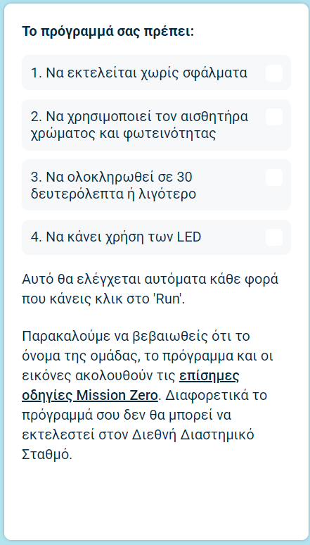

## Υποβολή της συμμετοχής σου

Υπάρχουν μερικοί κανόνες τους οποίους πρέπει να ακολουθεί ο κώδικάς σου, ώστε να μπορείς να τον υποβάλεις για εκτέλεση στον Διεθνή Διαστημικό Σταθμό. Εάν ο κώδικάς σου τους ακολουθεί, οι κανόνες στο κάτω μέρος του εξομοιωτή **Sense HAT** θα ανάψουν με πράσινο χρώμα, όταν εκτελέσεις το πρόγραμμα.

**Συμβουλή:** Δοκίμασε τον κώδικά σου με μερικές διαφορετικές ρυθμίσεις χρωμάτων (χρησιμοποιώντας τον επιλογέα) για να βεβαιωθείς ότι εκτελείται πάντα σωστά.

Παρακαλούμε να βεβαιωθείς ότι η υποβολή σου ακολουθεί τις [επίσημες οδηγίες](https://astro-pi.org/mission-zero/guidelines){:target="_blank"} για το Mission Zero. Εάν δεν ακολουθεί τις οδηγίες, το πρόγραμμά σου δεν θα μπορεί να εκτελεστεί στον Διεθνή Διαστημικό Σταθμό.

Παρακαλώ μην συμπεριλάβεις κανένα από τα ακόλουθα στο όνομα ή τον κώδικα της ομάδας σου:

+ Οτιδήποτε θα μπορούσε να εκληφθεί ως παράνομο, πολιτικό ή ευαίσθητο δεδομένο
+ Σημαίες, καθώς μπορούν να θεωρηθούν πολιτικά ευαίσθητο δεδομένο
+ Οτιδήποτε αναφέρεται σε δυσάρεστη συμπεριφορά ή είναι επιβλαβές για ένα άλλο άτομο
+ Προσωπικά δεδομένα όπως αριθμοί τηλεφώνου, ψευδώνυμα μέσων κοινωνικής δικτύωσης και διευθύνσεις email
+ Άσεμνες εικόνες
+ Ειδικούς χαρακτήρες ή emojis
+ Απρεπείς εκφράσεις ή βρισιές

--- task ---

Δώσε τον κωδικό της τάξης σου και το όνομα της ομάδας σου στο πλαίσιο στο κάτω μέρος - ο μέντοράς σου θα σου πει τι είναι ο κωδικός σου.

**Σημειώσεις για μέντορες** μπορούν να βρεθούν στο βήμα [Εισαγωγή](https://projects.raspberrypi.org/en/projects/astro-pi-mission-zero/0).

--- /task ---

--- task ---

Πάτα το κουμπί **Add your team** για να δώσεις τον κωδικό σου. Παρακαλώ λάβε υπόψη ότι ένα πρόγραμμα δεν μπορεί να αλλάξει μετά την υποβολή του.

Ο μέντοράς σου θα λάβει ένα email επιβεβαίωσης για την υποβολή σου.

--- /task ---

--- task ---

Αν θέλεις, μπορείς να κοινοποιήσεις έναν σύνδεσμο προς τον κώδικά σου στα κοινωνικά μέσα, για να δημοσιεύσεις ότι ο κώδικας που έγραψες θα εκτελεστεί στο διάστημα!

--- /task ---
