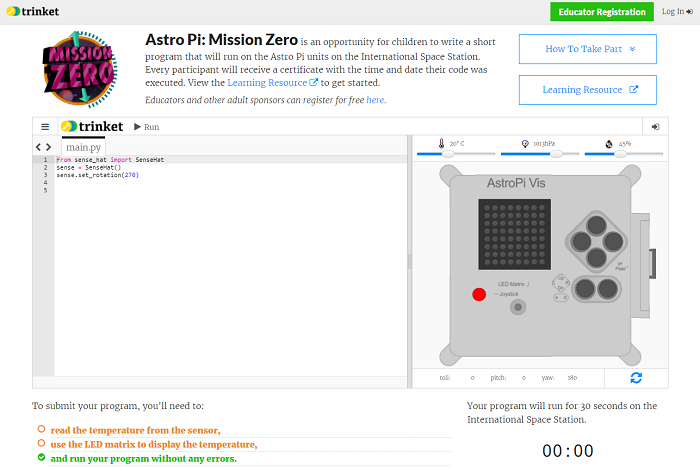

## Υποβάλετε την καταχώρησή σας

Υπάρχουν μερικοί κανόνες τους οποίους πρέπει να ακολουθεί ο κώδικάς σας, ώστε να μπορέσετε να τον υποβάλετε για εκτέλεση στον Διεθνή Διαστημικό Σταθμό. Αν ο κώδικάς σας τους ακολουθεί, οι κανόνες στο κάτω μέρος του εξομοιωτή θα γίνουν πράσινοι, όταν τρέξετε το πρόγραμμα.

1. Πραγματοποιήστε μια μέτρηση θερμοκρασίας
2. Ενεργοποιήστε τις φωτεινές ενδείξεις LED
3. Βεβαιωθείτε ότι ο κώδικάς σας εκτελείται μέχρι το τέλος χωρίς (να εμφανιστούν) σφάλματα. You should not include any `while True` loops in your code as this will keep you code running and prevent it from finishing.

Επίσης, βεβαιωθείτε ότι πληρούνται τα ακόλουθα κριτήρια:

1. Βεβαιωθείτε πως το μήνυμά σας στους αστροναύτες δεν εμφανίζεται για παραπάνω από 30 δευτερόλεπτα καθώς τόσος θα είναι ο χρόνος εκτέλεσης του κώδικά σας στον Διεθνή Διαστημικό Σταθμό.
2. Αποφύγετε τη χρήση μεθόδων που απαιτούν εισαγωγή
3. Κάντε εισαγωγή μόνο από τις ενότητες `sense_hat`, `time` και `random`
4. Βεβαιωθείτε ότι δεν χρησιμοποιείτε αισχρολογίες

Αν όλοι οι κανόνες είναι πράσινοι, μπορείτε να προχωρήσετε στην υποβολή.

\--- task --

Εισάγετε τον κωδικό της τάξης σας στο πλαίσιο στο κάτω μέρος - ο δάσκαλός σας θα σας δώσει τον κωδικό σας.

Θα βρείτε τις **Σημειώσεις για εκπαιδευτικούς ή σοφούς συμβούλους** στο βήμα [Εισαγωγή](https://projects.raspberrypi.org/en/projects/astro-pi-mission-zero/1).

\--- /task \---

\--- task --

Θα εμφανιστεί το όνομα του δασκάλου σας. Αν είναι το σωστό όνομα, κάντε κλικ στο κουμπί «**Continue to form**» (Συνέχεια στη φόρμα).

\--- /task \---

\--- task --

Εισάγετε το όνομα της ομάδας σας και τα ονόματα των μελών της ομάδας. Τα ονόματα αυτά θα εκτυπωθούν στο πιστοποιητικό που θα λάβετε μόλις ο κώδικάς σας εκτελεστεί στο διάστημα, οπότε βεβαιωθείτε ότι τα έχετε γράψει σωστά!

\--- /task \---

\--- task --

Πατήστε το κουμπί «**Submit**» (Υποβολή) για να υποβάλετε τον κώδικά σας. Ο δάσκαλος ή ο σύμβουλος σας θα λάβει ένα email επιβεβαίωσης για την καταχώρησή σας.

\--- /task \---

\--- task --

Αν θέλετε, μπορείτε να κοινοποιήσετε τον σύνδεσμο για τον κώδικά σας στα κοινωνικά μέσα, για να ενημερώσετε ότι ο κώδικας που γράψατε θα εκτελεστεί στο διάστημα!

\--- /task \---