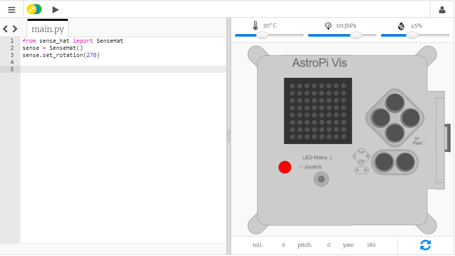

## What is a Sense HAT?

The Sense HAT is an add-on board for the Raspberry Pi, made especially for the Astro Pi competition. The board adds the ability to sense temperature, humidity, pressure and orientation, and to output information using a built-in LED matrix. The Sense HAT also has a joystick and buttons to help astronauts input information.

Here is a real Sense HAT inside a 3D printed Astro-Pi case:

For this mission, you will be using the Sense HAT emulator. The emulator is a piece of software which simulates all of the functions of the Sense HAT in your web browser.

