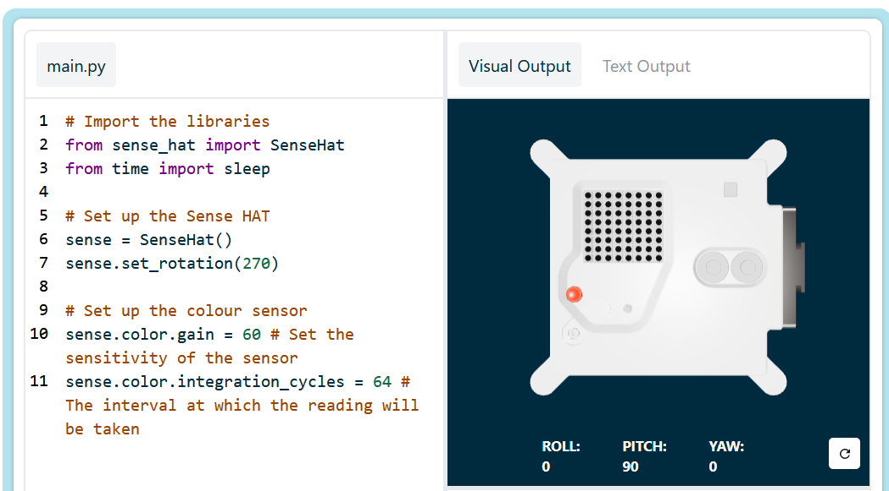

## Display a message

--- task ---

Open the [Sense HAT emulator](https://trinket.io/mission-zero){:target="_blank"} for the Mission Zero project.

You will see that three lines of code have been added for you automatically:

```python
from sense_hat import SenseHat
sense = SenseHat()
sense.set_rotation(270)
```



This code connects to the Astro Pi and makes sure the Astro Pi's LED display is shown the correct way around. Leave the code there, because you'll need it.

--- /task ---

--- task ---

Perhaps you could leave a nice greeting for the astronauts on the ISS who are working near the Astro Pi? Let's scroll a message across the display. 

Add this line below the other code:

```python
sense.show_message("Astro Pi")
```

--- /task ---

--- task ---

Press the **Run** button and watch as the message `Astro Pi` scrolls across the LED display.


--- /task ---


To display a different message, you can write anything you like between the quotation marks (`""`).

If you'd like to enter the competition to choose the names of the new Mark II Astro Pi computers, start your message with the words "I vote for" and then add in your selection from this list.

For example, if you'd like to vote for Ada Lovelace, your code would look like this:

```python
sense.show_message("I vote for Ada Lovelace")
```

--- collapse ---

---
title: What characters can be used?
---

The Sense HAT can only display the Latin 1 character set, meaning only the following characters will be available. Other characters will display as a `?`.

```
+-*/!"#$><0123456789.=)(

ABCDEFGHIJKLMNOPQRSTUVWXYZ

abcdefghijklmnopqrstuvwxyz

?,;:|@%[&_']\~
```

--- /collapse ---

--- task ---

You can also change the speed of the message scrolling across the screen. Add a `scroll_speed` to the line of code you already have, like this:

```python
sense.show_message("Astro Pi", scroll_speed=0.05)
```

The default speed of the message is `0.1`. Making the number smaller makes the message scroll more quickly, and making it larger makes the message scroll more slowly.

--- /task ---


