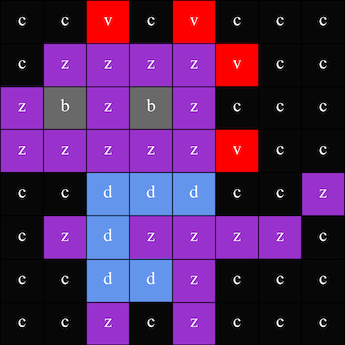

## Display an image

The Astro Pi's LED matrix can display colours. In this step, you will display images from nature on the Astro Pi's LED matrix. 

<p style="border-left: solid; border-width:10px; border-color: #0faeb0; background-color: aliceblue; padding: 10px;">
An <span style="color: #0faeb0">**LED matrix**</span> is a grid of LEDs that can be controlled individually or as a group to create different lighting effects. The LED matrix on the Sense HAT has 64 LEDs displayed in an 8 x 8 grid. The LEDs can be programmed to produce a wide range of colours.
</p>


--- task ---

Open the [Mission Zero starter project](https://missions.astro-pi.org/mz/code_submissions/){:target="_blank"}.

You will see that a few lines of code have been added for you automatically.

This code connects to the Astro Pi, makes sure the Astro Pi's LED display is shown the correct way around and sets up the colour sensor. Leave the code there, because you'll need it.

--- code ---
---
language: python
filename: main.py
line_numbers: false
line_number_start: 1
line_highlights: 
---
# Import the libraries
from sense_hat import SenseHat
from time import sleep

# Set up the Sense HAT
sense = SenseHat()
sense.set_rotation(270)

# Set up the colour sensor
sense.color.gain = 60 # Set the sensitivity of the sensor
sense.color.integration_cycles = 64 # The interval at which the reading will be taken

--- /code ---


--- /task ---

### RGB Colours 

Colours can be created using different proportions of red, green, and blue. You can find out about RGB colours here:

[[[generic-theory-simple-colours]]]

The LED matrix is an 8 x 8 grid. Each LED on the grid can be set to a different colour. Here is a list of variables for 24 different colours. Each colour has a value for red, green, and blue:

[[[ambient-colours]]]

### Choose an image 

--- task ---

**Choose:** Pick an image to display from the options below. Python stores the information for an image in a list. The code for each image includes the colour variables used and the list.  

You will need to **copy** all of the code for your chosen image then **paste** it into your project below the line which says `# Add colour variables and image`. 

--- collapse ---

---
title: Fox
---


Created by team i_pupi, Italy

```python
c = (0, 0, 0) # Black
a = (255, 255, 255) # white
t = (255, 140, 0) # dark orange

image = [
t, a, t, c, c, t, a, t,
t, a, t, c, c, t, a, t,
t, t, t, t, t, t, t, t,
t, a, c, t, t, c, a, t,
t, t, t, t, t, t, t, t,
a, a, a, c, c, a, a, a,
c, a, a, a, a, a, a, c,
c, c, a, a, a, a, c, c]
```

--- /collapse ---


--- collapse ---

---
title: Elephant
---


Created by team ILiFanT, Finland

```python
c = (0, 0, 0) # Black
b = (105, 105, 105) # dark grey
a = (255, 255, 255) # white
    
image = [
    c, c, c, c, c, c, c, c,
    c, b, b, b, c, c, c, c,
    c, b, c, b, c, c, b, b,
    c, b, c, c, c, b, b, b,
    c, b, b, c, c, b, c, b,
    c, b, b, b, b, b, b, b,
    c, c, b, b, a, b, b, b,
    c, c, c, c, a, b, b, b]
```

--- /collapse ---

--- collapse ---
---
title: Cactus
---


Created by team 6TETHASI, The Netherlands

```python
a = (255, 255, 255) # White
c = (0, 0, 0) # Black
n = (154, 205, 50) # YellowGreen
q = (255, 255, 0) # Yellow
t = (255, 140, 0) # DarkOrange
 
image = [   
  q, q, c, n, c, c, a, c,
  q, c, c, n, c, a, a, a,
  c, n, c, n, c, c, c, c,
  c, n, n, n, c, n, c, c,
  c, a, n, n, n, n, c, c,
  a, a, a, n, c, a, a, a,
  c, c, c, n, a, a, a, c,
  t, t, t, t, t, t, t, t]

```

--- /collapse ---
 
 
--- collapse ---
---
title: Crocodile
---


```python

a = (255, 255, 255) # White
c = (0, 0, 0) # Black
f = (25, 25, 112) # MidnightBlue
m = (34, 139, 34) # ForestGreen

image = [
  m, m, m, m, m, c, c, c,
  m, f, m, f, m, m, m, m,
  m, m, m, m, m, m, m, m,
  m, m, c, a, c, c, c, a,
  m, m, c, c, c ,c ,c ,c,
  m, m, c, c, c, a, c, c,
  m, m, m, m, m, m, m, m,
  m, m, m, m, m, m, m, m]

```
 
--- /collapse ---
 
--- collapse ---
---
title: Rainbow
---


Created by team camrus_6, United Kingdom

```python

c = (100, 149, 237) # CornflowerBlue
a = (255, 255, 255) # White
v = (255, 0, 0) # Red
t = (255, 140, 0) # DarkOrange
q = (255, 255, 0) # Yellow
l = (0, 255, 127) # SpringGreen
e = (0, 0, 205) # MediumBlue

image = [
  c, c, c, c, c, c, c, c, 
  v, v, v, v, c, c, c, c,
  t, t, t, t, v, v, c, c,
  q, q, q, q, t, v, c, c,
  l, l, l, l, q, t, v, c,
  e, e, e, l, q, t, v, c,
  c, c, e, a, a, a, a, c,
  c, a, a, a, a, a, a, a
]

```

--- /collapse ---

--- collapse ---
---
title: Dragon
---



Created by team hwplucyr, United Kingdom

```python

b = (105, 105, 105) # DimGray
c = (0, 0, 0) # Black
d = (100, 149, 237) # CornflowerBlue
v = (255, 0, 0) # Red
z = (153, 50, 204) # DarkOrchid

image = [
    c, c, v, c, v, c, c, c,
    c, z, z, z, z, v, c, c,
    z, b, z, b, z, c, c, c,
    z, z, z, z, z, v, c, c,
    c, c, d, d, d, c, c, z,
    c, z, d, z, z, z, z, c,
    c, c, d, d, z, c, c, c,
    c, c, z, c, z, c, c, c]

```

--- /collapse ---

--- /task ---

--- task ---

**Find:** the line which says `# Display the image` and add a line of code to display your image on the LED matrix:

--- code ---
---
language: python
filename: main.py
line_numbers: false
line_number_start: 1
line_highlights: 18, 19
---
b = (105, 105, 105) # DimGray
c = (0, 0, 0) # Black
d = (100, 149, 237) # CornflowerBlue
v = (255, 0, 0) # Red
z = (153, 50, 204) # DarkOrchid

image = [
    c, c, v, c, v, c, c, c,
    c, z, z, z, z, v, c, c,
    z, b, z, b, z, c, c, c,
    z, z, z, z, z, v, c, c,
    c, c, d, d, d, c, c, z,
    c, z, d, z, z, z, z, c,
    c, c, d, d, z, c, c, c,
    c, c, z, c, z, c, c, c]

# Display the image
sense.set_pixels(image)

--- /code ---

--- /task ---

--- task ---

Press **Run** at the bottom of the editor, to see your image displayed on the LED matrix.

--- /task ---

--- task ---

**Debug** 

My code has a syntax error:

- Check that your code matches the code in the examples above
- Check that you have indented the code in your list
- Check that your list is surrounded by `[` and `]`
- Check that each colour variable in the list is separated by a comma

My image does not appear:

- Check that your `sense.set_pixels(image)` is not indented

--- /task ---


--- task --- 

**Save your progress** 

Now that you have displayed an image, you can save your program on the Mission Starter project by entering your team name, team members' names, and the classroom code given to you. You can reload your program on any device with an internet connection by entering your team name and classroom code. 


--- /task --- 
