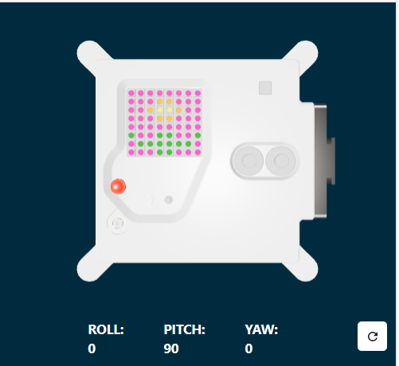
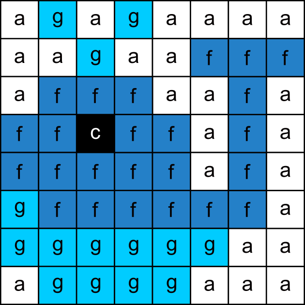

## Sense a colour

In this step, you will set up the colour luminosity sensor and use it to sense the amount of red, green, and blue reaching the sensor. This colour will then be used to colour in your chosen image. An astronaut walking up to the sensor in a blue shirt would see a different image than an astronaut in a red shirt. 



--- task ---

Use the colour sensor to colour your background.

Add code before your image list to get the colour from the sensor and change your `c` background colour variable to use the colour sensed by the Sense HAT colour sensor instead of black.

**Tip:** You don't need to type the comments that start with '#' (they are there to explain the code). 

--- code ---
---
language: python
filename: main.py
line_numbers: false
line_number_start: 1
line_highlights: 9, 10
---

# Add colour variables and image

a = (255, 255, 255) # White
c = (0, 0, 0)       # Black
f = (36, 128, 200)  # Ocean Blue
g = (0, 204, 255)   # Sky Blue

rgb = sense.color # get the colour from the sensor
c = (rgb.red, rgb.green, rgb.blue) # use the sensed colour

image = [
c, g, c, g, c, c, c, c,
c, c, g, c, c, f, f, f,
c, f, f, f, c, c, f, c,
f, f, c, f, f, c, f, c,
f, f, f, f, f, c, f, c,
g, f, f, f, f, f, f, c,
g, g, g, g, g, g, c, c,
c, g, g, g, g, c, c, c]


--- /code ---

--- /task ---

--- task ---

**Test:** Move the colour slider to a colour of your choice and then **run** your code. Your background colour will change. Repeat this test again with a new colour.

**Tip:** You will need to click 'Run' every time you change the colour.

--- /task ---

## Loop your program

The Astro Pi Mission Zero program is allowed to run for up to 30 seconds. You will use this time to repeatedly check the colour sensor and update the image.

Your code will use a `for` loop to run 28 times. **Each** time it will:
+ sense the latest colour
+ update the background colour of the image
+ pause for one second

--- task ---

**Find** your `rgb = sense.color` line of code.

**Add** code above it to set up your `for` loop for `28` repetitions.

--- code ---
---
language: python
filename: main.py
line_numbers: false
line_number_start: 1
line_highlights: 2
---

for i in range(28):
rgb = sense.color # get the colour from the sensor
c = (rgb.red, rgb.green, rgb.blue)

image = [
c, g, c, g, c, c, c, c,
c, c, g, c, c, f, f, f,
c, f, f, f, c, c, f, c,
f, f, c, f, f, c, f, c,
f, f, f, f, f, c, f, c,
g, f, f, f, f, f, f, c,
g, g, g, g, g, g, c, c,
c, g, g, g, g, c, c, c]

  
--- /code ---

--- /task ---

--- task ---

You now need to indent all your code below the `for` loop so that it sits **inside** the `for` loop.

**Tip:** To indent multiple lines, highlight the lines you want to indent then press the <kbd>Tab</kbd> key on your keyboard (usually above the <kbd>Caps Lock</kbd> key on the keyboard). 

--- code ---
---
language: python
filename: main.py
line_numbers: false
line_number_start: 1
line_highlights: 3, 4, 5, 6, 7, 8, 9, 10, 11, 12, 13, 14, 15, 16, 17, 18, 19
---

for i in range(28):
  rgb = sense.color # get the colour from the sensor
  c = (rgb.red, rgb.green, rgb.blue)

  image = [
      c, g, c, g, c, c, c, c,
      c, c, g, c, c, f, f, f,
      c, f, f, f, c, c, f, c,
      f, f, c, f, f, c, f, c,
      f, f, f, f, f, c, f, c,
      g, f, f, f, f, f, f, c,
      g, g, g, g, g, g, c, c,
      c, g, g, g, g, c, c, c]

    
  # Display the image

  sense.set_pixels(image)
 
--- /code ---

--- /task ---

--- task ---

At the bottom of your code, add a `sleep` of one second inside your loop:

--- code ---
---
language: python
filename: main.py
line_numbers: false
line_number_start: 1 
line_highlights: 5
---
  
  # Display the image

  sense.set_pixels(image)
  sleep(1)  
  
--- /code ---

**Tip:** Make sure this line of code is indented within your `for` loop. 

--- /task ---

--- task ---

**Test:** Run your code and change the colour picker several times as your project is running. Check that your image updates to use the sensed colour on its next run. 

The image will stop updating when the loop finishes so that the program doesn't run for more than 30 seconds. 

--- /task ---

--- task ---

**Debug** 

My code has a syntax error or doesn't run as expected:

- Check that your code matches the code in the examples above
- Check that you have indented the code in your `for` loop
- Check that your list is surrounded by `[` and `]`
- Check that each colour variable in the list is separated by a comma 

My code runs for longer than 30 seconds:

- Decrease the number of times your for loop runs, from 28 to 25 or even 20.
- Decrease the length of the sleep, from 1 second to 0.5 seconds.

--- /task ---

--- task ---

Add `sense.clear()` at the end of your code to clear the image at the end of your loop. This will help you see when your animation has finished running. 

**Tip:** Make sure you **do not** indent the `sense.clear()` line of code as you want this to only run once at the end of your animation.

--- code ---
---
language: python
filename: main.py
line_numbers: false
line_number_start: 1 
line_highlights: 7
---
  
  # Display the image

  sense.set_pixels(image)
  sleep(1) 
  
sense.clear()
  
--- /code ---

--- /task ---

--- task ---

**Test:** Run your code again. When your project has finished running the LED matrix will clear, turning all the lights black (off).  

--- /task ---

--- task ---

**Debug** 

The LED matrix turns black every second:

- Check that you have not indented the `sense.clear()` code within your `for` loop

--- /task ---

--- task ---

Add code to clear the LED matrix to a colour of your choice. Create a variable called `x` to store your new colour. 

You can mix your own colour or use the values from the list of colours to create your new `x`colour. 

[[[generic-theory-simple-colours]]]
--- collapse ---

---
title: List of Colour Variables
---


```python
a = (255, 255, 255) # White
b = (171, 171, 171) # Grey
c = (0, 0, 0)       # Black
d = (25, 25, 113)   # Navy Blue
e = (0, 0, 255)     # Pure Blue
f = (36, 128, 200)  # Ocean Blue
g = (0, 204, 255)   # Sky Blue
h = (86, 255, 255)  # Electric Cyan
j = (0, 255, 0)     # Pure Green
k = (46, 139, 33)   # Leaf Green
l = (57, 97, 17)    # Olive Green
m = (30, 65, 6)     # Forest Green
n = (126, 88, 25)   # Earth Brown
o = (179, 96, 65)   # Terracotta Brown
p = (180, 34, 34)   # Brick Red
q = (255, 0, 0)     # Pure Red
r = (232, 118, 5)   # Orange
s = (241, 231, 100) # Pale Yellow
t = (255, 255, 0)   # Pure Yellow
u = (255, 209, 209) # Pale Pink
v = (255, 177, 177) # Blush Pink
w = (249, 169, 255) # Light Pink
y = (248, 97, 255)  # Magenta
z = (220, 53, 232)  # Purple

```

--- /collapse ---

--- code ---
---
language: python
filename: main.py
line_numbers: false
line_number_start: 1 
line_highlights: 7, 8
---
  
  # Display the image

  sense.set_pixels(image)
  sleep(1) 

x = (178, 34, 34)  # choose your own red, green, blue values between 0 - 255
sense.clear(x)
  
--- /code ---

--- /task ---

--- task ---

**Test:** Run your code again. When your project has finished running the LED matrix will clear to your chosen colour. You can change then test the colour as many times as you want.  

--- /task ---


--- task ---

**Save your progress**

You can save your program on the Mission Starter project by entering your team name, team members' names, and the classroom code given to you. You can reload your program on any device with an internet connection by entering your team name and classroom code. 


--- /task --- 


--- task ---

--- collapse ---

---
title: Completed code example
---



--- code ---
---
language: python
filename: main.py
line_numbers: false
---
# Import the libraries
from sense_hat import SenseHat
from time import sleep

# Set up the Sense HAT
sense = SenseHat()
sense.set_rotation(270)

# Set up the colour sensor
sense.color.gain = 60 # Set the sensitivity of the sensor
sense.color.integration_cycles = 64 # The interval at which the reading will be taken

# Add colour variables and image

a = (255, 255, 255) # White
c = (0, 0, 0)       # Black
f = (36, 128, 200)  # Ocean Blue
g = (0, 204, 255)   # Sky Blue

for i in range(28):
  rgb = sense.color # get the colour from the sensor
  c = (rgb.red, rgb.green, rgb.blue)

  image = [
      c, g, c, g, c, c, c, c,
      c, c, g, c, c, f, f, f,
      c, f, f, f, c, c, f, c,
      f, f, c, f, f, c, f, c,
      f, f, f, f, f, c, f, c,
      g, f, f, f, f, f, f, c,
      g, g, g, g, g, g, c, c,
      c, g, g, g, g, c, c, c]


  # Display the image

  sense.set_pixels(image)
  sleep(1)

x = (178, 34, 34)  # choose your own red, green, blue values between 0 and 255
sense.clear(x)

--- /code ---

--- /collapse ---

--- /task ---
