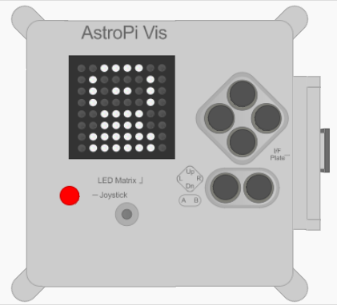

## Display an image

You can display pictures on the Astro Pi's LED matrix. Perhaps your greeting for the astronauts could include a picture or a pattern, as well as or instead of a written message?



--- task ---


At the bottom of your program, create some colour variables to define the colours with which you want to to draw your picture. You can use as many colours as you like, but in this example we'll use only a few colours — red ('r'), white (`w`), black (`b`) and two shades of of grey (`g` and `s`). Notice that the shades are achieved by reducing the amount of light in all three channels while keeping the proportions the same. 

```python
w = (255, 255, 255)
b = (0, 0, 0)
g = (50,50,50)
s = (200,255,200)
r = (255,0,0)
```

**Note:** This time, it's a good idea to give the colour variables single-letter names, because that will save time in the next step, where you are going to be typing them out many times. Moreover, using single letters will make it easier to see the picture you'll draw.


--- /task ---

--- task ---


Below your new variables, create a list of 64 items. Each item represents one pixel on the LED matrix, and corresponds to one of the colour variables you defined.

[[[rpi-sensehat-multiple-pixels]]]

Draw your picture by putting a variable where you want its assigned colour to appear. We have drawn an astronaut by using the  black (`b`) pixels as the background and the grey (`g`) pixels to draw the metal parts of the Astro Pi Flight Case:


```python
 picture = [
    g, b, b, b, b, b, b, g,
    b, g, g, g, g, g, g, b,
    b, g, b, b, g, w, g, g,
    b, g, b, b, g, g, g, g,
    b, g, g, g, s, s, g, g,
    b, g, r, g, g, g, g, g,
    b, g, g, g, g, g, g, b,
    g, b, b, b, b, b, b, g
    ]


```
--- /task ---

--- task ---

Add a line of code to display your picture on the LED display.

```python
sense.set_pixels(picture)
```

--- /task ---

--- task ---

Press **Run** to see your picture displayed.

--- /task ---

--- task ---

You might want to add some code to include a short wait (or `sleep`) after the picture is displayed. This will give the astronauts time to see your picture before the next part of your message appears. At the top of your program, add:

```python
from time import sleep
```

Then, on the line after the one that displays your picture, add this code to wait for two seconds:

```python
sleep(2)
```

--- /task ---

--- task ---

Create your own picture or pattern to display to the astronauts!

--- /task ---
