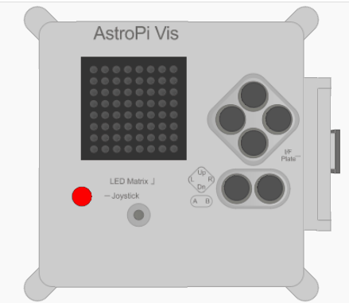

## Measure the temperature

The Sense HAT can measure the temperature which is useful to help you gather data about the conditions in space.



Part of your mission is to contribute to the daily lives of the crew aboard the ISS, so letting them know that the temperature aboard the space station is within normal parameters will help reassure them.

--- collapse ---
---
title: What is temperature?
---
Temperature is the measure of how hot something is, or to be more precise, the amount of thermal energy of the particles in a substance. It is measured by the Sense HAT in degrees Celsius (&deg;C). You may well have had your temperature taken with a thermometer when you have visited the doctor.


_By Menchi [CC-BY-SA-3.0](http://creativecommons.org/licenses/by-sa/3.0/)] via Wikimedia Commons_

As the amount of heat energy absorbed by a substance changes, the substance might change state. You have probably noticed that an ice cube begins as a solid, but as it absorbs heat energy from its environment it melts and becomes a liquid.

The Sense HAT's temperature sensor measures the ambient temperature of the air around it in the ISS. Because temperatures in space vary much more than those on Earth, it can measure temperatures from as low as -40 degrees Celsius up to +120 degrees Celsius.

--- /collapse ---

+ Add this code to take a temperature reading:

```python
temp = sense.get_temperature()
```

This will take the current temperature in degrees Celsius and store it in the variable `temp`.

+ The temperature will be taken to a large number of decimal places. If you would like to round the temperature to a certain number of decimal places, you can do it like this.

In the example, we have rounded to 1 decimal place, but for a different level of precision, change the number 1 to the number of decimal places you would like to see.

```python
temp = round( sense.get_temperature(), 1 )
```

+ You can display the current temperature as a scrolling message on the display like this:

```python
sense.show_message( str(temp) )
```

The `str()` part converts the temperature from a number into text so that the Sense HAT can display it.

+ You can also display the temperature as part of another message, like this. The parts of the message are joined together with a `+`.

```python
sense.show_message( "It is " + str(temp) + " degrees" )
```

+ The real Sense HAT will measure the temperature around it, but you can move the temperature slider on the Sense HAT emulator to simulate temperature changes and test your code.


