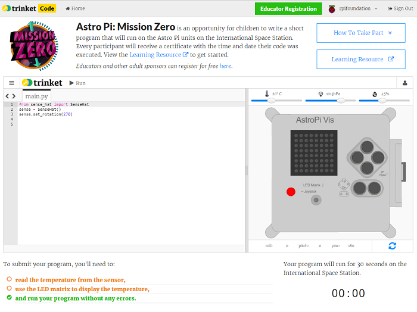
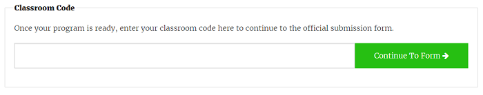

## Submit your entry

Please note: Mission Zero is now closed for the 2021/22 season. You can still complete the activity but won’t be able to submit it. The next Challenge will launch in Autumn 2022

There are a few rules your code needs to follow so that you can submit it to be run on the International Space Station. If your code follows them, the rules at the bottom of the [Sense HAT emulator](https://trinket.io/mission-zero) will light up in green when you run the program.

1. Take a humidity reading.
1. Light up the LEDs.
1. Ensure your code runs all the way to the end without any errors occurring. You should not include any `while True` loops in your code as this will keep you code running and prevent it from finishing.
1. Test your code with a few different humidity settings (using the slider) to make sure it will always run correctly. 

Also make sure you have met the following criteria:

1. Make sure your message to the astronauts runs for no longer than 30 seconds, as this is how long your code will run for on the ISS
1. Avoid using any methods needing input
1. Only import from the `sense_hat`, `time`, and `random` modules
1. Make sure you don't include any profanity

Once the rules are all green, you are ready to submit.

--- task ---

Enter your classroom code in the box at the bottom — your teacher or mentor will tell you what your code is.

**Notes for teachers or mentors** can be found in the [Introduction](https://projects.raspberrypi.org/en/projects/astro-pi-mission-zero/1) step.

--- /task ---

--- task ---

Your teacher's name will appear. If it is the right name, click on the green **Continue to form** button.

--- /task ---

--- task ---

Enter your team name and the names of the team members. These will be printed on the certificate once your code is run in space, so make sure you spell them correctly!

--- /task ---

--- task ---

Press the **Submit** button to enter your code. Your teacher or mentor will get an email to confirm your entry.

--- /task ---

--- task ---

If you want to, you can share the link to your code on social media to tell people that code which you wrote will be run in space!

--- /task ---
