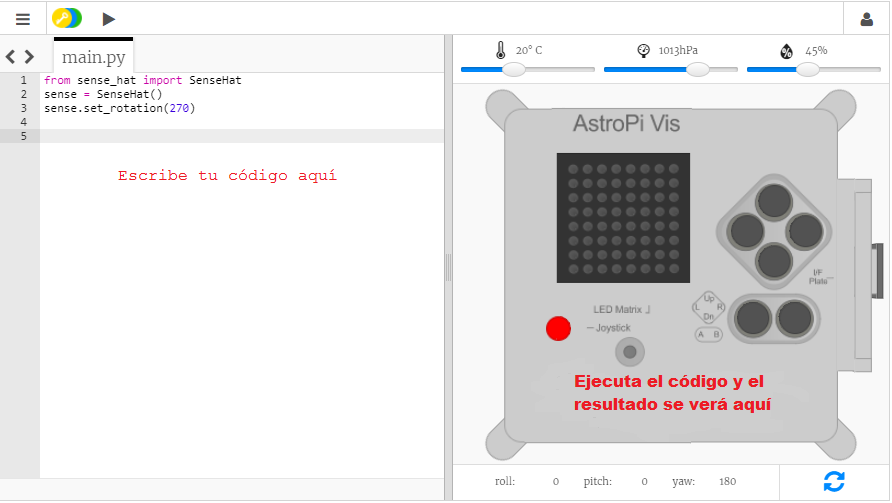

## ¿Qué es un Astro Pi?

Un Astro Pi es un ordenador Raspberry Pi cubierto por una carcasa especialmente diseñada para el entorno espacial. También posee una placa de circuitos adicional denominada Sense HAT diseñada específicamente para la misión Astro Pi. Sense HAT tiene un joystick, una pantalla LED y sensores para el registro de la temperatura, la humedad, la presión y la dirección.

Aquí tienes una unidad Astro Pi real de la Estación Espacial Internacional ejecutando algunos códigos escritos por los estudiantes. ¡Aquí es donde se ejecutará tu código! <iframe src="https://player.vimeo.com/video/172737314" width="640" height="360" frameborder="0" webkitallowfullscreen mozallowfullscreen allowfullscreen mark="crwd-mark"></iframe> 

Para esta misión, usarás el emulador Sense HAT. El emulador es una pieza de software que simula todas las funciones del Astro Pi en tu navegador web.

Existen algunas diferencias entre el Sense HAT real y el emulado:

- En el emulador, podrás establecer la temperatura, la presión y la humedad utilizando los controles deslizantes, sin embargo, el Sense HAT real del Astro Pi usa sensores para medir estos parámetros en su entorno.

- Podrás usar el ratón para hacer clic y arrastrar el Sense HAT emulado para moverlo y girarlo, simulando cambios en su dirección; el Astro Pi (y su Sense HAT) real puede moverse en el mundo real y los sensores de dirección de Sense HAT detectan cuándo y cómo se ha movido.