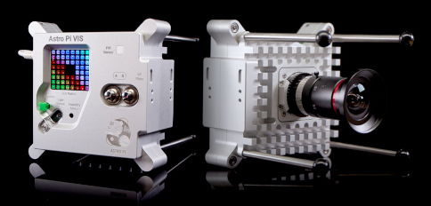

## ¿Qué es un Astro Pi?

Una Astro Pi es una computadora Raspberry Pi que ha sido especialmente diseñada para funcionar en el espacio.

Las computadoras Astro Pi tienen un conjunto de sensores llamados “Sense HAT” que los jóvenes pueden utilizar para llevar a cabo experimentos científicos. Un sensor es algo que puede detectar o medir lo que está ocurriendo a su alrededor. Los sensores del Sense Hat pueden medir aspectos como el color y el brillo de los objetos que se encuentran frente a él. El Sense Hat también incluye una matriz de LED de 8 x 8 que puede mostrar imágenes e información sencillas.

Una **matriz de LEDs** es una cuadrícula de LEDs (diodos emisores de luz) que se pueden controlar individualmente o en grupo para crear diferentes efectos de iluminación. La matriz de LEDs del Sense HAT tiene 64 LEDs que se muestran en una cuadrícula de 8 x 8. Los LEDs se pueden programar para producir una amplia gama de colores.

