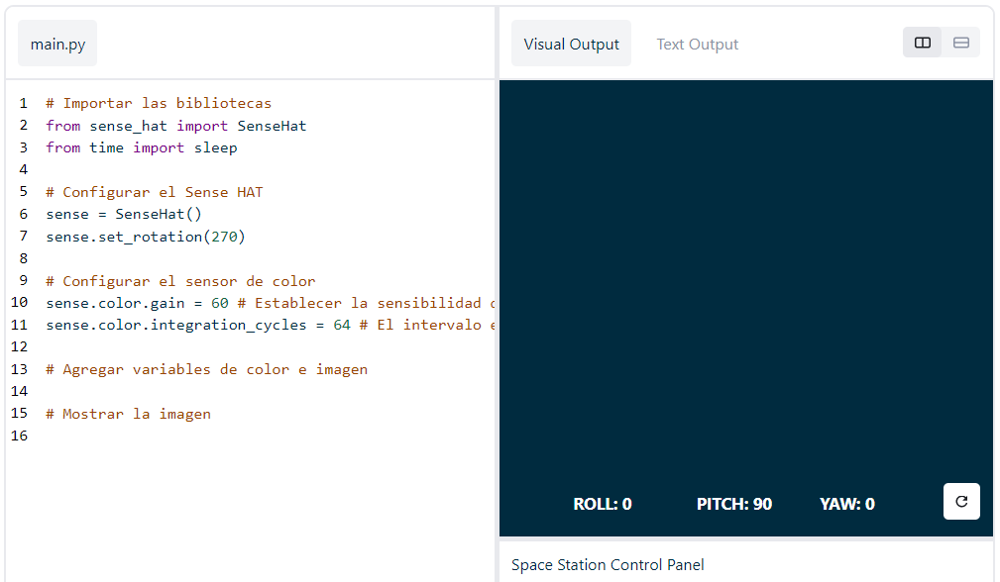
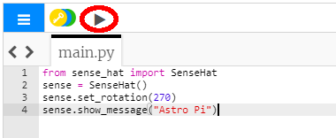

## Mostrar un mensaje

--- task ---

Abre el [emulador Sense HAT](https://trinket.io/mission-zero){:target="_blank"} para el proyecto Mission Zero.

Comprobarás que se han añadido automáticamente tres líneas de código.

```python
from sense_hat import SenseHat
sense = SenseHat()
sense.set_rotation(270)
```



Este código se conecta al Astro Pi y se asegura que la pantalla LED de Astro Pi se muestre en la orientación correcta. Deja estas líneas de código, ya que las necesitarás más adelante.

--- /task ---

--- task ---

¿Por qué no escribes un saludo para los astronautas de la ISS que están trabajando cerca de Astro Pi? Mostremos un mensaje que se desplace por la pantalla.

Añade esta línea debajo del otro código:

```python
sense.show_message("Astro Pi")
```

--- /task ---

--- task ---

Pulsa el botón **Run** (Ejecutar) y observa cómo el mensaje `Astro Pi` se desplaza por la pantalla LED.



--- /task ---


Para mostrar otro mensaje, escribe lo que quieras entre las comillas (`""`).

--- collapse ---
---
title: ¿Qué caracteres puedo utilizar?
---
Sense HAT solamente muestra el set de caracteres Latin 1, es decir, solamente están disponibles los siguientes caracteres. El resto de caracteres se mostrarán como `?`.

    +-*/!"#$><0123456789.=)(
    
    ABCDEFGHIJKLMNOPQRSTUVWXYZ
    
    abcdefghijklmnopqrstuvwxyz
    
    ?,;:|@%[&_']\~
    

--- /collapse ---

--- task ---

También puedes cambiar la velocidad de desplazamiento del mensaje por la pantalla. Añade `scroll_speed` a la línea del código que ya tienes, de este modo:

```python
sense.show_message("Astro Pi", scroll_speed=0.05)
```

La velocidad predeterminada del mensaje es `0.1`. Disminuir el número hará que el mensaje se desplace más rápidamente; y aumentarlo, que se desplace más lentamente.

--- /task ---