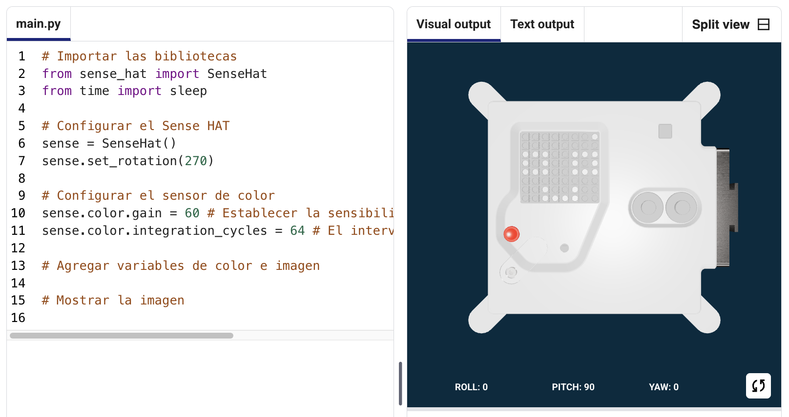
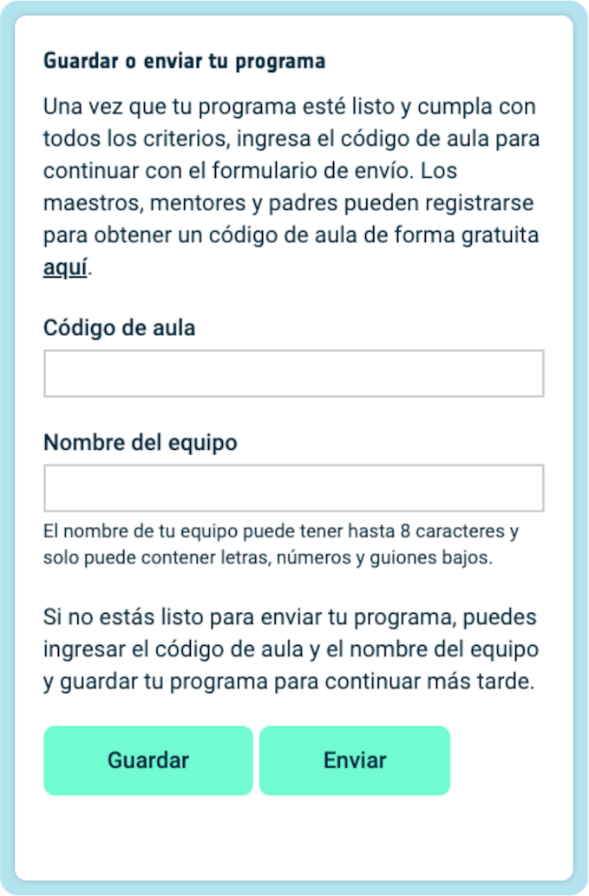

## Muestra una imagen

La matriz LED del Astro Pi puede mostrar colores. En este paso, mostrarás imágenes de la naturaleza en la matriz LED de Astro Pi.

<p style="border-left: solid; border-width:10px; border-color: #0faeb0; background-color: aliceblue; padding: 10px;">
Una <span style="color: #0faeb0">**matriz de LEDs**</span> es una cuadrícula de LEDs que se puede controlar individualmente o en grupo para crear diferentes efectos de iluminación. La matriz de LEDs del Sense HAT tiene 64 LEDs que se muestran en una cuadrícula de 8 x 8. Los LED se pueden programar para producir una amplia gama de colores.
</p>


--- task ---

Abre el [proyecto inicial de Mission Zero](https://missions.astro-pi.org/mz/code_submissions/){:target="_blank"} para el proyecto Mission Zero.

Comprobarás que se han añadido automáticamente unas líneas de código.

Este código se conecta al Astro Pi, se asegura de que la pantalla LED de Astro Pi se muestre en la orientación correcta e inicializa el sensor de color. Deja estas líneas de código, ya que las necesitarás más adelante.

--- code ---
---
language: python
filename: main.py
line_numbers: false
line_number_start: 1
line_highlights: 
---
# Importar las bibliotecas
from sense_hat import SenseHat
from time import sleep

# Configurar el Sense HAT
sense = SenseHat()
sense.set_rotation(270)

# Configurar el sensor de color
sense.color.gain = 60 # Establecer la sensibilidad del sensor
sense.color.integration_cycles = 64 # El intervalo en el que se tomará la lectura

--- /code ---



--- /task ---

### Colores RGB

Los colores se pueden crear usando diferentes proporciones de rojo, verde y azul. Aquí puedes encotrar información sobre los colores RGB:

[[[generic-theory-simple-colours]]]

La matriz de LEDs es una cuadrícula de 8 x 8. Cada LED de la cuadrícula se puede configurar en un color diferente. Aquí hay una lista de variables para 24 colores diferentes. Cada color tiene un valor para rojo, verde y azul:

[[[ambient-colours]]]

### Elige una imagen

--- task ---

**Seleccionar:** Elije una imagen para mostrar entre las opciones a continuación. Python almacena la información de una imagen en una lista. El código para cada imagen incluye las variables de color utilizadas y la lista.

Deberás **copiar** todo el código para la imagen elegida y luego **pegarlo** en ru proyecto debajo de la línea que dice `# Agregar variables de color e imagen`.

--- collapse ---

---
title: Pez
---


Creado por el equipo Chalka, Polonia

```python
z = (153, 50, 204) # OrquideaOscuro
q = (255, 255, 0) # Amarillo
d = (51, 153, 255) # Azul
c = (0, 0, 0) # Negro

imagen = [
d, d, z, d, d, d, d, d,
d, d, d, z, z, d, d, d,
z, d, q, q, q, q, d, d,
z, z, q, q, q, c, q, d,
z, z, z, q, q, q, q, d,
z, z, q, q, q, q, q, d,
z, d, q, z, z, q, d, d,
d, d, d, z, d, d, d, d]

```

--- /collapse ---


--- collapse ---

---
title: Morsa
---


Creado por el equipo Walrus, Finlandia

```python
h = (0, 255, 255) # Cian
c = (0, 0, 0) # Negro
s = (139, 69, 19) # MarrónCuero
a = (255, 255, 255) # Blanco
r = (184, 134, 11) # VerdeOscuro

imagen = [
h, h, h, h, h, h, h, h,
h, h, s, s, s, h, h, h,
h, s, s, s, s, s, h, h,
h, s, c, s, c, s, s, s,
h, r, r, r, r, r, s, s,
h, h, a, s, a, s, s, s,
h, h, a, s, a, s, s, s,
r, r, s, s, s, s, s, s]

```

--- /collapse ---

--- collapse ---
---
title: Paxi
---


Creado por el equipo tony_pi, Italia

```python
v = (255, 0, 0) # Rojo
m = (34, 139, 34) # VerdeBosque
c = (0, 0, 0) # Negro
e = (100, 149, 237) # AzulFlorDeMaiz
l = (0, 255, 0) # Verde

imagen = [
    c, v, m, c, c, m, v, c,
    c, c, v, v, v, v, c, c,
    c, v, c, e, l, e, v, c,
    c, v, c, l, l, l, v, c,
    c, v, c, l, c, l, v, c,
    c, c, v, v, v, v, c, c,
    c, c, l, c, c, l, c, c,
    c, m, m, c, c, m, m, c]

```

--- /collapse ---


--- collapse ---
---
title: Perro
---


Creado por el equipo ptpr_07, España

```python

c = (0, 0, 0) # Negro
r = (184, 134, 11) # VerdeOscuro
s = (139, 69, 19) # MarrónCuero
y = (255, 20, 147) # RosaProfundo

imagen = [
    c, r, r, c, c, r, r, c,
    c, r, s, s, s, s, r, c,
    c, r, c, s, s, c, r, c,
    c, s, s, s, s, s, s, c,
    c, s, s, s, s, s, s, c,
    c, s, s, c, c, s, s, c,
    c, c, s, y, y, s, c, c,
    c, c, c, y, y, c, c, c]


```

--- /collapse ---

--- collapse ---
---
title: Camaleón
---


Creado por el equipo The_ETs, Reino Unido

```python

c = (0, 0, 0) # Negro
s = (139, 69, 19) # MarrónCuero
a = (255, 255, 255) # Blanco
v = (255, 0, 0) # Rojo
t = (255, 140, 0) # AnaranjadoOscuro
q = (255, 255, 0) # Amarillo
m = (34, 139, 34) # VerdeBosque
h = (0, 255, 255) # Cian
z = (153, 50, 204) # OrquídeaOscuro
y = (255, 20, 147) # RosaProfundo

imagen = [
    a, a, v, v, t, a, a, a,
    a, v, v, t, t, q, a, a,
    v, c, t, t, q, q, m, a,
    v, t, t, q, q, m, m, h,
    s, s, q, s, s, m, s, h,
    a, a, a, a, a, a, a, z,
    a, a, a, a, y, a, a, z,
    a, a, a, a, a, y, z, a]

```

--- /collapse ---

--- collapse ---
---
title: Cometa
---


Creado por el equipo Val, Grecia

```python

c = (0, 0, 0) # Negro
m = (34, 139, 34) # VerdeBosque
v = (255, 0, 0) # Rojo
q = (255, 255, 0) # Amarillo
e = (0, 0, 205) # AzulMedio
h = (0, 255, 255) # Cian

imagen = [
    h, h, h, h, h, h, h, h, 
    h, h, h, e, e, v, v, h, 
    h, h, h, e, e, v, v, h, 
    h, h, h, q, q, m, m, h, 
    h, h, h, q, q, m, m, h,
    h, h, c, h, h, h, h, h, 
    h, c, h, h, h, h, h, h, 
    c, h, h, h, h, h, h, h]

```

--- /collapse ---

--- collapse ---
---
title: Pollo
---


Creado por el equipo de Slepicky, República Checa

```python

v = (255, 0, 0) # Rojo
c = (0, 0, 0) # Negro
b = (105, 105, 105) # GrisApagado
q = (255, 255, 0) # Amarillo
r = (184, 134, 11) # VerdeOscuro

imagen =  [
    c, c, v, v, v, c, c, c,
    c, v, b, b, r, c, c, r,
    c, b, c, b, b, c, r, b,
    q, r, b, b, b, b, b, r,
    c, v, b, b, b, b, r, b,
    c, v, b, r, r, r, b, r,
    c, c, c, r, b, q, r, c,
    c, c, c, c, q, q, c, c]

```

--- /collapse ---

--- /task ---

--- task ---

**Busca:** la línea que dice `# Mostrar la imagen` y añade una línea de código para mostrar la imagen en la matriz LED:

--- code ---
---
language: python
filename: main.py
line_numbers: false
line_number_start: 1
line_highlights: 18, 19
---
z = (153, 50, 204) # Orquídea Oscuro
q = (255, 255, 0) # Amarillo
d = (51, 153, 255) # Azul
c = (0, 0, 0) # Negro

imagen = [
d, d, z, d, d, d, d, d,
d, d, d, z, z, d, d, d,
z, d, q, q, q, q, d, d,
z, z, q, q, q, c, q, d,
z, z, z, q, q, q, q, d,
z, z, q, q, q, q, q, d,
z, d, q, z, z, q, d, d,
d, d, d, z, d, d, d, d]

# Mostrar la imagen
sense.set_pixels(imagen)

--- /code ---

--- /task ---

--- task ---

Pulsa **Ejecutar** en la parte inferior del editor, para ver tu imagen en la matriz de LEDs.

--- /task ---

--- task ---

**Depurar**

Mi código tiene un error de sintaxis:

- Comprueba que tu código coincide con el código en los ejemplos anteriores
- Comprueba que has indentado el código en tu lista
- Compruebe que su lista está rodeada por `[` y `]`
- Verifica que cada variable de color de la lista esté separada por una coma

Mi imagen no aparece:

- Comprueba que tu `sense.set_pixels(imagen)` no esté indentado

--- /task ---


--- task ---

**Guarda tu progreso**

Ahora que has mostrado una imagen, puedes guardar tu programa en el Proyecto Inicial de la Misión ingresando el nombre de tu equipo, los nombres de los miembros del equipo y el código de aula que te dieron. Puedes recargar tu programa en cualquier dispositivo con conexión a Internet ingresando el nombre de tu equipo y el código de aula.



--- /task --- 
