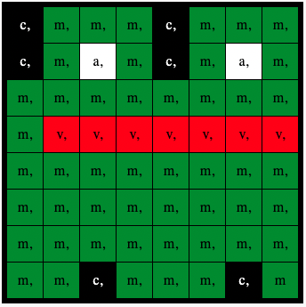

## Muestra una imagen

La matriz LED del Astro Pi puede mostrar colores. En este paso, mostrarás imágenes de la naturaleza en la matriz LED de Astro Pi.

Una **matriz de LEDs** es una cuadrícula de LEDs que se puede controlar individualmente o en grupo para crear diferentes efectos de iluminación. La matriz de LEDs del Sense HAT tiene 64 LEDs que se muestran en una cuadrícula de 8 x 8. Los LED se pueden programar para producir una amplia gama de colores.

--- task ---

Abre el [emulador Sense HAT](https://trinket.io/mission-zero){:target="_blank"} para el proyecto Mission Zero.

Comprobarás que se han añadido automáticamente tres líneas de código.

Este código se conecta al Astro Pi y se asegura de que la pantalla LED de Astro Pi se muestre en la orientación correcta. Deja estas líneas de código, ya que las necesitarás más adelante.

--- code ---
---
language: python filename: main.py line_numbers: false line_number_start: 1
title: ¿Qué caracteres puedo utilizar?
---
# Importar las bibliotecas
Muestra un mensaje y elige un nombre para los nuevos ordenadores Astro Pi

# Configurar el Sense HAT
from sense_hat import SenseHat sense = SenseHat() sense.set_rotation(270)

# Configurar el sensor de color
sense.color.gain = 60 # Set the sensitivity of the sensor sense.color.integration_cycles = 64 # The interval at which the reading will be taken

--- /code ---

--- /task ---

### Colores RGB

Los colores se pueden crear usando diferentes proporciones de rojo, verde y azul. Aquí puedes encotrar información sobre los colores RGB:

[[[generic-theory-simple-colours]]]

La matriz de LEDs es una cuadrícula de 8 x 8. Cada LED de la cuadrícula se puede configurar en un color diferente. Aquí hay una lista de variables para 24 colores diferentes. Cada color tiene un valor para rojo, verde y azul:

[[[ambient-colours]]]

### Elige una imagen

--- task ---

**Seleccionar:** Elije una imagen para mostrar entre las opciones a continuación. Python almacena la información de una imagen en una lista. El código para cada imagen incluye las variables de color utilizadas y la lista.

Deberás **copiar** todo el código para la imagen elegida y luego **pegarlo** en ru proyecto debajo de la línea que dice `# Agregar variables de color e imagen`.

--- collapse ---

---
title: Pollo
---

--- code ---
---
language: python filename: main.py
line_numbers: false
---
a = (255, 255, 255) # White c = (0, 0, 0) # Black e = (0, 0, 205) # MediumBlue q = (255, 255, 0) # Yellow t = (255, 140, 0) # DarkOrange w = (255, 192, 203) # Pink

image = [ c, c, c, q, q, q, c, c, c, c, t, q, e, q, c, c, c, c, c, q, q, q, c, c, c, w, w, w, w, w, w, c, c, w, a, a, a, a, w, c, c, w, a, a, a, a, w, c, c, c, w, a, a, w, c, c, c, c, c, w, w, c, c, c]

--- /code ---

--- /collapse ---

--- collapse ---

---
title: Flor
---

--- code ---
---
language: python filename: main.py
line_numbers: false
---
c = (0, 0, 0) # Black m = (34, 139, 34) # ForestGreen q = (255, 255, 0) # Yellow t = (255, 140, 0) # DarkOrange y = (255, 20, 147) # DeepPink

image = [ c, c, y, y, y, y, c, c, c, y, y, t, t, y, y, c, y, y, t, q, q, t, y, y, c, y, y, t, t, y, y, c, c, c, y, y, y, y, c, c, m, c, c, m, m, c, c, m, c, m, m, m, m, m, m, c, c, c, c, m, m, c, c, c]

--- /code ---

--- /collapse ---

--- collapse ---
---
title: Cangrejo
---

--- code ---
---
language: python filename: main.py
line_numbers: false
---
a = (255, 255, 255) # White c = (0, 0, 0) # Black v = (255, 0, 0) # Red

image = [ c, a, a, c, a, a, c, c, c, a, c, c, a, c, c, c, c, v, c, c, v, c, c, c, c, v, c, c, v, c, c, c, v, v, v, v, v, c, v, v, v, v, c, c, v, v, v, c, v, v, v, v, v, c, v, v, v, c, v, c, v, c, c, c]

--- /code ---

--- /collapse ---

--- collapse ---
---
title: Cocodrilo
---

--- code ---
---
language: python filename: main.py
line_numbers: false
---
a = (255, 255, 255) # White c = (0, 0, 0) # Black f = (25, 25, 112) # MidnightBlue m = (34, 139, 34) # ForestGreen

image = [ m, m, m, m, m, c, c, c, m, f, m, f, m, m, m, m, m, m, m, m, m, m, m, m, m, m, c, a, c, c, c, a, m, m, c, c, c ,c ,c ,c, m, m, c, c, c, a, c, c, m, m, m, m, m, m, m, m, m, m, m, m, m, m, m, m]

--- /code ---

--- /collapse ---

--- collapse ---
---
title: Serpiente
---

--- code ---
---
language: python filename: main.py
line_numbers: false
---
 c = (0, 0, 0) # Black m = (34, 139, 34) # ForestGreen q = (255, 255, 0) # Yellow v = (255, 0, 0) # Red

image = [ c, c, c, c, c, c, c, m, c, m, m, m, m, m, m, m, c, m, c, c, c, c, c, c, c, m, m, m, m, m, c, c, c, c, c, c, c, m, c, c, q, m, q, m, m, m, c, c, m, m, m, c, c, c, c, c, v, c, c, c, c, c, c, c]

--- /code ---

--- /collapse ---

--- collapse ---
---
title: Rana
---

--- code ---
---
language: python filename: main.py line_numbers: false line_number_start:
line_highlights:
---
c = (0, 0, 0) # Black m = (34, 139, 34) # ForestGreen q = (255, 255, 0) # Yellow v = (255, 0, 0) # Red

image = [ c, m, m, m, c, m, m, m, c, m, q, m, c, m, q, m, m, m, m, m, m, m, m, m, m, v, v, v, v, v, v, v, m, m, m, m, m, m, m, m, m, m, m, m, m, m, m, m, m, m, m, m, m, m, m, m, m, m, c, m, m, m, c, m]

--- /code ---

--- /collapse ---

--- /task ---

--- task ---

**Buscar:** la línea que dice `# Mostrar la imagen` y añade una línea de código para mostrar la imagen en la matriz LED:

--- code ---
---
language: python filename: main.py line_numbers: false line_number_start: 1
line_highlights: 12
---
image = [ c, c, c, q, q, q, c, c, c, c, t, q, e, q, c, c, c, c, c, q, q, q, c, c, c, w, w, w, w, w, w, c, c, w, a, a, a, a, w, c, c, w, a, a, a, a, w, c, c, c, w, a, a, w, c, c, c, c, c, w, w, c, c, c]

# Muestra la imagen
sense.set_pixels(image)

--- /code ---

--- /task ---

--- task ---

Pulsa **Ejecutar** en la parte inferior del editor, para ver tu imagen en la matriz de LEDs.

--- /task ---

--- task ---

**Depurar**

Mi código tiene un error de sintaxis:

- Comprueba que tu código coincide con el código en los ejemplos anteriores
- Comprueba que has indentado el código en tu lista
- Compruebe que su lista está rodeada por `[` y `]`
- Verifica que cada variable de color de la lista esté separada por una coma

Mi imagen no aparece:

- Comprueba que tu `sense.set_pixels(image)` no esté indentado

--- /task ---

