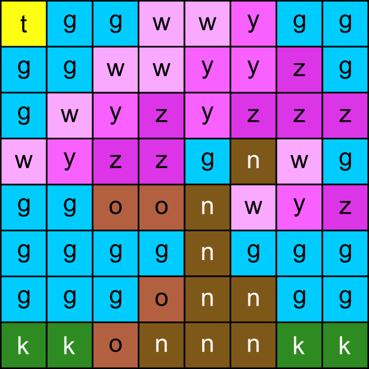

## Muestra una imagen

La imagen que muestre estará hecha de 64 cuadrados coloreados llamados **píxeles**. Los píxeles están dispuestos en una cuadrícula de 8 x 8. Cada píxel puede ser de un color diferente. Si eliges los colores con cuidado, puedes crear una imagen. Aquí tienes un ejemplo de una ballena creada con diferentes tonalidades de azul sobre un fondo negro.

<p style="border-left: solid; border-width:10px; border-color: #0faeb0; background-color: aliceblue; padding: 10px;">
Una <span style="color: #0faeb0">**matriz de LEDs**</span> es una cuadrícula de LEDs que se puede controlar individualmente o en grupo para crear diferentes efectos de iluminación. La matriz de LEDs del Sense HAT tiene 64 LEDs que se muestran en una cuadrícula de 8 x 8. Los LED se pueden programar para producir una amplia gama de colores.
</p>


Observa que cada cuadrado está etiquetado con un código que representa un color en particular. En esta imagen se utilizan 3 colores:
+ c = negro
+ f = Azul océano
+ g = Azul cielo


--- task ---

Abre el [proyecto inicial de Mission Zero](https://missions.astro-pi.org/mz/code_submissions/){:target="_blank"} para el proyecto Mission Zero.

Comprobarás que se han añadido automáticamente unas líneas de código.

Este código se conecta al Astro Pi, se asegura de que la pantalla LED de Astro Pi se muestre en la orientación correcta e inicializa el sensor de color. Deja estas líneas de código, ya que las necesitarás más adelante.

--- code ---
---
language: python filename: main.py line_numbers: false line_number_start: 1
line_highlights:
---
# Import the libraries
from sense_hat import SenseHat from time import sleep

# Set up the Sense HAT
sense = SenseHat() sense.set_rotation(270)

# Set up the colour sensor
sense.color.gain = 60 # Set the sensitivity of the sensor sense.color.integration_cycles = 64 # The interval at which the reading will be taken

--- /code ---


--- /task ---

### Colores RGB

Los colores se pueden crear usando diferentes proporciones de rojo, verde y azul. Aquí puedes encotrar información sobre los colores RGB:


La matriz de LEDs es una cuadrícula de 8 x 8. Cada LED de la cuadrícula se puede configurar en un color diferente. Podemos usar las letras de la a a la z como nombres de variables para representar 24 colores diferentes. Cada color tiene un valor para rojo, verde y azul.

--- collapse ---

---
título: Lista de variables de color
---


```python
a = (255, 255, 255) # Blanco
b = (171, 171, 171) # Gris
c = (0, 0, 0) # Negro
d = (25, 25, 113) # Azul marino
e = (0, 0, 255) # Azul puro
f = (36, 128, 200) # Azul océano
g = (0, 204, 255) # Azul cielo
h = (86, 255, 255) # Cian eléctrico
j = (0, 255, 0) # Verde puro
k = (46, 139, 33) # Verde hoja
l = (57, 97, 17) # Verde oliva
m = (30, 65, 6) # Verde bosque
n = (126, 88, 25) # Marrón tierra
o = (179, 96, 65) # Marrón terracota
p = (180, 34, 34) # Rojo ladrillo
q = (255, 0, 0) # Rojo puro
r = (232, 118, 5) # Naranja
s = (241, 231, 100) # Amarillo claro
t = (255, 255, 0) # Amarillo puro
u = (255, 209, 209) # Rosa pálido
v = (255, 177, 177) # Rosa rubor
w = (249, 169, 255) # Rosa claro
y = (248, 97, 255) # Magenta
z = (220, 53, 232) # Violeta

```

--- /collapse ---

### Elige una imagen

--- task ---

**Seleccionar:** Elije una imagen para mostrar entre las opciones a continuación. Python almacena la información de una imagen en una lista. El código para cada imagen incluye las variables de color utilizadas y la lista.

Deberás **copiar** todo el código para la imagen elegida y luego **pegarlo** en ru proyecto debajo de la línea que dice `# Agregar variables de color e imagen`.

--- collapse ---

---
title: Ballena
---


Creado por el Equipo Naicom, Italia

```python
c = (0, 0, 0)       # Black
f = (36, 128, 200)  # Ocean Blue
g = (0, 204, 255)   # Sky Blue

image = [
c, g, c, g, c, c, c, c,
c, c, g, c, c, f, f, f,
c, f, f, f, c, c, f, a,
f, f, c, f, f, c, f, c,
f, f, f, f, f, c, f, c,
g, f, f, f, f, f, f, c,
g, g, g, g, g, g, c, c,
c, g, g, g, g, c, c, c]

```

--- /collapse ---


--- collapse ---

---
title: Limón
---


Creado por el equipo g4lemoni, Grecia

```python
a = (255, 255, 255) # White
k = (46, 139, 33)   # Leaf Green
t = (255, 255, 0)   # Pure Yellow

image = [
c, c, c, k, k, c, c, c,
c, c, k, c, k, c, c, c,
c, k, c, t, t, c, c, c,
c, c, t, t, t, t, c, c,
c, c, t, t, t, t, c, c,
c, c, t, t, t, t, c, c,
c, c, t, t, t, t, c, c,
c, c, c, t, t, c, c, c]

```

--- /collapse ---

--- collapse ---
---
title: Cerdo
---


Creado por Gary, Reino Unido

```python
a = (255, 255, 255) # White
u = (255, 209, 209) # Pale Pink
v = (255, 177, 177) # Blush Pink
o = (179, 96, 65)   # Terracotta Brown
c = (0, 0, 0)       # Black

image = [
a, a, y, a, a, y, a, a,
a, y, y, y, y, y, y, a,
a, y, c, y, c, y, y, y,
v, v, v, v, v, y, y, y,
v, o, v, o, v, y, y, y,
v, v, v, v, v, y, y, y,
a, y, y, y, y, y, y, y,
a, a, y, a, a, a, y, a]

```

--- /collapse ---


--- collapse ---
---
title: Tormenta
---


Created by team hop2p023, Spain

```python

c = (0, 0, 0)       # Black
f = (36, 128, 200)  # Ocean Blue
g = (0, 204, 255)   # Sky Blue
t = (255, 255, 0)   # Pure Yellow

image = [
c, c, c, c, c, c, c, c,
c, c, f, f, f, f, c, c,
c, f, f, f, f, f, f, c,
c, g, c, g, t, g, c, c,
c, c, c, t, t, c, c, c,
c, c, t, t, c, c, c, c,
c, c, g, c, c, c, c, g,
c, g, c, c, c, c, c, c]


```

--- /collapse ---

--- collapse ---
---
title: Duck
---


Created by Peter, Ireland

```python

c = (0, 0, 0) # Black
l = (57, 97, 17)    # Olive Green
m = (30, 65, 6)     # Forest Green
r = (232, 118, 5)   # Orange
a = (255, 255, 255) # White
b = (171, 171, 171) # Grey

image = [
c, l, l, c, c, c, c, c,
r, r, m, c, c, c, c, c,
c, l, l, c, c, c, c, c,
c, a, a, l, a, a, c, c,
c, l, l, a, a, a, b, a,
c, a, a, b, b, b, a, a,
c, c, a, a, a, a, c, c,
c, c, c, r, c, r, c, c]

```

--- /collapse ---

--- collapse ---
---
title: Frog
---


Created by team Jmeno, Czech Republic

```python

a = (255, 255, 255) # White
b = (171, 171, 171) # Grey
c = (0, 0, 0)       # Black
q = (255, 0, 0)     # Pure Red
j = (0, 255, 0)     # Pure Green
k = (46, 139, 33)   # Leaf Green
n = (126, 88, 25)   # Earth Brown

image = [
a, a, a, a, a, a, a, a,
a, a, a, a, a, b, a, b,
a, a, a, a, a, a, c, a,
a, a, c, a, c, a, q, a,
a, a, j, j, j, q, a, a,
a, j, j, k, q, a, a, a,
j, k, j, k, k, a, a, a,
k, k, k, j, k, n, n, n]

```

--- /collapse ---

--- collapse ---
---
title: Blossom Tree
---



Created by team Zssh14, Slovakia

```python

t = (255, 255, 0)   # Pure Yellow
g = (0, 204, 255)   # Sky Blue
w = (249, 169, 255) # Light Pink
y = (248, 97, 255)  # Magenta
z = (220, 53, 232)  # Purple
n = (126, 88, 25)   # Earth Brown
o = (179, 96, 65)   # Terracotta Brown
k = (46, 139, 33)   # Leaf Green

image =  [
t, g, g, w, w, y, g, g,
g, g, w, w, y, y, z, g,
g, w, y, z, y, z, z, z,
w, y, z, z, g, n, w, g,
g, g, o, o, n, w, y, z,
g, g, g, g, n, g, g, g,
g, g, g, o, n, n, g, g,
k, k, o, n, n, n, k, k]

```

--- /collapse ---

--- /task ---

--- task ---

**Busca:** la línea que dice `# Mostrar la imagen` y añade una línea de código para mostrar la imagen en la matriz LED:

--- code ---
---
language: python filename: main.py line_numbers: false line_number_start: 1
line_highlights: 17, 18
---
c = (0, 0, 0)       # Black f = (36, 128, 200)  # Ocean Blue g = (0, 204, 255)   # Sky Blue

image = [ c, g, c, g, c, c, c, c, c, c, g, c, c, f, f, f, c, f, f, f, c, c, f, a, f, f, c, f, f, c, f, c, f, f, f, f, f, c, f, c, g, f, f, f, f, f, f, c, g, g, g, g, g, g, c, c, c, g, g, g, g, c, c, c]

# Muestra la imagen
sense.set_pixels(image)

--- /code ---

--- /task ---

--- task ---

Pulsa **Ejecutar** en la parte inferior del editor, para ver tu imagen en la matriz de LEDs.

--- /task ---

--- task ---

**Depurar**

Mi código tiene un error de sintaxis:

- Comprueba que tu código coincide con el código en los ejemplos anteriores
- Comprueba que has indentado el código en tu lista
- Compruebe que su lista está rodeada por `[` y `]`
- Verifica que cada variable de color de la lista esté separada por una coma

Mi imagen no aparece:

- Comprueba que tu `sense.set_pixels(imagen)` no esté indentado

--- /task ---


--- task ---

**Guarda tu progreso**

Ahora que has mostrado una imagen, puedes guardar tu programa en el Proyecto Inicial de la Misión ingresando el nombre de tu equipo, los nombres de los miembros del equipo y el código de aula que te dieron. Puedes recargar tu programa en cualquier dispositivo con conexión a Internet ingresando el nombre de tu equipo y el código de aula.


--- /task --- 
