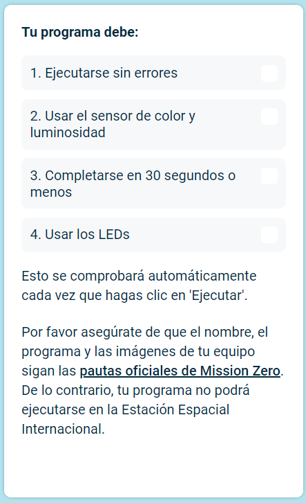

## Envía tu proyecto

Hay algunas reglas que tu código debe seguir para que puedas enviarlo en la Estación Espacial Internacional. Si tu código las cumple, las reglas de la parte inferior del **emulador** se iluminarán en verde cuando ejecutes el programa.

**Nota:** Es una buena idea dar a las variables de color nombres de una sola letra, puesto que te ahorrará tiempo en el siguiente paso, en donde vas a escribirlas muchas veces.

Por favor, asegúrate de que tu entrada sigue las [directrices oficiales](https://astro-pi.org/mission-zero/guidelines){:target="_blank"} para Mission Zero. Si no sigue las pautas, tu programa no podrá ejecutarse en la Estación Espacial Internacional.

Por favor, no incluyas ninguno de los siguientes en su nombre de equipo o código:

+ Cualquier cosa que pueda interpretarse como de naturaleza ilegal, política o sensible
+ Banderas, ya que pueden considerarse políticamente sensibles
+ Cualquier cosa que haga referencia a cosas desagradables o daño a otra persona
+ Datos personales como números de teléfono, redes sociales y direcciones de correo electrónico
+ Imágenes obscenas
+ Caracteres especiales o emojis
+ Malas palabras o palabrotas

--- task ---

Introduce el código de tu clase y el nombre del equipo en la casilla de abajo — tu mentor te dirá cuál es tu código.

**Las notas para mentores** se pueden encontrar en el paso [Introducción](https://projects.raspberrypi.org/es-ES/projects/astro-pi-mission-zero/0).

--- /task ---

--- task ---

Pulsa el botón **Añadir tu equipo** para introducir tu código. Ten en cuenta que una vez que se envíes un programa no podrás cambiarlo.

Tu mentor recibirá un correo electrónico para confirmar tu entrada.

--- /task ---

--- task ---

Si quieres, ¡puedes compartir el enlace de tu código en los medios sociales para contarles a los demás que el código que escribiste será ejecutado en el espacio!

--- /task ---
