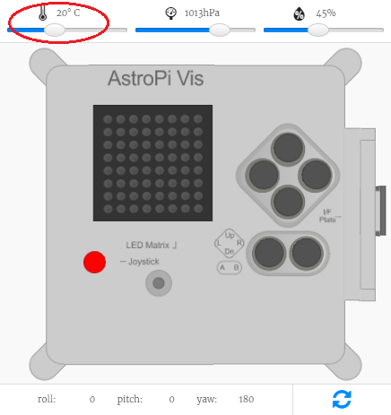

## Medir la temperatura

El sensor de temperatura de Astro Pi puede medir la temperatura del ambiente; una función útil para ayudarte a obtener datos sobre las condiciones del espacio.


Astro Pi mide la temperatura de la ISS en grados Celsius (&deg;C). Puesto que la temperatura en el espacio varía mucho más que la de la Tierra, Astro Pi puede medir temperaturas dentro de la siguiente gama: de -40 grados Celsius hasta +120 grados Celsius.

Parte de tu misión es contribuir a la vida diaria de la tripulación de la ISS. Informarles de que la temperatura a bordo de la estación espacial se encuentra dentro de la normalidad los tranquilizará.

## \--- collapse \---

## title: ¿Qué es la temperatura?

La temperatura es la medida de lo caliente que está algo. Seguramente te hayan tomado la temperatura con un termómetro en una de tus visitas al médico.

 *By Menchi [CC-BY-SA-3.0](http://creativecommons.org/licenses/by-sa/3.0/){:target="_blank"} via Wikimedia Commons*

Para ser más preciso, la temperatura es la medida de la cantidad de energía térmica de una sustancia. Como bien sabes, un cubito de hielo es sólido, sin embargo, al calentarse, es decir, según absorbe energía térmica del entorno, se derrite y se vuelve líquido. Esto se debe a que cuando una sustancia absorbe o pierde suficiente energía térmica, el estado de dicha sustancia cambia, por ejemplo, de estado sólido a estado líquido.

\--- /collapse \---

\--- task \---

Añade este código para tomar una lectura de temperatura:

```python
temp = sense.temperature
```

Esta línea medirá la temperatura actual y almacenará el valor medido en la variable `temp`.

\--- /task \---

\--- task \---

La temperatura se registra con gran precisión, es decir, el valor almacenado tendrá un gran número de decimales. Puedes redondear el valor a cualquier número de decimales. En el ejemplo hemos redondeado a un decimal, sin embargo, para lograr otro nivel de precisión, cambia el número `1` al número de decimales que quieras ver.

```python
temp = round( sense.temperature, 1 )
```

\--- /task \---

\--- task \---

Para ver la temperatura actual a modo de mensaje desplazándose por la pantalla, añade esta línea de código:

```python
sense.show_message( str(temp) )
```

La parte `str()` convierte la temperatura de número a texto, de modo que Astro Pi pueda mostrarla.

\--- /task \---

\--- task \---

También podrás mostrar la temperatura como parte de otro mensaje uniendo las parte de tu mensaje con `+`.

```python
sense.show_message( "It is " + str(temp) + " degrees" )
```

\--- /task \---

El Astro Pi real medirá la temperatura a su alrededor, sin embargo, tu podrás mover el control deslizante de la temperatura en el emulador Sense HAT para simular cambios de temperatura y probar tu código.



**Nota:** Puede que te preguntes porqué el control deslizante de la temperatura muestra la temperatura en números enteros a pesar de que la lectura que obtienes tiene decimales. El emulador simula la ligera inexactitud del sensor real, de modo que la medición de temperatura que ves podría ser ligeramente inferior o superior al valor establecido con el control deslizante.