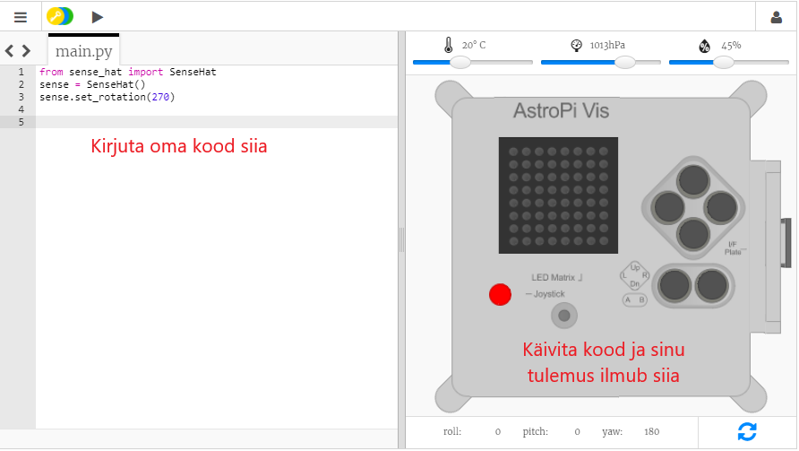

## Mis on Astro Pi?

Astro Pi on kapsliga ümbritsetud Raspberry Pi arvuti, mis on spetsiaalselt valmistatud kosmoses valitsevate tingimuste jaoks. Sellel on ka lisandmoodul Sense HAT, mis on spetsiaalselt tehtud Astro Pi missiooniks. Sense HAT-il on juhtkang, LED-ekraan ja sensorid, mis registreerivad õhutemperatuuri, -niiskust, -rõhku ja -suunda.

See on tõeline rahvusvahelises kosmosejaamas (Iss) asuv Astro Pi kapsel, kus on käivitatud õpilaste poolt kirjutatud kood. Siin käivitataksegi sinu kood! <iframe width="560" height="315" src="https://www.youtube.com/embed/4ykbAJeGPMM" frameborder="0" allow="accelerometer; autoplay; encrypted-media; gyroscope; picture-in-picture" allowfullscreen mark="crwd-mark"></iframe> 

>

Selle missiooni jaoks kasutad Sense HAT-i emulaatorit. Emulaator on tarkvara, mis simuleerib sinu veebibrauseris kõiki Astro Pi funktsioone.

Tõelise ja emuleeritud Sense HAT-i vahel on mõned erinevused:

- Emulaatoril võid sina liugureid kasutades määrata õhutemperatuuri, -rõhu ja -niiskuse, aga Astro Pi-l asuv tõeline Sense HAT kasutab sensoreid nende parameetrite mõõtmiseks oma keskkonnas.

- Saad hiire klahvidel klõpsates ja seda lohistades emuleeritud Sense HAT-i liigutada ja keerata, simuleerides muutusi tema liikumise suunas; tõeline Astro Pi (ja tema Sense HAT) saavad päriselt ringi liikuda ja Sense HAT-i liikumise sensorid määravad kindlaks, millal ning kuidas see on liikunud.