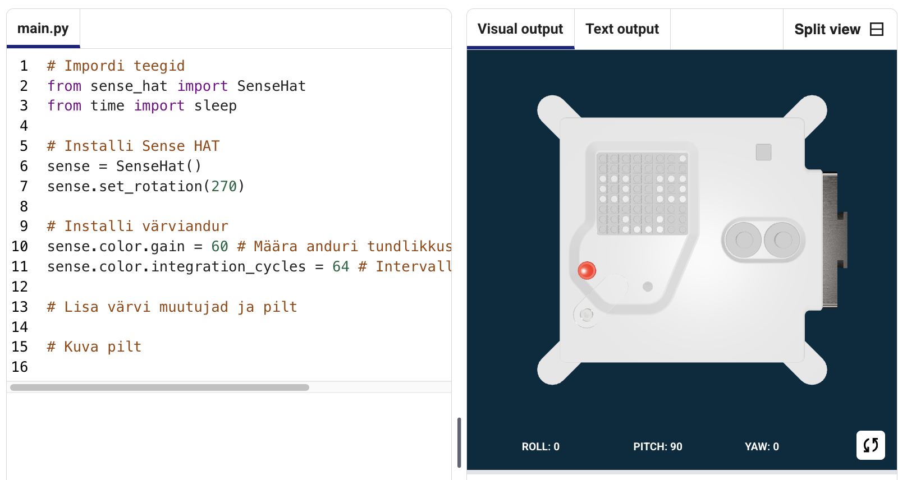

## Kuva pilt

Astro Pi LED-maatriksid suudavad kuvada ka värve. Selles etapis kuvad Astro Pi LED-maatriksil pilte loodusest.

<p style="border-left: solid; border-width:10px; border-color: #0faeb0; background-color: aliceblue; padding: 10px;">
<span style="color: #0faeb0">**LED-maatriks**</span> on LED-ide võre, mida saab juhtida üksikult või rühmana, et luua erinevaid valgusefekte. Sense HAT-i LED-maatriksil on 64 LED-i, mis kuvatakse 8 x 8 võrena. LED-e saab programmeerida tootma laias valikus värve.
</p>


--- task ---

Ava [Mission Zero stardiprojekt](https://missions.astro-pi.org/mz/code_submissions/){:target="_blank"}.

Näed, et sulle on automaatselt lisatud mõned read koodi.

See kood ühendub Astro Pi-ga ja tagab, et Astro Pi LED-ekraan kuvatakse õigesti ning unstallib värvianduri. Jäta kood sinna, sest sul läheb seda vaja.

--- code ---
---
language: python
filename: main.py
line_numbers: false
line_number_start: 1
line_highlights: 
---
# Impordi teegid
from sense_hat import SenseHat
from time import sleep

# Installi Sense HAT
sense = SenseHat()
sense.set_rotation(270)

# Installi värviandur
sense.color.gain = 60 # Määra anduri tundlikkus
sense.color.integration_cycles = 64 # Intervall, millega näit võetakse

--- /code ---



--- /task ---

### RGB värvid

Värve saab luua kasutades erinevaid punase, rohelise ja sinise proportsioone. RGB värvide kohta saad rohkem teada siin:

[[[generic-theory-simple-colours]]]

LED-maatriks on 8x8-ruudustik. Iga võre LED-i saab seadistada erinevat värvi. Siin on 24 erineva värvi muutujate loend. Igal värvil on väärtus punase, rohelise ja sinise jaoks:

[[[ambient-colours]]]

### Vali pilt

--- task ---

**Vali:** Vali allolevatest variantidest pilt, mida kuvada. Python salvestab pildi teabe loendisse. Iga pildi kood sisaldab kasutatud värvide muutujaid ja loendit.

Pead **kopeerima** kogu valitud pildi koodi ja seejärel **kleepima** selle oma projekti selle rea alla, mis ütleb `# Lisa värvi muutujad ja pilt`.

--- collapse ---

---
title: Kala
---


Loonud meeskond chalka, Poola

```python
z = (153, 50, 204) # Tume orhidee
q = (255, 255, 0) # Kollane
d = (51, 153, 255) # sinine
c = (0, 0, 0) # Must

pilt = [
d, d, z, d, d, d, d, d,
d, d, d, z, z, d, d, d,
z, d, q, q, q, q, d, d,
z, z, q, q, q, c, q, d,
z, z, z, q, q, q, q, d,
z, z, q, q, q, q, q, d,
z, d, q, z, z, q, d, d,
d, d, d, z, d, d, d, d]

```

--- /collapse ---


--- collapse ---

---
title: Morsk
---


Loonud meeskond Walrus, Soome

```python
h = (0, 255, 255) # Tsüaan
c = (0, 0, 0) # Must
s = (139, 69, 19) # SaddleBrown
a = (255, 255, 255) # Valge
r = (184, 134, 11) # Tume kuldvits

pilt = [
h, h, h, h, h, h, h, h,
h, h, s, s, s, h, h, h,
h, s, s, s, s, s, h, h,
h, s, c, s, c, s, s, s,
h, r, r, r, r, r, s, s,
h, h, a, s, a, s, s, s,
h, h, a, s, a, s, s, s,
r, r, s, s, s, s, s, s]

```

--- /collapse ---

--- collapse ---
---
title: Paxi
---


Loonud meeskond tony_pi, Itaalia

```python
v = (255, 0, 0) # Punane
m = (34, 139, 34) # Metsaroheline
c = (0, 0, 0) # Must 
e = (100, 149, 237) # Rukkilillesinine
l = (0, 255, 0) # Roelline

pilt = [
    c, v, m, c, c, m, v, c,
    c, c, v, v, v, v, c, c,
    c, v, c, e, l, e, v, c,
    c, v, c, l, l, l, v, c,
    c, v, c, l, c, l, v, c,
    c, c, v, v, v, v, c, c,
    c, c, l, c, c, l, c, c,
    c, m, m, c, c, m, m, c]

```

--- /collapse ---


--- collapse ---
---
title: Koer
---


Loonud meeskond ptpr_07, Hispaania

```python

c = (0, 0, 0) # Must
r = (184, 134, 11) # Tume kuldvits
s = (139, 69, 19) # SaddleBrown
y = (255, 20, 147) # Sügavroosa

pilt = [
    c, r, r, c, c, r, r, c,
    c, r, s, s, s, s, r, c,
    c, r, c, s, s, c, r, c,
    c, s, s, s, s, s, s, c,
    c, s, s, s, s, s, s, c,
    c, s, s, c, c, s, s, c,
    c, c, s, y, y, s, c, c,
    c, c, c, y, y, c, c, c]


```

--- /collapse ---

--- collapse ---
---
title: Kameeleon
---


Loonud meeskond The_ETs, Ühendkuningriik

```python

c = (0, 0, 0) # Must
s = (139, 69, 19) # SaddleBrown
a = (255, 255, 255) # Valge
v = (255, 0, 0) # Punane
t = (255, 140, 0) # Tumeoranž
q = (255, 255, 0) # Kollane
m = (34, 139, 34) # Metsaroheline
h = (0, 255, 255) # Tsüaan
z = (153, 50, 204) # Tume orhidee
y = (255, 20, 147) # Sügavroosa

pilt = [
    a, a, v, v, t, a, a, a,
    a, v, v, t, t, q, a, a,
    v, c, t, t, q, q, m, a,
    v, t, t, q, q, m, m, h,
    s, s, q, s, s, m, s, h,
    a, a, a, a, a, a, a, z,
    a, a, a, a, y, a, a, z,
    a, a, a, a, a, y, z, a]

```

--- /collapse ---

--- collapse ---
---
title: Tuulelohe
---


Loonud meeskond Val, Kreeka

```python

c = (0, 0, 0) # Must
m = (34, 139, 34) # Metsaroheline
v = (255, 0, 0) # Punane
q = (255, 255, 0) # Kollane
e = (0, 0, 205) # Keskminesinine
h = (0, 255, 255) # Tsüaan

pilt = [
    h, h, h, h, h, h, h, h, 
    h, h, h, e, e, v, v, h, 
    h, h, h, e, e, v, v, h, 
    h, h, h, q, q, m, m, h, 
    h, h, h, q, q, m, m, h,
    h, h, c, h, h, h, h, h, 
    h, c, h, h, h, h, h, h, 
    c, h, h, h, h, h, h, h]

```

--- /collapse ---

--- collapse ---
---
title: Kana
---


Loonud meeskond Slepicky, Tšehhi

```python

v = (255, 0, 0) # Punane
c = (0, 0, 0) # Must
b = (105, 105, 105) # Tuhmhall
q = (255, 255, 0) # Kollane
r = (184, 134, 11) # Tume kuldvits

pilt =  [
    c, c, v, v, v, c, c, c,
    c, v, b, b, r, c, c, r,
    c, b, c, b, b, c, r, b,
    q, r, b, b, b, b, b, r,
    c, v, b, b, b, b, r, b,
    c, v, b, r, r, r, b, r,
    c, c, c, r, b, q, r, c,
    c, c, c, c, q, q, c, c]

```

--- /collapse ---

--- /task ---

--- task ---

**Leia:** rida, mis ütleb `# Kuva pilt` ja lisa koodirida, et kuvada oma pilt LED-maatriksil:

--- code ---
---
language: python
filename: main.py
line_numbers: false
line_number_start: 1
line_highlights: 18, 19
---
z = (153, 50, 204) # Tume orhidee
q = (255, 255, 0) # Kollane
d = (51, 153, 255) # Sinine
c = (0, 0, 0) # Must

pilt = [
d, d, z, d, d, d, d, d,
d, d, d, z, z, d, d, d,
z, d, q, q, q, q, d, d,
z, z, q, q, q, c, q, d,
z, z, z, q, q, q, q, d,
z, z, q, q, q, q, q, d,
z, d, q, z, z, q, d, d,
d, d, d, z, d, d, d, d]

# Kuva pilt
sense.set_pixels(pilt)

--- /code ---

--- /task ---

--- task ---

Vajuta **Käivita** redaktori allosas, et näha oma pilti LED-maatriksil kuvatuna.

--- /task ---

--- task ---

**Silumine**

Minu koodis on süntaksiviga:

- Kontrolli, kas sinu kood ühtib ülaltoodud näidetes oleva koodiga
- Kontrolli, kas oled oma loendis koodi taandanud
- Kontrolli, kas sinu loend on ümbritsetud `[` ja `]`-ga
- Kontrollige, kas iga värvi muutuja on loendis komaga eraldatud

Minu pilt ei ilmu:

- Kontrolli, ega sinu `sense.set_pixels(pilt)` ei ole taandega

--- /task ---


--- task ---

**Salvesta oma edusammud**

Nüüd, kui oled pildi kuvanud, saad oma programmi salvestada Mission Starter projekti, sisestades oma meeskonna nime, meeskonnaliikmete nimed ja sulle antud klassiruumi koodi. Saad oma programmi uuesti laadida mis tahes internetiühendusega seadmesse, sisestades oma meeskonna nime ja klassiruumi koodi.


--- /task --- 
