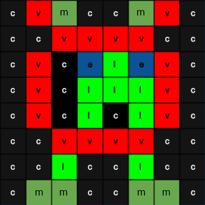
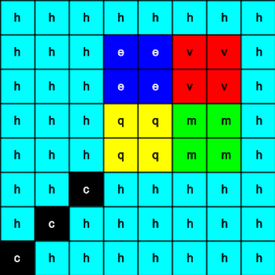

## Kuva pilt

Astro Pi LED-maatriksid suudavad kuvada ka värve. Selles etapis kuvad Astro Pi LED-maatriksil pilte loodusest.

<p style="border-left: solid; border-width:10px; border-color: #0faeb0; background-color: aliceblue; padding: 10px;">
<span style="color: #0faeb0">**LED-maatriks**</span> on LED-ide võre, mida saab juhtida üksikult või rühmana, et luua erinevaid valgusefekte. Sense HAT-i LED-maatriksil on 64 LED-i, mis kuvatakse 8 x 8 võrena. LED-e saab programmeerida tootma laias valikus värve.
</p>


--- task ---

Ava [Mission Zero stardiprojekt](https://missions.astro-pi.org/mz/code_submissions/){:target="_blank"}.

Näed, et sulle on automaatselt lisatud mõned read koodi.

See kood ühendub Astro Pi-ga ja tagab, et Astro Pi LED-ekraan kuvatakse õigesti ning unstallib värvianduri. Jäta kood sinna, sest sul läheb seda vaja.

--- code ---
---
language: python filename: main.py line_numbers: false line_number_start: 1
line_highlights:
---
# Impordi teegid
from sense_hat import SenseHat from time import sleep

# Installi Sense HAT
sense = SenseHat() sense.set_rotation(270)

# Installi värviandur
sense.color.gain = 60 # Set the sensitivity of the sensor sense.color.integration_cycles = 64 # The interval at which the reading will be taken

--- /code ---


--- /task ---

### RGB värvid

Värve saab luua kasutades erinevaid punase, rohelise ja sinise proportsioone. RGB värvide kohta saad rohkem teada siin:

[[[generic-theory-simple-colours]]]

The LED matrix is an 8 x 8 grid. Iga võre LED-i saab seadistada erinevat värvi. Siin on 24 erineva värvi muutujate loend. Igal värvil on väärtus punase, rohelise ja sinise jaoks:

[[[ambient-colours]]]

### Vali pilt

--- task ---

**Vali:** Vali allolevatest variantidest pilt, mida kuvada. Python salvestab pildi teabe loendisse. Iga pildi kood sisaldab kasutatud värvide muutujaid ja loendit.

Pead **kopeerima** kogu valitud pildi koodi ja seejärel **kleepima** selle oma projekti selle rea alla, mis ütleb `# Lisa värvi muutujad ja pilt`.

--- collapse ---

---
title: Rebane
---


Loonud meeskond i_pupi, Itaalia

```python
z = (204, 0, 204) # magenta
q = (255, 255, 0) # yellow
d = (51, 153, 255) # blue
c = (0, 0, 0) # black

image = [
d, d, z, d, d, d, d, d,
d, d, d, z, z, d, d, d,
z, d, q, q, q, q, d, d,
z, z, q, q, q, c, q, d,
z, z, z, q, q, q, q, d,
z, z, q, q, q, q, q, d,
z, d, q, z, z, q, d, d,
d, d, d, z, d, d, d, d]

```

--- /collapse ---


--- collapse ---

---
title: Elevant
---


Loonud meeskond ILiFanT, Soome

```python
h = (0, 255, 255)
c = (0, 0, 0)
s = (139, 69, 19)
a = (255, 255, 255)
r = (184, 134, 11)   

image = [
h, h, h, h, h, h, h, h,
h, h, s, s, s, h, h, h,
h, s, s, s, s, s, h, h,
h, s, c, s, c, s, s, s,
h, r, r, r, r, r, s, s,
h, h, a, s, a, s, s, s,
h, h, a, s, a, s, s, s,
r, r, s, s, s, s, s, s]

```

--- /collapse ---

--- collapse ---
---
title: Paxi
---



Loonud meeskond 6TETHASI, Holland

```python
v = (255, 0, 0) # Red
j = (34, 139, 34) # ForestGreen
c = (0, 0, 0) # Black 
e = (100, 149, 237) # CornflowerBlue
l = (0, 255, 0) # Green

image = [
    c, v, j, c, c, j, v, c,
    c, c, v, v, v, v, c, c,
    c, v, c, e, l, e, v, c,
    c, v, c, l, l, l, v, c,
    c, v, c, l, c, l, v, c,
    c, c, v, v, v, v, c, c,
    c, c, l, c, c, l, c, c,
    c, j, j, c, c, j, j, c]

```

--- /collapse ---


--- collapse ---
---
title: Krokodill
---


Created by team ptpr_07, Spain
```python

c = (0, 0, 0) # Black
r = (86, 71, 0) # Light Brown
s = (123, 61, 0) # Orange Brown
y = (155, 0, 134) # Deep Pink

image = [
    c, r, r, c, c, r, r, c,
    c, r, s, s, s, s, r, c,
    c, r, c, s, s, c, r, c,
    c, s, s, s, s, s, s, c,
    c, s, s, s, s, s, s, c,
    c, s, s, c, c, s, s, c,
    c, c, s, y, y, s, c, c,
    c, c, c, y, y, c, c, c]


```

--- /collapse ---

--- collapse ---
---
title: Vikerkaar
---


Created by team The_ETs, United Kingdom

```python

c = (0, 0, 0) # Black
s = (95, 65, 0) # Brown
a = (255, 255, 255) # white
v = (255, 0, 0) # Red
t = (255, 153, 28) # Orange
q = (255, 255, 0) # Yellow
m = (0, 255, 0) # Green
h = (0, 255, 255) # Cyan
z = (128, 0, 255) # Purple
y = (191, 0, 255) # Magenta

image = [
    a, a, v, v, t, a, a, a,
    a, v, v, t, t, q, a, a,
    v, c, t, t, q, q, m, a,
    v, t, t, q, q, m, m, h,
    s, s, q, s, s, m, s, h,
    a, a, a, a, a, a, a, z,
    a, a, a, a, y, a, a, z,
    a, a, a, a, a, y, z, a]

```

--- /collapse ---

--- collapse ---
---
title: Draakon
---



Created by team Val, Greece

```python

c = (0, 0, 0) # Black
m = (0, 255, 0) # Green
v = (255, 0, 0) # Red
q = (255, 255, 0) # Yellow
e = (0, 0, 255) # Blue
h = (0, 255, 255) # Cyan

image = [
    h, h, h, h, h, h, h, h, 
    h, h, h, e, e, v, v, h, 
    h, h, h, e, e, v, v, h, 
    h, h, h, q, q, m, m, h, 
    h, h, h, q, q, m, m, h,
    h, h, c, h, h, h, h, h, 
    h, c, h, h, h, h, h, h, 
    c, h, h, h, h, h, h, h]

```

--- /collapse ---

--- collapse ---
---
title: Chicken
---


Created by team Slepicky, Czech Republic

```python

w = (255, 255, 255) #  White                                                                
v = (255, 0, 0) # Red
c = (0, 0, 0) # Black
b = (105, 105, 105) # Light Grey
q = (255, 255, 0) # Yellow
k = (79, 79, 79) # Dark Grey


image =  [
    a, a, v, v, v, a, a, a,
    a, v, b, b, k, a, a, k,
    a, b, c, b, b, a, k, b,
    q, k, b, b, b, b, b, k,
    a, v, b, b, b, b, k, b,
    a, v, b, k, k, k, b, k,
    a, a, a, k, b, q, k, a,
    a, a, a, a, q, q, a, a]

```

--- /collapse ---

--- /task ---

--- task ---

**Leia:** rida, mis ütleb `# Kuva pilt` ja lisa koodirida, et kuvada oma pilt LED-maatriksil:

--- code ---
---
language: python filename: main.py line_numbers: false line_number_start: 1
line_highlights: 18, 19
---
z = (204, 0, 204) # magenta q = (255, 255, 0) # yellow d = (51, 153, 255) # blue c = (0, 0, 0) # black

image = [ d, d, z, d, d, d, d, d, d, d, d, z, z, d, d, d, z, d, q, q, q, q, d, d, z, z, q, q, q, c, q, d, z, z, z, q, q, q, q, d, z, z, q, q, q, q, q, d, z, d, q, z, z, q, d, d, d, d, d, z, d, d, d, d]

# Display the image
sense.set_pixels(image)

--- /code ---

--- /task ---

--- task ---

Vajuta **Käivita** redaktori allosas, et näha oma pilti LED-maatriksil kuvatuna.

--- /task ---

--- task ---

**Silumine**

Minu koodis on süntaksiviga:

- Kontrolli, kas sinu kood ühtib ülaltoodud näidetes oleva koodiga
- Kontrolli, kas oled oma loendis koodi taandanud
- Kontrolli, kas sinu loend on ümbritsetud `[` ja `]`-ga
- Kontrollige, kas iga värvi muutuja on loendis komaga eraldatud

Minu pilt ei ilmu:

- Kontrolli, ega sinu `sense.set_pixels(image)` ei ole taandega

--- /task ---


--- task ---

**Salvesta oma edusammud**

Nüüd, kui oled pildi kuvanud, saad oma programmi salvestada Mission Starter projekti, sisestades oma meeskonna nime, meeskonnaliikmete nimed ja sulle antud klassiruumi koodi. Saad oma programmi uuesti laadida mis tahes internetiühendusega seadmesse, sisestades oma meeskonna nime ja klassiruumi koodi.


--- /task --- 
