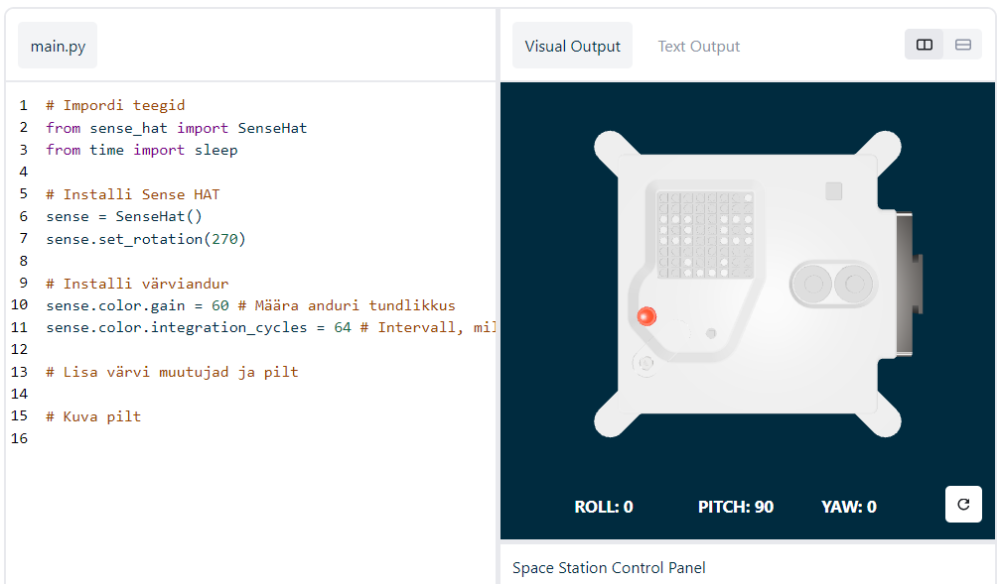

## Kuva sõnum ja vali uutele Astro Pi arvutitele nimi

--- task ---

Ava [Sense HAT-i emulaator](https://trinket.io/mission-zero){:target="_blank"} Mission Zero projekti jaoks.

Näed, et sulle on automaatselt lisatud kolm rida koodi:

```python
from sense_hat import SenseHat
sense = SenseHat()
sense.set_rotation(270)
```



See kood ühendub Astro Pi-ga ja tagab, et Astro Pi LED-ekraan kuvatakse õigesti. Jäta kood sinna, sest sul läheb seda vaja.

--- /task ---

--- task ---

Võib-olla jätaksid toreda tervituse neile ISS-i astronautidele, kes töötavad Astro Pi läheduses? Kerime sõnumit tervel ekraanil.

Lisa see rida teise koodi alla:

```python
sense.show_message("Astro Pi")
```

--- /task ---

--- task ---

Vajuta **Run** (Käivita) nuppu ja vaata sõnumit `Astro Pi` LED-ekraanil.


--- /task ---


Teistsuguse sõnumi kuvamiseks kirjuta jutumärkide vahele, mida iganes sa soovid (`""`).

--- collapse ---

---
title: Milliseid tähemärke saab kasutada?
---

Sense HAT-iga saab kuvada ainult Latin 1 tähemärke, seetõttu on valikus vaid järgmised tähemärgid. Kõiki teisi tähemärke kuvataks nii `?`.

```
+-*/!"#$><0123456789.=)(

ABCDEFGHIJKLMNOPQRSTUVWXYZ

abcdefghijklmnopqrstuvwxyz

?,;:|@%[&_']\~
```

--- /collapse ---

--- task ---

Samuti saad muuta ekraanil keritava sõnumi kiirust. Lisa `scroll_speed` olemasolevale koodireale, nagu näidatud:

```python
sense.show_message("Astro Pi", scroll_speed=0.05)
```

Sõnumi kerimise vaikekiirus on `0,1`. Numbri vähendamine muudab sõnumi kerimise kiiremaks ja numbri suurendamine muudab selle aeglasemaks.

--- /task ---

### Valige uutele Astro Pi arvutitele nimi

--- task --- Anname Astro Pi arvutitele nime kahe inspireeriva Euroopa teadlase järgi. Sajad mehed ja naised on andnud oma panuse teaduse ja tehnoloogia vallas ja osalejad saavad soovitada endapakutud nimesid või valida meie soovituste loendist:


[Ada Lovelace](https://en.wikipedia.org/wiki/Ada_Lovelace){:target="_blank"} 
[Alan Turing](https://en.wikipedia.org/wiki/Alan_Turing){:target="_blank"} 
[Caroline Herschel](https://en.wikipedia.org/wiki/Caroline_Herschel){:target="_blank"} 
[Edsger Dijkstra](https://en.wikipedia.org/wiki/Edsger_W._Dijkstra){:target="_blank"} 
[Hedy Lamarr](https://en.wikipedia.org/wiki/Hedy_Lamarr){:target="_blank"} 
[Hypatia](https://en.wikipedia.org/wiki/Hypatia){:target="_blank"} 
[John Edmonstone](https://en.wikipedia.org/wiki/John_Edmonstone){:target="_blank"} 
[Marie Curie](https://en.wikipedia.org/wiki/Marie_Curie){:target="_blank"} 
[Nikola Tesla](https://en.wikipedia.org/wiki/Nikola_Tesla){:target="_blank"} 
[Tycho Brahe](https://en.wikipedia.org/wiki/Tycho_Brahe){:target="_blank"}

Hääletamiseks alusta oma sõnumit sõnadega "Minu nimi peaks olema". Näiteks juhul, kui soovid hääletada Ada Lovelace'i poolt, näeks sinu kood välja selline:

```python
sense.show_message("My name should be Ada Lovelace")
```

Kui soovid anda oma hääle, *peab* sinu sõnum algama nende sõnadega, vastasel juhul ei saa me sinu pakkumist automaatselt arvesse võtta.

--- /task ---


